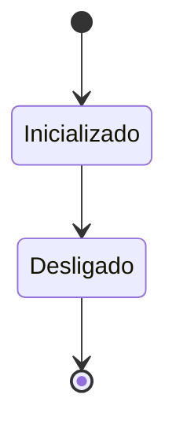
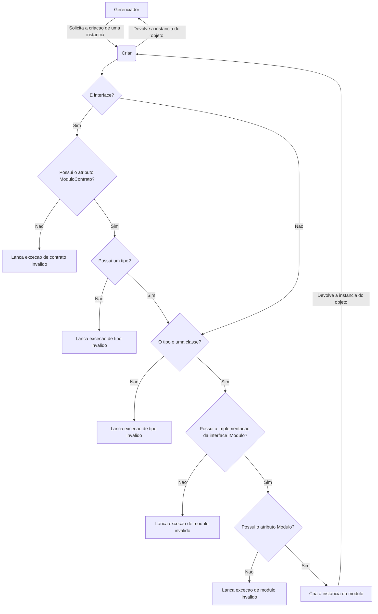
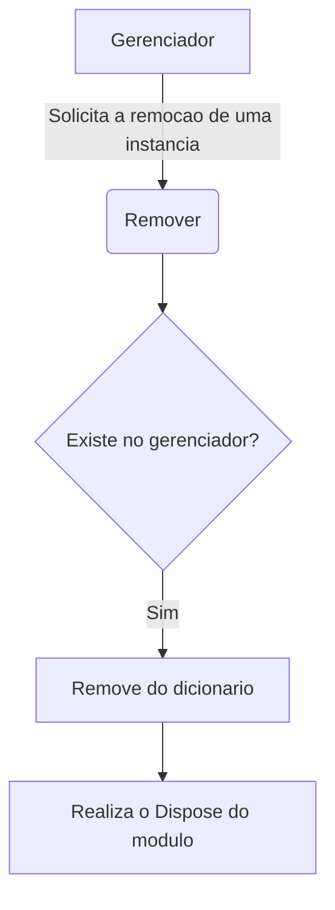
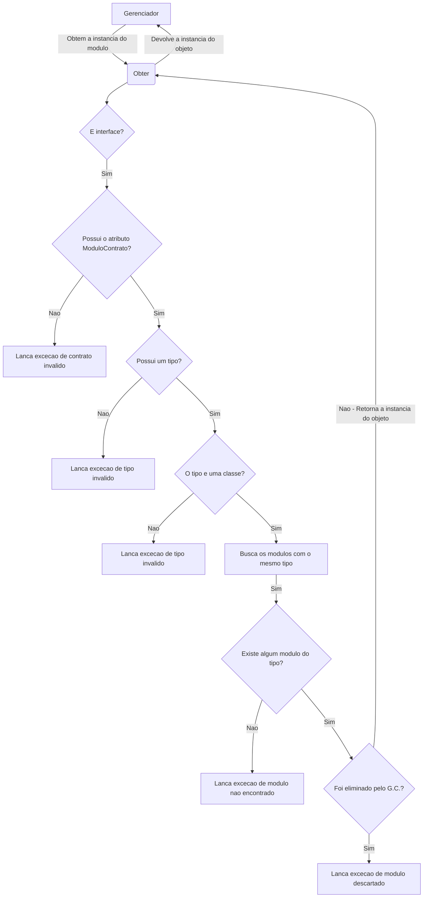

# Gerenciador

A classe Gerenciador é responsável por carregar, inicializar e gerenciar todos os módulos do sistema.

## Estado de um modulo

## Criar
Fluxo para criacao de um novo modulo

## Remover

## Obter

**Este documento nao esta finalizado, caso queria mais detalhes, acesse a pasta "propeus" para obter a documentacao auto-gerado.
    