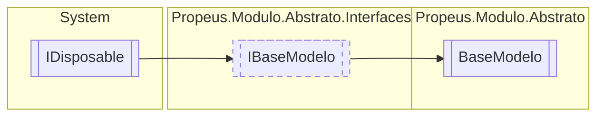

# BaseModelo `class`

## Description
Classe com o modelo base para todo o projeto

## Diagram


## Members
### Properties
#### Public  properties
| Type | Name | Methods |
| --- | --- | --- |
| [`Estado`](./propeusmoduloabstrato-Estado.md) | [`Estado`](#estado)<br>Representa o estado do objeto. | `get, set` |
| `string` | [`Id`](#id)<br>Representação alfanumerica e unica do objeto. | `get` |
| `string` | [`Nome`](#nome)<br>Representação amigavel do ojeto. <br><br> | `get, protected set` |
| `string` | [`Versao`](#versao)<br>Versao do modelo | `get` |

### Methods
#### Public  methods
| Returns | Name |
| --- | --- |
| `void` | [`Dispose`](#dispose-22)() |
| `string` | [`ToString`](#tostring)()<br>Exibe informações basicas sobre o modelo |

#### Protected  methods
| Returns | Name |
| --- | --- |
| `void` | [`Dispose`](#dispose-12)(`bool` disposing)<br>Libera os objetos deste modelo e altera o estado dele para [Estado](./propeusmoduloabstrato-Estado.md).[Desligado](#desligado) |

## Details
### Summary
Classe com o modelo base para todo o projeto

### Inheritance
 - [
`IBaseModelo`
](./propeusmoduloabstratointerfaces-IBaseModelo.md)
 - `IDisposable`

### Constructors
#### BaseModelo [1/2]
```csharp
public BaseModelo()
```
##### Summary
Inicia um modelo basico

#### BaseModelo [2/2]
```csharp
public BaseModelo(string nome)
```
##### Arguments
| Type | Name | Description |
| --- | --- | --- |
| `string` | nome | Nome do modelo |

##### Summary
Inicia um modelo com um nome customizado

### Methods
#### ToString
```csharp
public override string ToString()
```
##### Summary
Exibe informações basicas sobre o modelo

##### Returns


#### Dispose [1/2]
```csharp
protected virtual void Dispose(bool disposing)
```
##### Arguments
| Type | Name | Description |
| --- | --- | --- |
| `bool` | disposing | Indica se deve alterar o estado do objeto para [Estado](./propeusmoduloabstrato-Estado.md).[Desligado](#desligado) |

##### Summary
Libera os objetos deste modelo e altera o estado dele para [Estado](./propeusmoduloabstrato-Estado.md).[Desligado](#desligado)

#### Dispose [2/2]
```csharp
public virtual void Dispose()
```

### Properties
#### Versao
```csharp
public virtual string Versao { get; }
```
##### Summary
Versao do modelo

#### Estado
```csharp
public Estado Estado { get; set; }
```
##### Summary
Representa o estado do objeto.

#### Nome
```csharp
public string Nome { get; protected set; }
```
##### Summary
Representação amigavel do ojeto. 


#### Id
```csharp
public virtual string Id { get; }
```
##### Summary
Representação alfanumerica e unica do objeto.

*Generated with* [*ModularDoc*](https://github.com/hailstorm75/ModularDoc)
