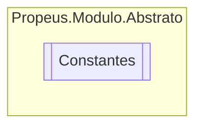

# Constantes `class`

## Description
Classe para adicionar valores constantes

## Diagram

## Details
### Summary
Classe para adicionar valores constantes

*Generated with* [*ModularDoc*](https://github.com/hailstorm75/ModularDoc)
