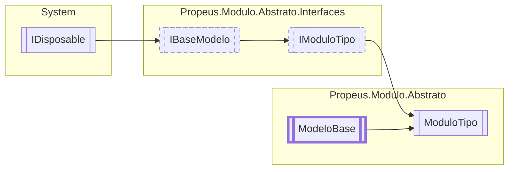

# ModuloTipo `class`

## Description
Informa detalhes sobre o modulo instanciado

## Diagram


## Members
### Properties
#### Public  properties
| Type | Name | Methods |
| --- | --- | --- |
| `bool` | [`Coletado`](#coletado)<br>Informa se o modulo foi coletado pelo GC | `get` |
| `bool` | [`Elimindado`](#elimindado)<br>Informa se o modulo foi eliminado da aplicação | `get` |
| `string` | [`IdModulo`](#idmodulo)<br>Informa o id gerado para o modulo instanciado | `get` |
| `bool` | [`InstanciaUnica`](#instanciaunica)<br>Informa se o modulo é instancia unica | `get` |
| [`IModulo`](./propeusmoduloabstratointerfaces-IModulo.md) | [`Modulo`](#modulo)<br>Instancia do modulo | `get` |
| `Type` | [`TipoModulo`](#tipomodulo)<br>Tipo do modulo | `get` |
| `string` | [`Versao`](#versao)<br>Versao do modulo | `get` |
| `WeakReference` | [`WeakReference`](#weakreference)<br>Referencia fraca da instancia do modulo | `get, protected set` |

### Methods
#### Public  methods
| Returns | Name |
| --- | --- |
| `string` | [`ToString`](#tostring)()<br>Exibe informacoes detalhadas sobre o modulo e seu estado no .NET |

#### Protected  methods
| Returns | Name |
| --- | --- |
| `void` | [`Dispose`](#dispose)(`bool` disposing)<br>Libera os objetos deste modelo e altera o estado dele para [Estado](./propeusmoduloabstrato-Estado.md).[Desligado](#desligado) |

## Details
### Summary
Informa detalhes sobre o modulo instanciado

### Inheritance
 - [
`IModuloTipo`
](./propeusmoduloabstratointerfaces-IModuloTipo.md)
 - [
`IBaseModelo`
](./propeusmoduloabstratointerfaces-IBaseModelo.md)
 - `IDisposable`
 - [
`ModeloBase`
](./propeusmoduloabstrato-ModeloBase.md)

### Constructors
#### ModuloTipo
```csharp
public ModuloTipo(IModulo modulo)
```
##### Arguments
| Type | Name | Description |
| --- | --- | --- |
| [`IModulo`](./propeusmoduloabstratointerfaces-IModulo.md) | modulo | Instancia do modulo |

##### Summary
Inicializa o objeto informando a instancia do modulo

##### Exceptions
| Name | Description |
| --- | --- |
| ArgumentNullException | Modulo nao pode ser nulo |

### Methods
#### ToString
```csharp
public override string ToString()
```
##### Summary
Exibe informacoes detalhadas sobre o modulo e seu estado no .NET

##### Returns


#### Dispose
```csharp
protected override void Dispose(bool disposing)
```
##### Arguments
| Type | Name | Description |
| --- | --- | --- |
| `bool` | disposing | Indica se deve alterar o estado do objeto para [Estado](./propeusmoduloabstrato-Estado.md).[Desligado](#desligado) |

##### Summary
Libera os objetos deste modelo e altera o estado dele para [Estado](./propeusmoduloabstrato-Estado.md).[Desligado](#desligado)

### Properties
#### Versao
```csharp
public override string Versao { get; }
```
##### Summary
Versao do modulo

#### Coletado
```csharp
public virtual bool Coletado { get; }
```
##### Summary
Informa se o modulo foi coletado pelo GC

#### Elimindado
```csharp
public virtual bool Elimindado { get; }
```
##### Summary
Informa se o modulo foi eliminado da aplicação

#### WeakReference
```csharp
public WeakReference WeakReference { get; protected set; }
```
##### Summary
Referencia fraca da instancia do modulo

#### Modulo
```csharp
public virtual IModulo Modulo { get; }
```
##### Summary
Instancia do modulo

#### TipoModulo
```csharp
public virtual Type TipoModulo { get; }
```
##### Summary
Tipo do modulo

#### InstanciaUnica
```csharp
public virtual bool InstanciaUnica { get; }
```
##### Summary
Informa se o modulo é instancia unica

#### IdModulo
```csharp
public virtual string IdModulo { get; }
```
##### Summary
Informa o id gerado para o modulo instanciado

*Generated with* [*ModularDoc*](https://github.com/hailstorm75/ModularDoc)
