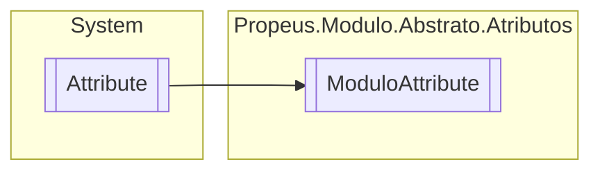

# ModuloAttribute `class`

## Description
Identificador de extremidade de um modulo

## Diagram


## Members
### Properties
#### Public  properties
| Type | Name | Methods |
| --- | --- | --- |
| `bool` | [`AutoAtualizavel`](#autoatualizavel)<br>Indica se deve ser recriado todas as instancias do modulo, caso a DLL seja alterada | `get, set` |
| `bool` | [`AutoInicializavel`](#autoinicializavel)<br>Indica se o modulo e autoinicializavel | `get, set` |

## Details
### Summary
Identificador de extremidade de um modulo

### Inheritance
 - `Attribute`

### Constructors
#### ModuloAttribute
```csharp
public ModuloAttribute()
```

### Properties
#### AutoInicializavel
```csharp
public bool AutoInicializavel { get; set; }
```
##### Summary
Indica se o modulo e autoinicializavel

#### AutoAtualizavel
```csharp
public bool AutoAtualizavel { get; set; }
```
##### Summary
Indica se deve ser recriado todas as instancias do modulo, caso a DLL seja alterada

*Generated with* [*ModularDoc*](https://github.com/hailstorm75/ModularDoc)
