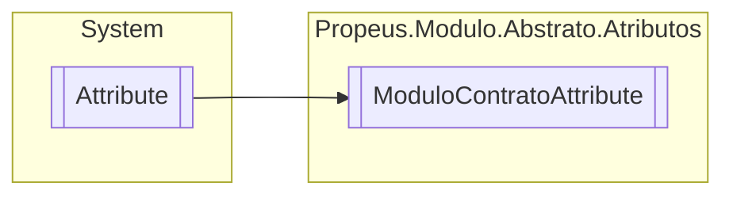

# ModuloContratoAttribute `class`

## Description
Atributo de identificação de modulo.

## Diagram


## Members
### Properties
#### Public  properties
| Type | Name | Methods |
| --- | --- | --- |
| `string` | [`Nome`](#nome)<br>Nome do modulo | `get` |
| `Type` | [`Tipo`](#tipo)<br>Tipo do modulo | `get` |

## Details
### Summary
Atributo de identificação de modulo.

### Inheritance
 - `Attribute`

### Constructors
#### ModuloContratoAttribute [1/2]
```csharp
public ModuloContratoAttribute(string nome)
```
##### Arguments
| Type | Name | Description |
| --- | --- | --- |
| `string` | nome | Nome do modulo |

##### Summary
Indica a qual modulo o contrato pertence

#### ModuloContratoAttribute [2/2]
```csharp
public ModuloContratoAttribute(Type modulo)
```
##### Arguments
| Type | Name | Description |
| --- | --- | --- |
| `Type` | modulo | Tipo do modulo |

##### Summary
Indica a qual modulo o contrato pertence

### Properties
#### Nome
```csharp
public string Nome { get; }
```
##### Summary
Nome do modulo

#### Tipo
```csharp
public Type Tipo { get; }
```
##### Summary
Tipo do modulo

##### Remarks
Esta propriedade e opcional e sera preenchida somente quando o tipo for informado no construtor do atributo

*Generated with* [*ModularDoc*](https://github.com/hailstorm75/ModularDoc)
