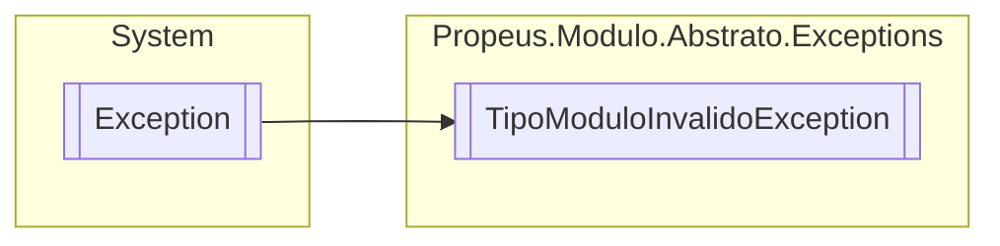

# TipoModuloInvalidoException `class`

## Description
Excecao para quando o modulo nao seguir os padroes de implementacao

## Diagram


## Details
### Summary
Excecao para quando o modulo nao seguir os padroes de implementacao

### Inheritance
 - `Exception`

### Constructors
#### TipoModuloInvalidoException
```csharp
public TipoModuloInvalidoException(string message)
```
##### Arguments
| Type | Name | Description |
| --- | --- | --- |
| `string` | message | Mensagem do erro |

##### Summary
Construtor padrao

*Generated with* [*ModularDoc*](https://github.com/hailstorm75/ModularDoc)
