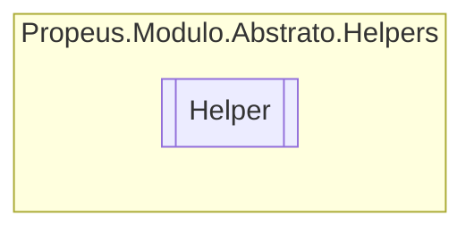

# Helper `class`

## Description
Classe estatica para ajuda

## Diagram


## Members
### Methods
#### Public Static methods
| Returns | Name |
| --- | --- |
| [`ModuloAttribute`](./propeusmoduloabstratoatributos-ModuloAttribute.md) | [`ObterModuloAtributo`](#obtermoduloatributo)(`Type` objeto)<br>Obtem o atributo [ModuloAttribute](./propeusmoduloabstratoatributos-ModuloAttribute.md) de um objeto |
| [`ModuloContratoAttribute`](./propeusmoduloabstratoatributos-ModuloContratoAttribute.md) | [`ObterModuloContratoAtributo`](#obtermodulocontratoatributo)(`Type` objeto)<br>Obtem o atributo [ModuloContratoAttribute](./propeusmoduloabstratoatributos-ModuloContratoAttribute.md) de um objeto |

## Details
### Summary
Classe estatica para ajuda

### Methods
#### ObterModuloAtributo
```csharp
public static ModuloAttribute ObterModuloAtributo(Type objeto)
```
##### Arguments
| Type | Name | Description |
| --- | --- | --- |
| `Type` | objeto | Qualquer objeto do tipo Type |

##### Summary
Obtem o atributo [ModuloAttribute](./propeusmoduloabstratoatributos-ModuloAttribute.md) de um objeto

##### Returns


##### Exceptions
| Name | Description |
| --- | --- |
| ArgumentException | Argumeto obj vazio ou nulo |
| InvalidOperationException | [ModuloAttribute](./propeusmoduloabstratoatributos-ModuloAttribute.md) não encontrado |

#### ObterModuloContratoAtributo
```csharp
public static ModuloContratoAttribute ObterModuloContratoAtributo(Type objeto)
```
##### Arguments
| Type | Name | Description |
| --- | --- | --- |
| `Type` | objeto | Qualquer objeto do tipo Type |

##### Summary
Obtem o atributo [ModuloContratoAttribute](./propeusmoduloabstratoatributos-ModuloContratoAttribute.md) de um objeto

##### Returns


##### Exceptions
| Name | Description |
| --- | --- |
| ArgumentException | Argumeto obj vazio ou nulo |
| InvalidOperationException | [ModuloContratoAttribute](./propeusmoduloabstratoatributos-ModuloContratoAttribute.md) não encontrado |

*Generated with* [*ModularDoc*](https://github.com/hailstorm75/ModularDoc)
