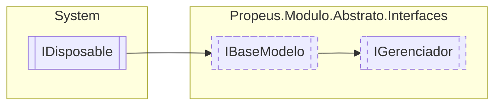

# IGerenciador `interface`

## Description
Modelo base para criação de gerenciadores

## Diagram


## Members
### Properties
#### Public  properties
| Type | Name | Methods |
| --- | --- | --- |
| `DateTime` | [`DataInicio`](#datainicio)<br>Retorna data e hora que o gerenciador iniciou | `get` |
| `int` | [`ModulosInicializados`](#modulosinicializados)<br>Indica a quantidade de modulos inicializados pelo gerenciador | `get` |
| `DateTime` | [`UltimaAtualizacao`](#ultimaatualizacao)<br>Data e hora do ultimo evento realizado no gerenciador | `get` |

### Methods
#### Public  methods
| Returns | Name |
| --- | --- |
| `T` | [`Criar`](#criar-13)(`...`) |
| `bool` | [`Existe`](#existe-13)(`...`)<br>Verifica se a instancia do modulo existe no genrenciador |
| `IEnumerable`&lt;[`IModulo`](./propeusmoduloabstratointerfaces-IModulo.md)&gt; | [`Listar`](#listar)()<br>Lista todos os modulos |
| `Task` | [`ManterVivoAsync`](#mantervivoasync)()<br>Mantem o gerenciador vivo durante o uso da aplicação |
| `T` | [`Obter`](#obter-13)(`...`) |
| `T` | [`Reciclar`](#reciclar-12)(`...`) |
| `void` | [`Remover`](#remover-12)(`...`)<br>Remove um modulo pelo seu ID |
| `void` | [`RemoverTodos`](#removertodos)()<br>Remove todos os modulos |

## Details
### Summary
Modelo base para criação de gerenciadores

### Inheritance
 - [
`IBaseModelo`
](./propeusmoduloabstratointerfaces-IBaseModelo.md)
 - `IDisposable`

### Methods
#### Criar [1/3]
```csharp
public T Criar<T>()
where T : IModulo
```

#### Criar [2/3]
```csharp
public IModulo Criar(Type modulo)
```
##### Arguments
| Type | Name | Description |
| --- | --- | --- |
| `Type` | modulo | Tipo do modulo |

##### Summary
Cria uma nova instancia do modulo usando o tipo do parametro `modulo`

##### Returns
[IModulo](./propeusmoduloabstratointerfaces-IModulo.md)

#### Criar [3/3]
```csharp
public IModulo Criar(string nomeModulo)
```
##### Arguments
| Type | Name | Description |
| --- | --- | --- |
| `string` | nomeModulo | Nome do modulo |

##### Summary
Cria uma nova instancia do modulo buscando o tipo pelo nome

##### Returns
[IModulo](./propeusmoduloabstratointerfaces-IModulo.md)

#### Remover [1/2]
```csharp
public void Remover(string id)
```
##### Arguments
| Type | Name | Description |
| --- | --- | --- |
| `string` | id | Identificação unica do modulo |

##### Summary
Remove um modulo pelo seu ID

#### Remover [2/2]
```csharp
public void Remover<T>(T modulo)
where T : IModulo
```
##### Arguments
| Type | Name | Description |
| --- | --- | --- |
| `T` | modulo |   |

#### RemoverTodos
```csharp
public void RemoverTodos()
```
##### Summary
Remove todos os modulos

#### Obter [1/3]
```csharp
public T Obter<T>()
where T : IModulo
```

#### Obter [2/3]
```csharp
public IModulo Obter(Type modulo)
```
##### Arguments
| Type | Name | Description |
| --- | --- | --- |
| `Type` | modulo | Qualquer tipo herdado de IModulo |

##### Summary
Obtem a instancia de `modulo` caso exista 


##### Returns
[IModulo](./propeusmoduloabstratointerfaces-IModulo.md)

#### Obter [3/3]
```csharp
public IModulo Obter(string id)
```
##### Arguments
| Type | Name | Description |
| --- | --- | --- |
| `string` | id | Identificação unica do modulo |

##### Summary
Obtem a instancia do modulo pelo id

##### Returns
[IModulo](./propeusmoduloabstratointerfaces-IModulo.md)

#### Existe [1/3]
```csharp
public bool Existe(IModulo modulo)
```
##### Arguments
| Type | Name | Description |
| --- | --- | --- |
| [`IModulo`](./propeusmoduloabstratointerfaces-IModulo.md) | modulo | A instancia do modulo |

##### Summary
Verifica se a instancia do modulo existe no genrenciador

##### Returns
Boolean

#### Existe [2/3]
```csharp
public bool Existe(Type modulo)
```
##### Arguments
| Type | Name | Description |
| --- | --- | --- |
| `Type` | modulo | Tipo da instancia do modulo a ser verificado |

##### Summary
Verifica se existe alguma instancia do tipo no gerenciador

##### Returns
Boolean

#### Existe [3/3]
```csharp
public bool Existe(string id)
```
##### Arguments
| Type | Name | Description |
| --- | --- | --- |
| `string` | id | Identificação unica do modulo |

##### Summary
Verifica se existe alguma instancia com o id no gerenciador

##### Returns
Boolean

#### Reciclar [1/2]
```csharp
public T Reciclar<T>(T modulo)
where T : IModulo
```
##### Arguments
| Type | Name | Description |
| --- | --- | --- |
| `T` | modulo |   |

#### Reciclar [2/2]
```csharp
public IModulo Reciclar(string id)
```
##### Arguments
| Type | Name | Description |
| --- | --- | --- |
| `string` | id | Identificação unica do modulo |

##### Summary
Realiza uma reciclagem do modulo

##### Returns
Boolean

#### Listar
```csharp
public IEnumerable<IModulo> Listar()
```
##### Summary
Lista todos os modulos

##### Returns
IEnumerable&lt;ModularDoc.Elements.Markdown.TextElement&gt;

#### ManterVivoAsync
```csharp
public Task ManterVivoAsync()
```
##### Summary
Mantem o gerenciador vivo durante o uso da aplicação

##### Returns
Task

### Properties
#### DataInicio
```csharp
public DateTime DataInicio { get; }
```
##### Summary
Retorna data e hora que o gerenciador iniciou

#### UltimaAtualizacao
```csharp
public DateTime UltimaAtualizacao { get; }
```
##### Summary
Data e hora do ultimo evento realizado no gerenciador

##### Remarks
Os eventos sao o CRUD (Criar, Reiniciar, Atualizar ou Remover) do genreciador

#### ModulosInicializados
```csharp
public int ModulosInicializados { get; }
```
##### Summary
Indica a quantidade de modulos inicializados pelo gerenciador

*Generated with* [*ModularDoc*](https://github.com/hailstorm75/ModularDoc)
