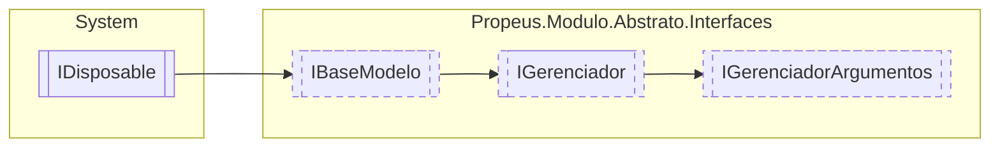

# IGerenciadorArgumentos `interface`

## Description
Interface para criar instancias de modulo passando argumentos

## Diagram


## Members
### Methods
#### Public  methods
| Returns | Name |
| --- | --- |
| `T` | [`Criar`](#criar-13)(`...`) |

## Details
### Summary
Interface para criar instancias de modulo passando argumentos

### Inheritance
 - [
`IGerenciador`
](./propeusmoduloabstratointerfaces-IGerenciador.md)
 - [
`IBaseModelo`
](./propeusmoduloabstratointerfaces-IBaseModelo.md)
 - `IDisposable`

### Methods
#### Criar [1/3]
```csharp
public T Criar<T>(object[] args)
where T : IModulo
```
##### Arguments
| Type | Name | Description |
| --- | --- | --- |
| `object``[]` | args |   |

#### Criar [2/3]
```csharp
public IModulo Criar(Type modulo, object[] args)
```
##### Arguments
| Type | Name | Description |
| --- | --- | --- |
| `Type` | modulo | Tipo do modulo |
| `object``[]` | args | Qualquer argumento necessário para o modulo |

##### Summary
Cria uma nova instancia do modulo usando o tipo do parametro `modulo`

##### Returns
[IModulo](./propeusmoduloabstratointerfaces-IModulo.md)

#### Criar [3/3]
```csharp
public IModulo Criar(string nomeModulo, object[] args)
```
##### Arguments
| Type | Name | Description |
| --- | --- | --- |
| `string` | nomeModulo | Nome do modulo |
| `object``[]` | args | Qualquer argumento necessário para o modulo |

##### Summary
Cria uma nova instancia do modulo buscando o tipo pelo nome

##### Returns
[IModulo](./propeusmoduloabstratointerfaces-IModulo.md)

*Generated with* [*ModularDoc*](https://github.com/hailstorm75/ModularDoc)
