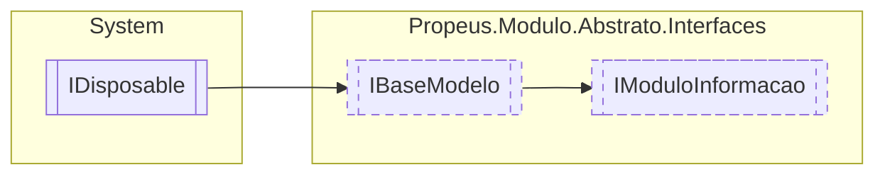

# IModuloInformacao `interface`

## Description
Interface de modelo para detalhar informações sobre o modulo

## Diagram


## Members
### Properties
#### Public  properties
| Type | Name | Methods |
| --- | --- | --- |
| `Assembly` | [`Assembly`](#assembly)<br>Assembly a qual o modulo pertence | `get` |
| `AssemblyName` | [`AssemblyName`](#assemblyname)<br>Informações sobre o assembly do modulo | `get` |
| `string` | [`Caminho`](#caminho)<br>Caminho do modulo em disco | `get` |
| [`IModuloTipo`](./propeusmoduloabstratointerfaces-IModuloTipo.md) | [`Item`](#item) | `get, set` |
| `Dictionary`&lt;`string`, [`IModuloTipo`](./propeusmoduloabstratointerfaces-IModuloTipo.md)&gt; | [`Modulos`](#modulos)<br>ModuloInformacao mapeados do assembly | `get` |
| `int` | [`ModulosCarregados`](#moduloscarregados)<br>Informa a quantidade de modulos criados. | `get` |
| `int` | [`ModulosDescobertos`](#modulosdescobertos)<br>Informa a quantidade de modulos disponiveis dentro de uma DLL | `get` |

### Methods
#### Public  methods
| Returns | Name |
| --- | --- |
| `void` | [`AdicionarContrato`](#adicionarcontrato)(`string` nomeModulo, `Type` contrato)<br>Atrela uma interface de contrato ao modulo |
| `Type` | [`CarregarTipoModulo`](#carregartipomodulo)(`string` nomeModulo)<br>Obtem o Type do modulo informado |
| `List`&lt;`Type`&gt; | [`ObterContratos`](#obtercontratos)(`string` nomeModulo)<br>Obtem as interfaces de contratos atrelados ao modulo |
| `bool` | [`PossuiModulo`](#possuimodulo)(`string` nomeModulo)<br>Indica se o modulo informado esta prensente |

## Details
### Summary
Interface de modelo para detalhar informações sobre o modulo

### Inheritance
 - [
`IBaseModelo`
](./propeusmoduloabstratointerfaces-IBaseModelo.md)
 - `IDisposable`

### Methods
#### AdicionarContrato
```csharp
public void AdicionarContrato(string nomeModulo, Type contrato)
```
##### Arguments
| Type | Name | Description |
| --- | --- | --- |
| `string` | nomeModulo | Nome do modulo que ira receber o contrato |
| `Type` | contrato | O tipo da interface de contrato |

##### Summary
Atrela uma interface de contrato ao modulo

#### CarregarTipoModulo
```csharp
public Type CarregarTipoModulo(string nomeModulo)
```
##### Arguments
| Type | Name | Description |
| --- | --- | --- |
| `string` | nomeModulo | Nome do modulo a ser obtido o Type |

##### Summary
Obtem o Type do modulo informado

##### Returns
Type

#### ObterContratos
```csharp
public List<Type> ObterContratos(string nomeModulo)
```
##### Arguments
| Type | Name | Description |
| --- | --- | --- |
| `string` | nomeModulo | Nome do modulo a ser buscado as interfaces de contrato |

##### Summary
Obtem as interfaces de contratos atrelados ao modulo

##### Returns
List&lt;ModularDoc.Elements.Markdown.TextElement&gt;

#### PossuiModulo
```csharp
public bool PossuiModulo(string nomeModulo)
```
##### Arguments
| Type | Name | Description |
| --- | --- | --- |
| `string` | nomeModulo | Nome do modulo |

##### Summary
Indica se o modulo informado esta prensente

##### Returns
Retorna caso ache o modulo, caso contrario retorna

### Properties
#### Item
```csharp
public IModuloTipo Item { get; set; }
```

#### Assembly
```csharp
public Assembly Assembly { get; }
```
##### Summary
Assembly a qual o modulo pertence

#### AssemblyName
```csharp
public AssemblyName AssemblyName { get; }
```
##### Summary
Informações sobre o assembly do modulo

#### Modulos
```csharp
public Dictionary<string, IModuloTipo> Modulos { get; }
```
##### Summary
ModuloInformacao mapeados do assembly

#### Caminho
```csharp
public string Caminho { get; }
```
##### Summary
Caminho do modulo em disco

#### ModulosDescobertos
```csharp
public int ModulosDescobertos { get; }
```
##### Summary
Informa a quantidade de modulos disponiveis dentro de uma DLL

#### ModulosCarregados
```csharp
public int ModulosCarregados { get; }
```
##### Summary
Informa a quantidade de modulos criados.

*Generated with* [*ModularDoc*](https://github.com/hailstorm75/ModularDoc)
