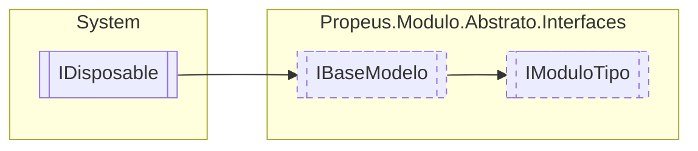

# IModuloTipo `interface`

## Description
Informa detalhes sobre o modulo instanciado

## Diagram


## Members
### Properties
#### Public  properties
| Type | Name | Methods |
| --- | --- | --- |
| `bool` | [`Coletado`](#coletado)<br>Informa se o modulo foi coletado pelo GC | `get` |
| `bool` | [`Elimindado`](#elimindado)<br>Informa se o modulo foi eliminado da aplicação | `get` |
| `string` | [`IdModulo`](#idmodulo)<br>Informa o id gerado para o modulo instanciado | `get` |
| `bool` | [`InstanciaUnica`](#instanciaunica)<br>Informa se o modulo é instancia unica | `get` |
| [`IModulo`](./propeusmoduloabstratointerfaces-IModulo.md) | [`Modulo`](#modulo)<br>Instancia do modulo | `get` |
| `Type` | [`TipoModulo`](#tipomodulo)<br>Tipo do modulo | `get` |
| `WeakReference` | [`WeakReference`](#weakreference)<br>Referencia fraca da instancia do modulo | `get` |

## Details
### Summary
Informa detalhes sobre o modulo instanciado

### Inheritance
 - [
`IBaseModelo`
](./propeusmoduloabstratointerfaces-IBaseModelo.md)
 - `IDisposable`

### Properties
#### Coletado
```csharp
public bool Coletado { get; }
```
##### Summary
Informa se o modulo foi coletado pelo GC

#### Elimindado
```csharp
public bool Elimindado { get; }
```
##### Summary
Informa se o modulo foi eliminado da aplicação

#### IdModulo
```csharp
public string IdModulo { get; }
```
##### Summary
Informa o id gerado para o modulo instanciado

#### InstanciaUnica
```csharp
public bool InstanciaUnica { get; }
```
##### Summary
Informa se o modulo é instancia unica

#### Modulo
```csharp
public IModulo Modulo { get; }
```
##### Summary
Instancia do modulo

#### TipoModulo
```csharp
public Type TipoModulo { get; }
```
##### Summary
Tipo do modulo

#### WeakReference
```csharp
public WeakReference WeakReference { get; }
```
##### Summary
Referencia fraca da instancia do modulo

*Generated with* [*ModularDoc*](https://github.com/hailstorm75/ModularDoc)
