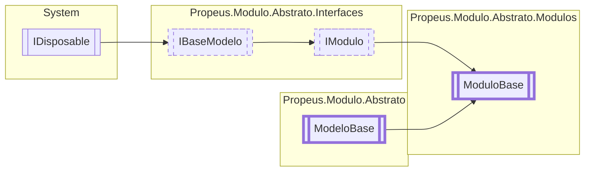

# ModuloBase `class`

## Description
Classe base para o modulo

## Diagram


## Members
### Properties
#### Public  properties
| Type | Name | Methods |
| --- | --- | --- |
| `bool` | [`InstanciaUnica`](#instanciaunica)<br>Informa se o modulo é instancia unica | `get` |

### Methods
#### Public  methods
| Returns | Name |
| --- | --- |
| `string` | [`ToString`](#tostring)()<br>Exibe informacoes basicas sobre o modulo |

## Details
### Summary
Classe base para o modulo

### Inheritance
 - [
`IModulo`
](./propeusmoduloabstratointerfaces-IModulo.md)
 - [
`IBaseModelo`
](./propeusmoduloabstratointerfaces-IBaseModelo.md)
 - `IDisposable`
 - [
`ModeloBase`
](./propeusmoduloabstrato-ModeloBase.md)

### Constructors
#### ModuloBase
```csharp
protected ModuloBase(bool instanciaUnica)
```
##### Arguments
| Type | Name | Description |
| --- | --- | --- |
| `bool` | instanciaUnica | Informa se a instancia é unica ou multipla |

##### Summary
Inicializa um modulo

### Methods
#### ToString
```csharp
public override string ToString()
```
##### Summary
Exibe informacoes basicas sobre o modulo

##### Returns


### Properties
#### InstanciaUnica
```csharp
public virtual bool InstanciaUnica { get; }
```
##### Summary
Informa se o modulo é instancia unica

*Generated with* [*ModularDoc*](https://github.com/hailstorm75/ModularDoc)
