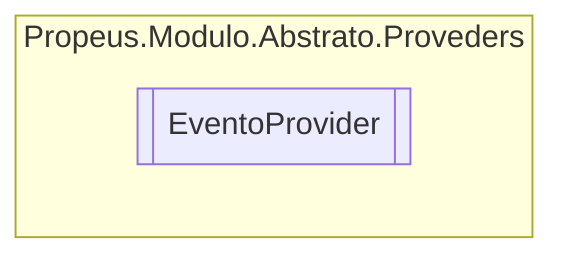

# EventoProvider `class`

## Description
Classe para disparar mensagens para os ouvintes

## Diagram


## Members
### Methods
#### Public Static methods
| Returns | Name |
| --- | --- |
| `void` | [`NotificarAviso`](#notificaraviso)(`object` fonte, `string` mensagem)<br>Envia uma informacao para os ouvintes |
| `void` | [`NotificarErro`](#notificarerro)(`object` fonte, `string` mensagem, `Exception` exception)<br>Delegate padrao |
| `void` | [`NotificarInformacao`](#notificarinformacao)(`object` fonte, `string` mensagem)<br>Envia uma informacao para os ouvintes |
| `void` | [`RegistrarOuvinteAviso`](#registrarouvinteaviso)(`Evento` ouvinte) |
| `void` | [`RegistrarOuvinteErro`](#registrarouvinteerro)(`Evento` ouvinte) |
| `void` | [`RegistrarOuvinteInformacao`](#registrarouvinteinformacao)(`Evento` ouvinte) |

## Details
### Summary
Classe para disparar mensagens para os ouvintes

### Methods
#### NotificarInformacao
```csharp
public static void NotificarInformacao(object fonte, string mensagem)
```
##### Arguments
| Type | Name | Description |
| --- | --- | --- |
| `object` | fonte | Tipo do objeto que esta distribuindo a mensagem |
| `string` | mensagem | Conteudo |

##### Summary
Envia uma informacao para os ouvintes

#### NotificarAviso
```csharp
public static void NotificarAviso(object fonte, string mensagem)
```
##### Arguments
| Type | Name | Description |
| --- | --- | --- |
| `object` | fonte | Tipo do objeto que esta distribuindo a mensagem |
| `string` | mensagem | Conteudo |

##### Summary
Envia uma informacao para os ouvintes

#### NotificarErro
```csharp
public static void NotificarErro(object fonte, string mensagem, Exception exception)
```
##### Arguments
| Type | Name | Description |
| --- | --- | --- |
| `object` | fonte | Tipo do objeto que esta distribuindo a mensagem |
| `string` | mensagem | Conteudo |
| `Exception` | exception | Excecao se houver |

##### Summary
Delegate padrao

#### RegistrarOuvinteInformacao
```csharp
public static void RegistrarOuvinteInformacao(Evento ouvinte)
```
##### Arguments
| Type | Name | Description |
| --- | --- | --- |
| `Evento` | ouvinte |   |

#### RegistrarOuvinteAviso
```csharp
public static void RegistrarOuvinteAviso(Evento ouvinte)
```
##### Arguments
| Type | Name | Description |
| --- | --- | --- |
| `Evento` | ouvinte |   |

#### RegistrarOuvinteErro
```csharp
public static void RegistrarOuvinteErro(Evento ouvinte)
```
##### Arguments
| Type | Name | Description |
| --- | --- | --- |
| `Evento` | ouvinte |   |

### Events
#### OnInfo
```csharp
internal static event Evento OnInfo
```

#### OnAviso
```csharp
internal static event Evento OnAviso
```

#### OnErro
```csharp
internal static event Evento OnErro
```

### Delegates
#### Evento
```csharp
public delegate void Evento(Type fonte, string mensagem, Exception exception)
```
##### Arguments
| Type | Name | Description |
| --- | --- | --- |
| `Type` | fonte |   |
| `string` | mensagem |   |
| `Exception` | exception |   |

*Generated with* [*ModularDoc*](https://github.com/hailstorm75/ModularDoc)
