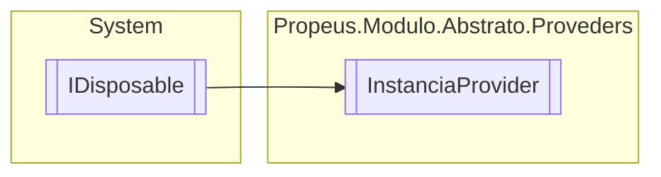

# InstanciaProvider `class`

## Description
Provedor de instancias

## Diagram


## Members
### Properties
#### Public Static properties
| Type | Name | Methods |
| --- | --- | --- |
| [`InstanciaProvider`](propeusmoduloabstratoproveders-InstanciaProvider.md) | [`Provider`](#provider) | `get` |

#### Public  properties
| Type | Name | Methods |
| --- | --- | --- |
| `int` | [`ModulosAtivos`](#modulosativos) | `get` |
| `int` | [`ModulosRegistrados`](#modulosregistrados) | `get` |

### Methods
#### Public  methods
| Returns | Name |
| --- | --- |
| [`IModulo`](./propeusmoduloabstratointerfaces-IModulo.md) | [`Create`](#create)(`Type` type, `object``[]` args)<br>Cria uma nova instancia do modulo |
| `void` | [`Dispose`](#dispose-22)() |
| `void` | [`Flush`](#flush)()<br>Desliga e remove todos os modulos do provedor. |
| `IEnumerable`&lt;[`IModuloTipo`](./propeusmoduloabstratointerfaces-IModuloTipo.md)&gt; | [`Get`](#get)()<br>Retorna todos os modulos ativos |
| [`IModuloTipo`](./propeusmoduloabstratointerfaces-IModuloTipo.md) | [`GetById`](#getbyid)(`string` id)<br>Obtem o modulo pelo id informado |
| [`IModuloTipo`](./propeusmoduloabstratointerfaces-IModuloTipo.md) | [`GetByName`](#getbyname)(`string` name)<br>Obtem o modulo pelo nome do modulo |
| `bool` | [`HasById`](#hasbyid)(`string` id)<br>Verifica se existe algum modulo com o id informado |
| `bool` | [`HasByName`](#hasbyname)(`string` name)<br>Verifica se existe algum modulo pelo nome |
| `bool` | [`HasCache`](#hascache)(`string` name)<br>Verifica se o tipo informado esta em cache |
| `void` | [`Register`](#register)([`IModulo`](./propeusmoduloabstratointerfaces-IModulo.md) modulo)<br>Registra um novo modulo no provider |
| `bool` | [`Remove`](#remove)([`IModulo`](./propeusmoduloabstratointerfaces-IModulo.md) modulo)<br>Desliga e remove o modulo do provedor |
| `bool` | [`RemoveById`](#removebyid)(`string` id)<br>Desliga e remove o modulo pelo id |

#### Protected  methods
| Returns | Name |
| --- | --- |
| `void` | [`Dispose`](#dispose-12)(`bool` disposing) |

## Details
### Summary
Provedor de instancias

### Remarks
Com grandes poderes ha grandes merdas

### Inheritance
 - `IDisposable`

### Constructors
#### InstanciaProvider
```csharp
public InstanciaProvider()
```

### Methods
#### HasCache
```csharp
public bool HasCache(string name)
```
##### Arguments
| Type | Name | Description |
| --- | --- | --- |
| `string` | name | Nome do modulo |

##### Summary
Verifica se o tipo informado esta em cache

##### Returns
caso exista

#### HasByName
```csharp
public bool HasByName(string name)
```
##### Arguments
| Type | Name | Description |
| --- | --- | --- |
| `string` | name | Nome do modulo |

##### Summary
Verifica se existe algum modulo pelo nome

##### Returns
caso exista

#### HasById
```csharp
public bool HasById(string id)
```
##### Arguments
| Type | Name | Description |
| --- | --- | --- |
| `string` | id | Id do modulo |

##### Summary
Verifica se existe algum modulo com o id informado

##### Returns
caso exista

#### GetById
```csharp
public IModuloTipo GetById(string id)
```
##### Arguments
| Type | Name | Description |
| --- | --- | --- |
| `string` | id | Id do modulo |

##### Summary
Obtem o modulo pelo id informado

##### Returns
[IModuloTipo](./propeusmoduloabstratointerfaces-IModuloTipo.md) caso exista senao retorna

#### GetByName
```csharp
public IModuloTipo GetByName(string name)
```
##### Arguments
| Type | Name | Description |
| --- | --- | --- |
| `string` | name | Nome do modulo |

##### Summary
Obtem o modulo pelo nome do modulo

##### Returns
[IModuloTipo](./propeusmoduloabstratointerfaces-IModuloTipo.md) caso exista senao retorna

#### Get
```csharp
public IEnumerable<IModuloTipo> Get()
```
##### Summary
Retorna todos os modulos ativos

##### Returns


#### Register
```csharp
public void Register(IModulo modulo)
```
##### Arguments
| Type | Name | Description |
| --- | --- | --- |
| [`IModulo`](./propeusmoduloabstratointerfaces-IModulo.md) | modulo | Instancia do modulo |

##### Summary
Registra um novo modulo no provider

##### Exceptions
| Name | Description |
| --- | --- |
| InvalidOperationException | Caso ja exista um registro de um mesmo modulo marcado como instancia unica |

#### Create
```csharp
public IModulo Create(Type type, object[] args)
```
##### Arguments
| Type | Name | Description |
| --- | --- | --- |
| `Type` | type | Tipo do modulo |
| `object``[]` | args | Argumentos para o construtor do modulo |

##### Summary
Cria uma nova instancia do modulo

##### Returns
Instancia do modulo

##### Exceptions
| Name | Description |
| --- | --- |
| [ModuloInstanciaUnicaException](./propeusmoduloabstratoexceptions-ModuloInstanciaUnicaException.md) | Caso ja exista um mesmo tipo como instancia unica |

#### Remove
```csharp
public bool Remove(IModulo modulo)
```
##### Arguments
| Type | Name | Description |
| --- | --- | --- |
| [`IModulo`](./propeusmoduloabstratointerfaces-IModulo.md) | modulo | Instancia do modulo |

##### Summary
Desliga e remove o modulo do provedor

##### Returns
Retorna caso tenha sido removido com sucesso, caso contrario

#### RemoveById
```csharp
public bool RemoveById(string id)
```
##### Arguments
| Type | Name | Description |
| --- | --- | --- |
| `string` | id | Id do modulo em execucao |

##### Summary
Desliga e remove o modulo pelo id

##### Returns
Retorna caso tenha sido removido com sucesso, caso contrario

#### Flush
```csharp
public void Flush()
```
##### Summary
Desliga e remove todos os modulos do provedor.

##### Remarks
Use com sabedoria

#### Dispose [1/2]
```csharp
protected virtual void Dispose(bool disposing)
```
##### Arguments
| Type | Name | Description |
| --- | --- | --- |
| `bool` | disposing |   |

#### Dispose [2/2]
```csharp
public virtual void Dispose()
```

### Properties
#### Provider
```csharp
public static InstanciaProvider Provider { get; }
```

#### ModulosRegistrados
```csharp
public int ModulosRegistrados { get; }
```

#### ModulosAtivos
```csharp
public int ModulosAtivos { get; }
```

*Generated with* [*ModularDoc*](https://github.com/hailstorm75/ModularDoc)
