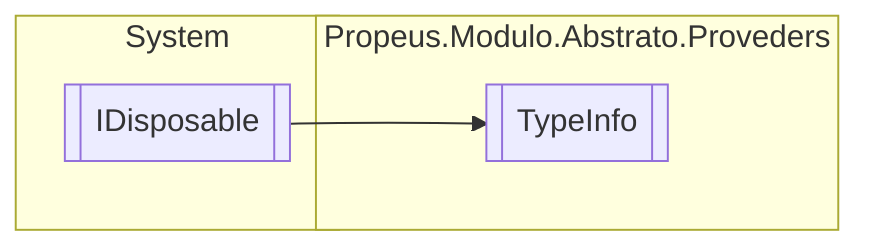

# TypeInfo `class`

## Description
Informacoes do tipo

## Diagram


## Members
### Properties
#### Public  properties
| Type | Name | Methods |
| --- | --- | --- |
| `DateTime` | [`Criado`](#criado) | `get` |
| `int` | [`QuantidadeReferencia`](#quantidadereferencia) | `get` |
| `WeakReference`&lt;`Type`&gt; | [`Referencia`](#referencia) | `get` |
| `Nullable`&lt;`DateTime`&gt; | [`UltimaModificacao`](#ultimamodificacao) | `get` |

### Methods
#### Public  methods
| Returns | Name |
| --- | --- |
| `void` | [`AdicionarContrato`](#adicionarcontrato)(`Type` contrato) |
| `void` | [`AtualizarReferencia`](#atualizarreferencia)(`Type` type) |
| `void` | [`Dispose`](#dispose-22)() |
| `Type` | [`GetReference`](#getreference)() |
| `IEnumerable`&lt;`Type`&gt; | [`ObterContratos`](#obtercontratos)() |

#### Protected  methods
| Returns | Name |
| --- | --- |
| `void` | [`Dispose`](#dispose-12)(`bool` disposing) |

## Details
### Summary
Informacoes do tipo

### Inheritance
 - `IDisposable`

### Constructors
#### TypeInfo
```csharp
public TypeInfo(Type type)
```
##### Arguments
| Type | Name | Description |
| --- | --- | --- |
| `Type` | type |   |

### Methods
#### AdicionarContrato
```csharp
public void AdicionarContrato(Type contrato)
```
##### Arguments
| Type | Name | Description |
| --- | --- | --- |
| `Type` | contrato |   |

#### ObterContratos
```csharp
public IEnumerable<Type> ObterContratos()
```

#### AtualizarReferencia
```csharp
public void AtualizarReferencia(Type type)
```
##### Arguments
| Type | Name | Description |
| --- | --- | --- |
| `Type` | type |   |

#### GetReference
```csharp
public Type GetReference()
```

#### Dispose [1/2]
```csharp
protected virtual void Dispose(bool disposing)
```
##### Arguments
| Type | Name | Description |
| --- | --- | --- |
| `bool` | disposing |   |

#### Dispose [2/2]
```csharp
public virtual void Dispose()
```

### Properties
#### Referencia
```csharp
public WeakReference<Type> Referencia { get; }
```

#### QuantidadeReferencia
```csharp
public int QuantidadeReferencia { get; }
```

#### Criado
```csharp
public DateTime Criado { get; }
```

#### UltimaModificacao
```csharp
public Nullable<DateTime> UltimaModificacao { get; }
```

*Generated with* [*ModularDoc*](https://github.com/hailstorm75/ModularDoc)
