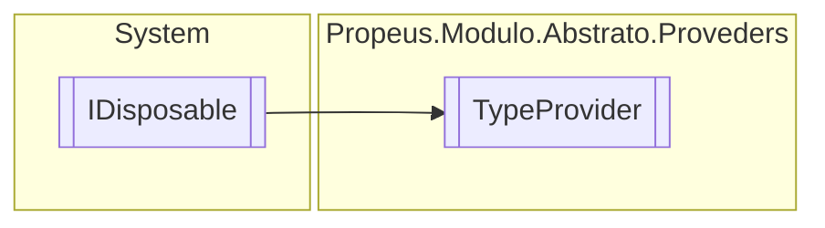

# TypeProvider `class`

## Description
Gerecia todas os tipos da aplicacao

## Diagram


## Members
### Properties
#### Public Static properties
| Type | Name | Methods |
| --- | --- | --- |
| [`TypeProvider`](propeusmoduloabstratoproveders-TypeProvider.md) | [`Provider`](#provider)<br>Obtem um provedor de tipos existente ou cria um novo | `get` |

### Methods
#### Public  methods
| Returns | Name |
| --- | --- |
| `void` | [`AddOrUpdate`](#addorupdate)(`Type` type)<br>Adiciona ou subistitui um tipo existente |
| `void` | [`AdicionarContrato`](#adicionarcontrato)(`Type` tipo, `Type` contrato)<br>Adiciona uma nova interface de contrato no tipo informado |
| `void` | [`Dispose`](#dispose-22)()<br>Remove todos os tipos carregados em memoria |
| `Type` | [`Get`](#get)(`string` name)<br>Retorna chave tipo pelo nome |
| `IEnumerable`&lt;`Type`&gt; | [`ObterAutoInicializavel`](#obterautoinicializavel)()<br>Obtem todos os tipos que estao marcados com chave atributo [ModuloAttribute](./propeusmoduloabstratoatributos-ModuloAttribute.md).AutoInicializavel |
| `IEnumerable`&lt;`Type`&gt; | [`ObterContratos`](#obtercontratos)(`Type` tipo)<br>Obtem todos os contratos pelo tipo informado |
| `IEnumerable`&lt;`Type`&gt; | [`ObterModuoController`](#obtermoduocontroller)()<br>Obtem todos os tipos que sao controllers |

#### Protected  methods
| Returns | Name |
| --- | --- |
| `void` | [`Dispose`](#dispose-12)(`bool` disposing)<br>Remove todos os tipo carregados em memoria |

## Details
### Summary
Gerecia todas os tipos da aplicacao

### Inheritance
 - `IDisposable`

### Methods
#### ObterAutoInicializavel
```csharp
public IEnumerable<Type> ObterAutoInicializavel()
```
##### Summary
Obtem todos os tipos que estao marcados com chave atributo [ModuloAttribute](./propeusmoduloabstratoatributos-ModuloAttribute.md).AutoInicializavel

##### Returns
Lista de tipos auto inicializavel

#### ObterModuoController
```csharp
public IEnumerable<Type> ObterModuoController()
```
##### Summary
Obtem todos os tipos que sao controllers

##### Returns
Lista de controllers

#### ObterContratos
```csharp
public IEnumerable<Type> ObterContratos(Type tipo)
```
##### Arguments
| Type | Name | Description |
| --- | --- | --- |
| `Type` | tipo | Tipo que sera obtido os contratos |

##### Summary
Obtem todos os contratos pelo tipo informado

##### Returns
Lista de contratos

#### AdicionarContrato
```csharp
public void AdicionarContrato(Type tipo, Type contrato)
```
##### Arguments
| Type | Name | Description |
| --- | --- | --- |
| `Type` | tipo | Tipo que ira receber chave contrato |
| `Type` | contrato | Interface de contrato |

##### Summary
Adiciona uma nova interface de contrato no tipo informado

#### AddOrUpdate
```csharp
public void AddOrUpdate(Type type)
```
##### Arguments
| Type | Name | Description |
| --- | --- | --- |
| `Type` | type | Tipo a ser adicionado ou atualizado |

##### Summary
Adiciona ou subistitui um tipo existente

#### Get
```csharp
public Type Get(string name)
```
##### Arguments
| Type | Name | Description |
| --- | --- | --- |
| `string` | name | Nome do tipo |

##### Summary
Retorna chave tipo pelo nome

##### Returns
Retorna chave tipo do modulo se houver, caso contrario,

#### Dispose [1/2]
```csharp
protected virtual void Dispose(bool disposing)
```
##### Arguments
| Type | Name | Description |
| --- | --- | --- |
| `bool` | disposing | Indica se deve ser liberado os objetos gerenciaveis da memoria |

##### Summary
Remove todos os tipo carregados em memoria

#### Dispose [2/2]
```csharp
public virtual void Dispose()
```
##### Summary
Remove todos os tipos carregados em memoria

### Properties
#### Provider
```csharp
public static TypeProvider Provider { get; }
```
##### Summary
Obtem um provedor de tipos existente ou cria um novo

### Events
#### OnUpdate
```csharp
public event Update OnUpdate
```

#### OnRegister
```csharp
public event Register OnRegister
```

#### OnRemove
```csharp
public event Remove OnRemove
```

### Delegates
#### Update
```csharp
public delegate void Update(Type antigo, Type novo)
```
##### Arguments
| Type | Name | Description |
| --- | --- | --- |
| `Type` | antigo |   |
| `Type` | novo |   |

#### Register
```csharp
public delegate void Register(Type novo)
```
##### Arguments
| Type | Name | Description |
| --- | --- | --- |
| `Type` | novo |   |

#### Remove
```csharp
public delegate void Remove(Type novo)
```
##### Arguments
| Type | Name | Description |
| --- | --- | --- |
| `Type` | novo |   |

*Generated with* [*ModularDoc*](https://github.com/hailstorm75/ModularDoc)
