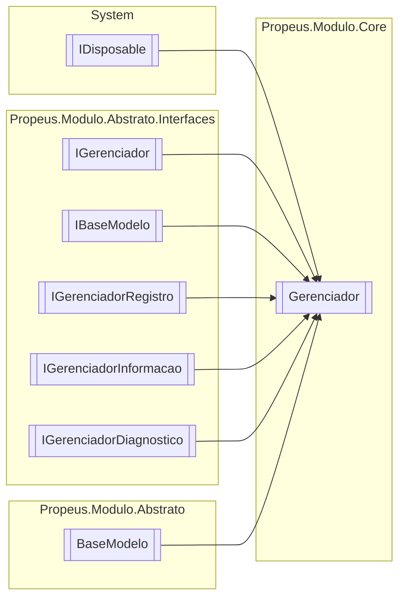

# Gerenciador `class`

## Description
Controlador de modulos

## Diagram


## Members
### Properties
#### Public Static properties
| Type | Name | Methods |
| --- | --- | --- |
| `IGerenciador` | [`Atual`](#atual) | `get` |

#### Public  properties
| Type | Name | Methods |
| --- | --- | --- |
| `DateTime` | [`DataInicio`](#datainicio) | `get` |
| `int` | [`ModulosInicializados`](#modulosinicializados) | `get` |
| `DateTime` | [`UltimaAtualizacao`](#ultimaatualizacao) | `get` |

### Methods
#### Public  methods
| Returns | Name |
| --- | --- |
| `IModulo` | [`Criar`](#criar-13)(`...`) |
| `bool` | [`Existe`](#existe-13)(`...`) |
| `IEnumerable`&lt;`IModulo`&gt; | [`Listar`](#listar)() |
| `Task` | [`ManterVivoAsync`](#mantervivoasync)() |
| `IModulo` | [`Obter`](#obter-13)(`...`) |
| `IModuloTipo` | [`ObterInfo`](#obterinfo-13)(`...`) |
| `T` | [`Reciclar`](#reciclar-12)(`...`) |
| `void` | [`Registrar`](#registrar)(`IModulo` modulo) |
| `void` | [`Remover`](#remover-12)(`...`) |
| `void` | [`RemoverTodos`](#removertodos)() |
| `string` | [`ToString`](#tostring)() |

#### Protected  methods
| Returns | Name |
| --- | --- |
| `void` | [`Dispose`](#dispose)(`bool` disposing) |

## Details
### Summary
Controlador de modulos

### Inheritance
 - `IGerenciador`
 - `IBaseModelo`
 - `IDisposable`
 - `IGerenciadorRegistro`
 - `IGerenciadorInformacao`
 - `IGerenciadorDiagnostico`
 - `BaseModelo`

### Methods
#### Criar [1/3]
```csharp
public virtual IModulo Criar(string nomeModulo)
```
##### Arguments
| Type | Name | Description |
| --- | --- | --- |
| `string` | nomeModulo |   |

##### Example
Exemplo para criar um modulo com contrato
            
            Exemplo de codigo do contrato
```csharp
using Propeus.Modulo.Abstrato.Atributos;
 
 namespace Propeus.Modulo.Exemplo
 {
     [ModuloContrato(typeof(CalculadoraModulo))]
     public interface ICalculadoraModuloContrato : IModulo
     {
         public int Calcular(int a, int b);
     }
 }
 
```
Exemplo de codigo do modulo
```csharp
using Propeus.Modulo.Abstrato.Atributos;

 namespace Propeus.Modulo.Exemplo
 {
     [Modulo]
     public class CalculadoraModulo : ICalculadoraModuloContrato
     {
     
         public ModuloTesteA(IGerenciador gerenciador) : base(gerenciador, false)
         {
         
         }
         
         public int Calcular(int a, int b)
         {
 return a+b;
         }
     }
 }
 
```
Exemplo de como criar uma instancia do modulo
```csharp
using System;
using Propeus.Modulo.Core.Gerenciador

namespace Propeus.Modulo.Exemplo
{
    internal class Program
    {
        private static void Main(string[] args)
        {
            using(Gerenciador gerenciador = Gereciador.Atual)
            {
   ICalculadoraModuloContrato modulo =  (ICalculadoraModuloContrato)gerenciador.Criar("ICalculadoraModuloContrato");
   Console.WriteLine(modulo.Calcular(1,1));
            }
        }
    }
            }

```

##### Exceptions
| Name | Description |
| --- | --- |
| ArgumentNullException | Parametro nulo |
| [TipoModuloInvalidoException](./propeusmodulocoreexceptions-TipoModuloInvalidoException.md) | Tipo do modulo invalido |
| [TipoModuloInvalidoException](./propeusmodulocoreexceptions-TipoModuloInvalidoException.md) | Tipo do modulo nao herdado de IModulo |
| [TipoModuloInvalidoException](./propeusmodulocoreexceptions-TipoModuloInvalidoException.md) | Tipo do modulo nao possui o atributo ModuloAttribute |
| [TipoModuloInvalidoException](./propeusmodulocoreexceptions-TipoModuloInvalidoException.md) | Parametro do construtor nao e um modulo valido |
| [ModuloContratoNaoEncontratoException](./propeusmodulocoreexceptions-ModuloContratoNaoEncontratoException.md) | Tipo da interface de contrato nao possui o atributo ModuloContratoAttribute |
| [TipoModuloNaoEncontradoException](./propeusmodulocoreexceptions-TipoModuloNaoEncontradoException.md) | Tipo nao encontrado pelo nome no atributo ModuloContratoAttribute |
| [TipoModuloNaoEncontradoException](./propeusmodulocoreexceptions-TipoModuloNaoEncontradoException.md) | Tipo ausente no atributo ModuloContratoAttribute |
| [TipoModuloAmbiguoException](./propeusmodulocoreexceptions-TipoModuloAmbiguoException.md) | Mais um tipo de mesmo nome |
| [ModuloInstanciaUnicaException](./propeusmodulocoreexceptions-ModuloInstanciaUnicaException.md) | Criacao de mais de uma instancia de modulo definido como instancia unica |
| [ModuloConstrutorAusenteException](./propeusmodulocoreexceptions-ModuloConstrutorAusenteException.md) | Construtor ausente no modulo |

#### Criar [2/3]
```csharp
public virtual T Criar<T>()
where T : IModulo
```

#### Criar [3/3]
```csharp
public virtual IModulo Criar(Type modulo)
```
##### Arguments
| Type | Name | Description |
| --- | --- | --- |
| `Type` | modulo |   |

##### Example
Exemplo para criar um modulo com contrato
            
            Exemplo de codigo do contrato
```csharp
using Propeus.Modulo.Abstrato.Atributos;
 
 namespace Propeus.Modulo.Exemplo
 {
     [ModuloContrato(typeof(CalculadoraModulo))]
     public interface ICalculadoraModuloContrato : IModulo
     {
         public int Calcular(int a, int b);
     }
 }
 
```
Exemplo de codigo do modulo
```csharp
using Propeus.Modulo.Abstrato.Atributos;

 namespace Propeus.Modulo.Exemplo
 {
     [Modulo]
     public class CalculadoraModulo : ICalculadoraModuloContrato
     {
     
         public ModuloTesteA(IGerenciador gerenciador) : base(gerenciador, false)
         {
         
         }
         
         public int Calcular(int a, int b)
         {
 return a+b;
         }
     }
 }
 
```
Exemplo de como criar uma instancia do modulo
```csharp
using System;
using Propeus.Modulo.Core.Gerenciador

namespace Propeus.Modulo.Exemplo
{
    internal class Program
    {
        private static void Main(string[] args)
        {
            using(Gerenciador gerenciador = Gereciador.Atual)
            {
   ICalculadoraModuloContrato modulo = (ICalculadoraModuloContrato)gerenciador.Criar(typeof(ICalculadoraModuloContrato));
   Console.WriteLine(modulo.Calcular(1,1));
            }
        }
    }
            }

```

##### Exceptions
| Name | Description |
| --- | --- |
| ArgumentNullException | Parametro nulo |
| [TipoModuloInvalidoException](./propeusmodulocoreexceptions-TipoModuloInvalidoException.md) | Tipo do modulo invalido |
| [TipoModuloInvalidoException](./propeusmodulocoreexceptions-TipoModuloInvalidoException.md) | Tipo do modulo nao herdado de IModulo |
| [TipoModuloInvalidoException](./propeusmodulocoreexceptions-TipoModuloInvalidoException.md) | Tipo do modulo nao possui o atributo ModuloAttribute |
| [TipoModuloInvalidoException](./propeusmodulocoreexceptions-TipoModuloInvalidoException.md) | Parametro do construtor nao e um modulo valido |
| [ModuloContratoNaoEncontratoException](./propeusmodulocoreexceptions-ModuloContratoNaoEncontratoException.md) | Tipo da interface de contrato nao possui o atributo ModuloContratoAttribute |
| [TipoModuloNaoEncontradoException](./propeusmodulocoreexceptions-TipoModuloNaoEncontradoException.md) | Tipo nao encontrado pelo nome no atributo ModuloContratoAttribute |
| [TipoModuloNaoEncontradoException](./propeusmodulocoreexceptions-TipoModuloNaoEncontradoException.md) | Tipo ausente no atributo ModuloContratoAttribute |
| [ModuloInstanciaUnicaException](./propeusmodulocoreexceptions-ModuloInstanciaUnicaException.md) | Criacao de mais de uma instancia de modulo definido como instancia unica |
| [ModuloConstrutorAusenteException](./propeusmodulocoreexceptions-ModuloConstrutorAusenteException.md) | Construtor ausente no modulo |

#### Existe [1/3]
```csharp
public virtual bool Existe(Type type)
```
##### Arguments
| Type | Name | Description |
| --- | --- | --- |
| `Type` | type |   |

##### Example
Exemplo para criar um modulo com contrato
            
            Exemplo de codigo do contrato
```csharp
using Propeus.Modulo.Abstrato.Atributos;
 
 namespace Propeus.Modulo.Exemplo
 {
     [ModuloContrato(typeof(CalculadoraModulo))]
     public interface ICalculadoraModuloContrato : IModulo
     {
         public int Calcular(int a, int b);
     }
 }
 
```
Exemplo de codigo do modulo
```csharp
using Propeus.Modulo.Abstrato.Atributos;

 namespace Propeus.Modulo.Exemplo
 {
     [Modulo]
     public class CalculadoraModulo : ICalculadoraModuloContrato
     {
     
         public ModuloTesteA(IGerenciador gerenciador) : base(gerenciador, false)
         {
         
         }
         
         public int Calcular(int a, int b)
         {
 return a+b;
         }
     }
 }
 
```
Exemplo de como verificar uma instancia do modulo pelo tipo
```csharp
using System;
using Propeus.Modulo.Core.Gerenciador

namespace Propeus.Modulo.Exemplo
{
    internal class Program
    {
        private static void Main(string[] args)
        {
            using(Gerenciador gerenciador = Gereciador.Atual)
            {
   ICalculadoraModuloContrato modulo = (ICalculadoraModuloContrato)gerenciador.Criar(typeof(ICalculadoraModuloContrato));
   Console.WriteLine(gerenciador.Existe(typeof(ICalculadoraModuloContrato)));
            }
        }
    }
            }

```

##### Exceptions
| Name | Description |
| --- | --- |
| ArgumentNullException | Parametro nulo |
| [TipoModuloInvalidoException](./propeusmodulocoreexceptions-TipoModuloInvalidoException.md) | Tipo do modulo invalido |
| [ModuloContratoNaoEncontratoException](./propeusmodulocoreexceptions-ModuloContratoNaoEncontratoException.md) | Tipo da interface de contrato nao possui o atributo ModuloContratoAttribute |

#### Existe [2/3]
```csharp
public virtual bool Existe(IModulo modulo)
```
##### Arguments
| Type | Name | Description |
| --- | --- | --- |
| `IModulo` | modulo |   |

##### Example
Exemplo para criar um modulo com contrato
            
            Exemplo de codigo do contrato
```csharp
using Propeus.Modulo.Abstrato.Atributos;
 
 namespace Propeus.Modulo.Exemplo
 {
     [ModuloContrato(typeof(CalculadoraModulo))]
     public interface ICalculadoraModuloContrato : IModulo
     {
         public int Calcular(int a, int b);
     }
 }
 
```
Exemplo de codigo do modulo
```csharp
using Propeus.Modulo.Abstrato.Atributos;

 namespace Propeus.Modulo.Exemplo
 {
     [Modulo]
     public class CalculadoraModulo : ICalculadoraModuloContrato
     {
     
         public ModuloTesteA(IGerenciador gerenciador) : base(gerenciador, false)
         {
         
         }
         
         public int Calcular(int a, int b)
         {
 return a+b;
         }
     }
 }
 
```
Exemplo de como verificar uma instancia do modulo
```csharp
using System;
using Propeus.Modulo.Core.Gerenciador

namespace Propeus.Modulo.Exemplo
{
    internal class Program
    {
        private static void Main(string[] args)
        {
            using(Gerenciador gerenciador = Gereciador.Atual)
            {
   ICalculadoraModuloContrato modulo = (ICalculadoraModuloContrato)gerenciador.Criar(typeof(ICalculadoraModuloContrato));
   Console.WriteLine(gerenciador.Existe(modulo));
            }
        }
    }
            }

```

##### Exceptions
| Name | Description |
| --- | --- |
| ArgumentNullException | Parametro nulo |

#### Existe [3/3]
```csharp
public virtual bool Existe(string id)
```
##### Arguments
| Type | Name | Description |
| --- | --- | --- |
| `string` | id |   |

##### Example
Exemplo para criar um modulo com contrato
            
            Exemplo de codigo do contrato
```csharp
using Propeus.Modulo.Abstrato.Atributos;
 
 namespace Propeus.Modulo.Exemplo
 {
     [ModuloContrato(typeof(CalculadoraModulo))]
     public interface ICalculadoraModuloContrato : IModulo
     {
         public int Calcular(int a, int b);
     }
 }
 
```
Exemplo de codigo do modulo
```csharp
using Propeus.Modulo.Abstrato.Atributos;
            
namespace Propeus.Modulo.Exemplo
{
    [Modulo]
    public class CalculadoraModulo : ICalculadoraModuloContrato
    {
    
        public ModuloTesteA(IGerenciador gerenciador) : base(gerenciador, false)
        {
        
        }
        
        public int Calcular(int a, int b)
        {
            return a+b;
        }
    }
}

```
Exemplo de como verificar uma instancia do modulo pelo id
```csharp
using System;
using Propeus.Modulo.Core.Gerenciador

namespace Propeus.Modulo.Exemplo
{
    internal class Program
    {
        private static void Main(string[] args)
        {
            using(Gerenciador gerenciador = Gereciador.Atual)
            {
   ICalculadoraModuloContrato modulo = (ICalculadoraModuloContrato)gerenciador.Criar(typeof(ICalculadoraModuloContrato));
   Console.WriteLine(gerenciador.Existe(modulo.Id));
            }
        }
    }
            }

```

##### Exceptions
| Name | Description |
| --- | --- |
| ArgumentNullException | Parametro nulo |

#### ObterInfo [1/3]
```csharp
public virtual IModuloTipo ObterInfo(Type modulo)
```
##### Arguments
| Type | Name | Description |
| --- | --- | --- |
| `Type` | modulo |   |

##### Example
Exemplo para criar um modulo com contrato
            
            Exemplo de codigo do contrato
```csharp
using Propeus.Modulo.Abstrato.Atributos;
 
 namespace Propeus.Modulo.Exemplo
 {
     [ModuloContrato(typeof(CalculadoraModulo))]
     public interface ICalculadoraModuloContrato : IModulo
     {
         public int Calcular(int a, int b);
     }
 }
 
```
Exemplo de codigo do modulo
```csharp
using Propeus.Modulo.Abstrato.Atributos;
            
namespace Propeus.Modulo.Exemplo
{
    [Modulo]
    public class CalculadoraModulo : ICalculadoraModuloContrato
    {
    
        public ModuloTesteA(IGerenciador gerenciador) : base(gerenciador, false)
        {
        
        }
        
        public int Calcular(int a, int b)
        {
            return a+b;
        }
    }
}

```
Exemplo de como obter informacoes de uma instancia do modulo pelo typo
```csharp
using System;
using Propeus.Modulo.Core.Gerenciador

namespace Propeus.Modulo.Exemplo
{
    internal class Program
    {
        private static void Main(string[] args)
        {
            using(Gerenciador gerenciador = Gereciador.Atual)
            {
   ICalculadoraModuloContrato modulo = (ICalculadoraModuloContrato)gerenciador.Criar(typeof(ICalculadoraModuloContrato));
   Console.WriteLine((gerenciador as IGerenciadorInformacao).ObterInfo(typeof(ICalculadoraModuloContrato)));
            }
        }
    }
            }

```

##### Exceptions
| Name | Description |
| --- | --- |
| ArgumentNullException | Parametro nulo |
| [TipoModuloInvalidoException](./propeusmodulocoreexceptions-TipoModuloInvalidoException.md) | Tipo do modulo invalido |
| [ModuloContratoNaoEncontratoException](./propeusmodulocoreexceptions-ModuloContratoNaoEncontratoException.md) | Tipo da interface de contrato nao possui o atributo ModuloContratoAttribute |
| [ModuloNaoEncontradoException](./propeusmodulocoreexceptions-ModuloNaoEncontradoException.md) | Instancia do modulo nao foi encontrado |

#### ObterInfo [2/3]
```csharp
public virtual IModuloTipo ObterInfo<T>()
where T : IModulo
```

#### ObterInfo [3/3]
```csharp
public virtual IModuloTipo ObterInfo(string id)
```
##### Arguments
| Type | Name | Description |
| --- | --- | --- |
| `string` | id |   |

##### Example
Exemplo para criar um modulo com contrato
            
            Exemplo de codigo do contrato
```csharp
using Propeus.Modulo.Abstrato.Atributos;
 
 namespace Propeus.Modulo.Exemplo
 {
     [ModuloContrato(typeof(CalculadoraModulo))]
     public interface ICalculadoraModuloContrato : IModulo
     {
         public int Calcular(int a, int b);
     }
 }
 
```
Exemplo de codigo do modulo
```csharp
using Propeus.Modulo.Abstrato.Atributos;
            
namespace Propeus.Modulo.Exemplo
{
    [Modulo]
    public class CalculadoraModulo : ICalculadoraModuloContrato
    {
    
        public ModuloTesteA(IGerenciador gerenciador) : base(gerenciador, false)
        {
        
        }
        
        public int Calcular(int a, int b)
        {
            return a+b;
        }
    }
}

```
Exemplo de como obter informacoes de uma instancia do modulo pelo ID
```csharp
using System;
using Propeus.Modulo.Core.Gerenciador

namespace Propeus.Modulo.Exemplo
{
    internal class Program
    {
        private static void Main(string[] args)
        {
            using(Gerenciador gerenciador = Gereciador.Atual)
            {
   ICalculadoraModuloContrato modulo = (ICalculadoraModuloContrato)gerenciador.Criar(typeof(ICalculadoraModuloContrato));
   Console.WriteLine((gerenciador as IGerenciadorInformacao).ObterInfo(modulo.Id));
            }
        }
    }
            }

```

##### Exceptions
| Name | Description |
| --- | --- |
| ArgumentNullException | Parametro nulo |
| [ModuloNaoEncontradoException](./propeusmodulocoreexceptions-ModuloNaoEncontradoException.md) | Instancia do modulo nao foi inicializado |

#### Obter [1/3]
```csharp
public virtual IModulo Obter(Type modulo)
```
##### Arguments
| Type | Name | Description |
| --- | --- | --- |
| `Type` | modulo |   |

##### Example
Exemplo para criar um modulo com contrato
            
            Exemplo de codigo do contrato
```csharp
using Propeus.Modulo.Abstrato.Atributos;
 
 namespace Propeus.Modulo.Exemplo
 {
     [ModuloContrato(typeof(CalculadoraModulo))]
     public interface ICalculadoraModuloContrato : IModulo
     {
         public int Calcular(int a, int b);
     }
 }
 
```
Exemplo de codigo do modulo
```csharp
using Propeus.Modulo.Abstrato.Atributos;

 namespace Propeus.Modulo.Exemplo
 {
     [Modulo]
     public class CalculadoraModulo : ICalculadoraModuloContrato
     {
     
         public ModuloTesteA(IGerenciador gerenciador) : base(gerenciador, false)
         {
         
         }
         
         public int Calcular(int a, int b)
         {
 return a+b;
         }
     }
 }
 
```
Exemplo de como obter uma instancia do modulo pelo tipo
```csharp
using System;
using Propeus.Modulo.Core.Gerenciador

namespace Propeus.Modulo.Exemplo
{
    internal class Program
    {
        private static void Main(string[] args)
        {
            using(Gerenciador gerenciador = Gereciador.Atual)
            {
   ICalculadoraModuloContrato modulo = (ICalculadoraModuloContrato)gerenciador.Criar(typeof(ICalculadoraModuloContrato));
   Console.WriteLine(gerenciador.Obter(typeof(ICalculadoraModuloContrato)));
            }
        }
    }
            }

```

##### Exceptions
| Name | Description |
| --- | --- |
| ArgumentNullException | Parametro nulo |
| [ModuloDescartadoException](./propeusmodulocoreexceptions-ModuloDescartadoException.md) | Instancia do modulo foi coletado pelo G.C ou acionou o IDisposable.Dispose |
| [TipoModuloInvalidoException](./propeusmodulocoreexceptions-TipoModuloInvalidoException.md) | Tipo do modulo invalido |
| [ModuloContratoNaoEncontratoException](./propeusmodulocoreexceptions-ModuloContratoNaoEncontratoException.md) | Tipo da interface de contrato nao possui o atributo ModuloContratoAttribute |
| [ModuloNaoEncontradoException](./propeusmodulocoreexceptions-ModuloNaoEncontradoException.md) | Instancia do modulo nao foi inicializado |

#### Obter [2/3]
```csharp
public virtual T Obter<T>()
where T : IModulo
```

#### Obter [3/3]
```csharp
public virtual IModulo Obter(string id)
```
##### Arguments
| Type | Name | Description |
| --- | --- | --- |
| `string` | id |   |

##### Example
Exemplo para criar um modulo com contrato
            
            Exemplo de codigo do contrato
```csharp
using Propeus.Modulo.Abstrato.Atributos;
 
 namespace Propeus.Modulo.Exemplo
 {
     [ModuloContrato(typeof(CalculadoraModulo))]
     public interface ICalculadoraModuloContrato : IModulo
     {
         public int Calcular(int a, int b);
     }
 }
 
```
Exemplo de codigo do modulo
```csharp
using Propeus.Modulo.Abstrato.Atributos;
            
namespace Propeus.Modulo.Exemplo
{
    [Modulo]
    public class CalculadoraModulo : ICalculadoraModuloContrato
    {
    
        public ModuloTesteA(IGerenciador gerenciador) : base(gerenciador, false)
        {
        
        }
        
        public int Calcular(int a, int b)
        {
            return a+b;
        }
    }
}

```
Exemplo de como obter uma instancia do modulo pelo ID
```csharp
using System;
using Propeus.Modulo.Core.Gerenciador

namespace Propeus.Modulo.Exemplo
{
    internal class Program
    {
        private static void Main(string[] args)
        {
            using(Gerenciador gerenciador = Gereciador.Atual)
            {
   ICalculadoraModuloContrato modulo = (ICalculadoraModuloContrato)gerenciador.Criar<ICalculadoraModuloContrato>();
   Console.WriteLine(gerenciador.Obter(modulo.Id));
            }
        }
    }
            }

```

##### Exceptions
| Name | Description |
| --- | --- |
| ArgumentNullException | Parametro nulo |
| [ModuloNaoEncontradoException](./propeusmodulocoreexceptions-ModuloNaoEncontradoException.md) | Instancia do modulo nao foi inicializado |
| [ModuloDescartadoException](./propeusmodulocoreexceptions-ModuloDescartadoException.md) | Instancia do modulo foi coletado pelo G.C ou acionou o IDisposable.Dispose |

#### Remover [1/2]
```csharp
public virtual void Remover<T>(T modulo)
where T : IModulo
```
##### Arguments
| Type | Name | Description |
| --- | --- | --- |
| `T` | modulo |   |

#### Remover [2/2]
```csharp
public virtual void Remover(string id)
```
##### Arguments
| Type | Name | Description |
| --- | --- | --- |
| `string` | id |   |

##### Example
Exemplo para criar um modulo com contrato
            
            Exemplo de codigo do contrato
```csharp
using Propeus.Modulo.Abstrato.Atributos;
 
 namespace Propeus.Modulo.Exemplo
 {
     [ModuloContrato(typeof(CalculadoraModulo))]
     public interface ICalculadoraModuloContrato : IModulo
     {
         public int Calcular(int a, int b);
     }
 }
 
```
Exemplo de codigo do modulo
```csharp
using Propeus.Modulo.Abstrato.Atributos;
            
namespace Propeus.Modulo.Exemplo
{
    [Modulo]
    public class CalculadoraModulo : ICalculadoraModuloContrato
    {
    
        public ModuloTesteA(IGerenciador gerenciador) : base(gerenciador, false)
        {
        
        }
        
        public int Calcular(int a, int b)
        {
            return a+b;
        }
    }
}

```
Exemplo de como remover uma instancia do modulo pelo ID
```csharp
using System;
using Propeus.Modulo.Core.Gerenciador

namespace Propeus.Modulo.Exemplo
{
    internal class Program
    {
        private static void Main(string[] args)
        {
            using(Gerenciador gerenciador = Gereciador.Atual)
            {
   ICalculadoraModuloContrato modulo = (ICalculadoraModuloContrato)gerenciador.Criar<ICalculadoraModuloContrato>();
   Console.WriteLine(gerenciador.Remover(modulo.Id));
            }
        }
    }
            }

```

##### Exceptions
| Name | Description |
| --- | --- |
| ArgumentNullException | Parametro nulo |
| [ModuloNaoEncontradoException](./propeusmodulocoreexceptions-ModuloNaoEncontradoException.md) | Instancia do modulo nao foi inicializado |
| [ModuloDescartadoException](./propeusmodulocoreexceptions-ModuloDescartadoException.md) | Instancia do modulo foi coletado pelo G.C ou acionou o IDisposable.Dispose |

#### RemoverTodos
```csharp
public virtual void RemoverTodos()
```
##### Example
Exemplo para criar um modulo com contrato
            
            Exemplo de codigo do contrato
```csharp
using Propeus.Modulo.Abstrato.Atributos;
 
 namespace Propeus.Modulo.Exemplo
 {
     [ModuloContrato(typeof(CalculadoraModulo))]
     public interface ICalculadoraModuloContrato : IModulo
     {
         public int Calcular(int a, int b);
     }
 }
 
```
Exemplo de codigo do modulo
```csharp
using Propeus.Modulo.Abstrato.Atributos;
            
namespace Propeus.Modulo.Exemplo
{
    [Modulo]
    public class CalculadoraModulo : ICalculadoraModuloContrato
    {
    
        public ModuloTesteA(IGerenciador gerenciador) : base(gerenciador, false)
        {
        
        }
        
        public int Calcular(int a, int b)
        {
            return a+b;
        }
    }
}

```
Exemplo de como remover todos os modulos
```csharp
using System;
using Propeus.Modulo.Core.Gerenciador

namespace Propeus.Modulo.Exemplo
{
    internal class Program
    {
        private static void Main(string[] args)
        {
            using(Gerenciador gerenciador = Gereciador.Atual)
            {
   ICalculadoraModuloContrato modulo = (ICalculadoraModuloContrato)gerenciador.Criar<ICalculadoraModuloContrato>();
   Console.WriteLine(gerenciador.RemoverTodos());
            }
        }
    }
            }

```

#### Reciclar [1/2]
```csharp
public virtual T Reciclar<T>(T modulo)
where T : IModulo
```
##### Arguments
| Type | Name | Description |
| --- | --- | --- |
| `T` | modulo |   |

#### Reciclar [2/2]
```csharp
public virtual IModulo Reciclar(string id)
```
##### Arguments
| Type | Name | Description |
| --- | --- | --- |
| `string` | id |   |

##### Example
Exemplo para criar um modulo com contrato
            
            Exemplo de codigo do contrato
```csharp
using Propeus.Modulo.Abstrato.Atributos;
 
 namespace Propeus.Modulo.Exemplo
 {
     [ModuloContrato(typeof(CalculadoraModulo))]
     public interface ICalculadoraModuloContrato : IModulo
     {
         public int Calcular(int a, int b);
     }
 }
 
```
Exemplo de codigo do modulo
```csharp
using Propeus.Modulo.Abstrato.Atributos;
            
namespace Propeus.Modulo.Exemplo
{
    [Modulo]
    public class CalculadoraModulo : ICalculadoraModuloContrato
    {
    
        public ModuloTesteA(IGerenciador gerenciador) : base(gerenciador, false)
        {
        
        }
        
        public int Calcular(int a, int b)
        {
            return a+b;
        }
    }
}

```
Exemplo de como reiniciar uma instancia do modulo pelo ID
```csharp
using System;
using Propeus.Modulo.Core.Gerenciador

namespace Propeus.Modulo.Exemplo
{
    internal class Program
    {
        private static void Main(string[] args)
        {
            using(Gerenciador gerenciador = Gereciador.Atual)
            {
   ICalculadoraModuloContrato modulo = (ICalculadoraModuloContrato)gerenciador.Criar<ICalculadoraModuloContrato>();
   Console.WriteLine(gerenciador.Reinicar(modulo.Id));
            }
        }
    }
            }

```

##### Exceptions
| Name | Description |
| --- | --- |
| ArgumentNullException | Parametro nulo |
| [ModuloNaoEncontradoException](./propeusmodulocoreexceptions-ModuloNaoEncontradoException.md) | Instancia do modulo nao foi inicializado |
| [ModuloDescartadoException](./propeusmodulocoreexceptions-ModuloDescartadoException.md) | Instancia do modulo foi coletado pelo G.C ou acionou o IDisposable.Dispose |

#### Registrar
```csharp
public virtual void Registrar(IModulo modulo)
```
##### Arguments
| Type | Name | Description |
| --- | --- | --- |
| `IModulo` | modulo |   |

##### Exceptions
| Name | Description |
| --- | --- |
| ArgumentNullException | Parametro nulo |
| [ModuloInstanciaUnicaException](./propeusmodulocoreexceptions-ModuloInstanciaUnicaException.md) | Criacao de mais de uma instancia de modulo definido como instancia unica |
| [ModuloRegistradoException](./propeusmodulocoreexceptions-ModuloRegistradoException.md) | O modulo de mesmo Id ja foi registrado |

#### ManterVivoAsync
```csharp
public virtual async Task ManterVivoAsync()
```
##### Example
Exemplo de como manter o gerenciador em modo interativo
```csharp
using System;
using Propeus.Modulo.Core.Gerenciador

namespace Propeus.Modulo.Exemplo
{
    internal class Program
    {
        private static void Main(string[] args)
        {
            using(Gerenciador gerenciador = Gereciador.Atual)
            {
   gerenciador.ManterVivoAsync().Wait();
            }
        }
    }
            }

```

#### Listar
```csharp
public virtual IEnumerable<IModulo> Listar()
```
##### Example
Exemplo para criar um modulo com contrato
            
            Exemplo de codigo do contrato
```csharp
using Propeus.Modulo.Abstrato.Atributos;
 
 namespace Propeus.Modulo.Exemplo
 {
     [ModuloContrato(typeof(CalculadoraModulo))]
     public interface ICalculadoraModuloContrato : IModulo
     {
         public int Calcular(int a, int b);
     }
 }
 
```
Exemplo de codigo do modulo
```csharp
using Propeus.Modulo.Abstrato.Atributos;
            
namespace Propeus.Modulo.Exemplo
{
    [Modulo]
    public class CalculadoraModulo : ICalculadoraModuloContrato
    {
    
        public ModuloTesteA(IGerenciador gerenciador) : base(gerenciador, false)
        {
        
        }
        
        public int Calcular(int a, int b)
        {
            return a+b;
        }
    }
}

```
Exemplo de como reiniciar uma instancia do modulo pelo ID
```csharp
using System;
using Propeus.Modulo.Core.Gerenciador

namespace Propeus.Modulo.Exemplo
{
    internal class Program
    {
        private static void Main(string[] args)
        {
            using(Gerenciador gerenciador = Gereciador.Atual)
            {
   ICalculadoraModuloContrato modulo = (ICalculadoraModuloContrato)gerenciador.Criar<ICalculadoraModuloContrato>();
   IEnumerable<IModulos> modulos = gerenciador.Listar();
   foreach(IModulo fModulo in modulos)
   {
       Console.WriteLine(fModulo);
   }
            }
        }
    }
            }

```

#### Dispose
```csharp
protected override void Dispose(bool disposing)
```
##### Arguments
| Type | Name | Description |
| --- | --- | --- |
| `bool` | disposing |   |

#### ToString
```csharp
public override string ToString()
```

### Properties
#### Atual
```csharp
public static IGerenciador Atual { get; }
```

#### DataInicio
```csharp
public virtual DateTime DataInicio { get; }
```

#### UltimaAtualizacao
```csharp
public virtual DateTime UltimaAtualizacao { get; }
```

#### ModulosInicializados
```csharp
public virtual int ModulosInicializados { get; }
```

*Generated with* [*ModularDoc*](https://github.com/hailstorm75/ModularDoc)
