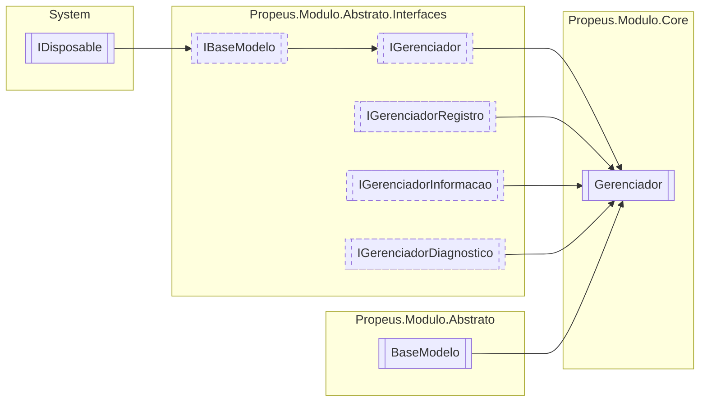

# Gerenciador `class`

## Description
Controlador de modulos

## Diagram


## Members
### Properties
#### Public Static properties
| Type | Name | Methods |
| --- | --- | --- |
| [`IGerenciador`](./propeusmoduloabstratointerfaces-IGerenciador.md) | [`Atual`](#atual) | `get` |

#### Public  properties
| Type | Name | Methods |
| --- | --- | --- |
| `DateTime` | [`DataInicio`](#datainicio)<br>Retorna data e hora que o gerenciador iniciou | `get` |
| `int` | [`ModulosInicializados`](#modulosinicializados)<br>Indica a quantidade de modulos inicializados pelo gerenciador | `get` |
| `DateTime` | [`UltimaAtualizacao`](#ultimaatualizacao)<br>Data e hora do ultimo evento realizado no gerenciador | `get` |

### Methods
#### Public  methods
| Returns | Name |
| --- | --- |
| [`IModulo`](./propeusmoduloabstratointerfaces-IModulo.md) | [`Criar`](#criar-13)(`...`)<br>Cria uma nova instancia do modulo buscando o tipo pelo nome |
| `bool` | [`Existe`](#existe-13)(`...`)<br>Verifica se existe alguma instancia do tipo no gerenciador |
| `IEnumerable`&lt;[`IModulo`](./propeusmoduloabstratointerfaces-IModulo.md)&gt; | [`Listar`](#listar)()<br>Lista todos os modulos |
| `Task` | [`ManterVivoAsync`](#mantervivoasync)()<br>Mantem o gerenciador vivo durante o uso da aplicação |
| [`IModulo`](./propeusmoduloabstratointerfaces-IModulo.md) | [`Obter`](#obter-13)(`...`)<br>Obtem a instancia de `type` caso exista <br><br> |
| [`IModuloTipo`](./propeusmoduloabstratointerfaces-IModuloTipo.md) | [`ObterInfo`](#obterinfo-13)(`...`)<br>Obtem o [IModuloTipo](./propeusmoduloabstratointerfaces-IModuloTipo.md) de `type` caso exista <br><br> |
| `T` | [`Reciclar`](#reciclar-12)(`...`) |
| `void` | [`Registrar`](#registrar)([`IModulo`](./propeusmoduloabstratointerfaces-IModulo.md) modulo)<br>Registra o modulo no gerenciador |
| `void` | [`Remover`](#remover-12)(`...`) |
| `void` | [`RemoverTodos`](#removertodos)()<br>Remove todos os modulos |
| `string` | [`ToString`](#tostring)()<br>Exibe informações basicas sobre o modelo |

#### Protected  methods
| Returns | Name |
| --- | --- |
| `void` | [`Dispose`](#dispose)(`bool` disposing)<br>Libera os objetos deste modelo e altera o estado dele para [Estado](./propeusmoduloabstrato-Estado.md).[Desligado](#desligado) |

## Details
### Summary
Controlador de modulos

### Inheritance
 - [
`IGerenciador`
](./propeusmoduloabstratointerfaces-IGerenciador.md)
 - [
`IBaseModelo`
](./propeusmoduloabstratointerfaces-IBaseModelo.md)
 - `IDisposable`
 - [
`IGerenciadorRegistro`
](./propeusmoduloabstratointerfaces-IGerenciadorRegistro.md)
 - [
`IGerenciadorInformacao`
](./propeusmoduloabstratointerfaces-IGerenciadorInformacao.md)
 - [
`IGerenciadorDiagnostico`
](./propeusmoduloabstratointerfaces-IGerenciadorDiagnostico.md)
 - [
`BaseModelo`
](./propeusmoduloabstrato-BaseModelo.md)

### Methods
#### Criar [1/3]
```csharp
public virtual IModulo Criar(string nomeModulo)
```
##### Arguments
| Type | Name | Description |
| --- | --- | --- |
| `string` | nomeModulo | Nome do modulo |

##### Summary
Cria uma nova instancia do modulo buscando o tipo pelo nome

##### Example
Exemplo para criar um modulo com contrato
```csharp
using System;
using Propeus.Modulo.Abstrato.Atributos;
using Propeus.Modulo.Core.Gerenciador;

namespace Propeus.Modulo.Exemplo
{
    [Modulo]
    public class CalculadoraModulo : ICalculadoraModuloContrato
    {
        public ModuloTesteA(IGerenciador gerenciador) : base(gerenciador, false)
        {

        }
        
        public int Calcular(int a, int b)
        {
return a+b;
        }
    }

    [ModuloContrato(typeof(CalculadoraModulo))]
    public interface ICalculadoraModuloContrato : IModulo
    {
        public int Calcular(int a, int b);
    }
    
    internal class Program
    {
        private static void Main(string[] args)
        {
using(Gerenciador gerenciador = Gereciador.Atual)
{
    ICalculadoraModuloContrato modulo =  (ICalculadoraModuloContrato)gerenciador.Criar("ICalculadoraModuloContrato");
    Console.WriteLine(modulo.Calcular(1,1));
}
        }
    }
}

```

##### Returns
[IModulo](./propeusmoduloabstratointerfaces-IModulo.md)

##### Exceptions
| Name | Description |
| --- | --- |
| ArgumentNullException | Parametro nulo |
| [TipoModuloInvalidoException](./propeusmoduloabstratoexceptions-TipoModuloInvalidoException.md) | Tipo do modulo invalido |
| [TipoModuloInvalidoException](./propeusmoduloabstratoexceptions-TipoModuloInvalidoException.md) | Tipo do modulo nao herdado de [IModulo](./propeusmoduloabstratointerfaces-IModulo.md) |
| [TipoModuloInvalidoException](./propeusmoduloabstratoexceptions-TipoModuloInvalidoException.md) | Tipo do modulo nao possui o atributo [ModuloAttribute](./propeusmoduloabstratoatributos-ModuloAttribute.md) |
| [TipoModuloInvalidoException](./propeusmoduloabstratoexceptions-TipoModuloInvalidoException.md) | Parametro do construtor nao e um modulo valido |
| [ModuloContratoNaoEncontratoException](./propeusmoduloabstratoexceptions-ModuloContratoNaoEncontratoException.md) | Tipo da interface de contrato nao possui o atributo [ModuloContratoAttribute](./propeusmoduloabstratoatributos-ModuloContratoAttribute.md) |
| [TipoModuloNaoEncontradoException](./propeusmoduloabstratoexceptions-TipoModuloNaoEncontradoException.md) | Tipo nao encontrado pelo nome no atributo [ModuloContratoAttribute](./propeusmoduloabstratoatributos-ModuloContratoAttribute.md) |
| [TipoModuloNaoEncontradoException](./propeusmoduloabstratoexceptions-TipoModuloNaoEncontradoException.md) | Tipo ausente no atributo [ModuloContratoAttribute](./propeusmoduloabstratoatributos-ModuloContratoAttribute.md) |
| [TipoModuloAmbiguoException](./propeusmoduloabstratoexceptions-TipoModuloAmbiguoException.md) | Mais um tipo de mesmo nome |
| [ModuloInstanciaUnicaException](./propeusmoduloabstratoexceptions-ModuloInstanciaUnicaException.md) | Criacao de mais de uma instancia de modulo definido como instancia unica |
| [ModuloConstrutorAusenteException](./propeusmoduloabstratoexceptions-ModuloConstrutorAusenteException.md) | Construtor ausente no modulo |

#### Criar [2/3]
```csharp
public virtual T Criar<T>()
where T : IModulo
```

#### Criar [3/3]
```csharp
public virtual IModulo Criar(Type modulo)
```
##### Arguments
| Type | Name | Description |
| --- | --- | --- |
| `Type` | modulo | Tipo do modulo |

##### Summary
Cria uma nova instancia do modulo usando o tipo do parametro `modulo`

##### Example
Exemplo para criar um modulo com contrato
```csharp
using System;
using Propeus.Modulo.Abstrato.Atributos;
using Propeus.Modulo.Core.Gerenciador;

namespace Propeus.Modulo.Exemplo
{
    [Modulo]
    public class CalculadoraModulo : ICalculadoraModuloContrato
    {
        public ModuloTesteA(IGerenciador gerenciador) : base(gerenciador, false)
        {

        }
        
        public int Calcular(int a, int b)
        {
return a+b;
        }
    }

    [ModuloContrato(typeof(CalculadoraModulo))]
    public interface ICalculadoraModuloContrato : IModulo
    {
        public int Calcular(int a, int b);
    }
    
    internal class Program
    {
        private static void Main(string[] args)
        {
using(Gerenciador gerenciador = Gereciador.Atual)
{
    ICalculadoraModuloContrato modulo = (ICalculadoraModuloContrato)gerenciador.Criar(typeof(ICalculadoraModuloContrato));
    Console.WriteLine(modulo.Calcular(1,1));
}
        }
    }
}

```

##### Returns
[IModulo](./propeusmoduloabstratointerfaces-IModulo.md)

##### Exceptions
| Name | Description |
| --- | --- |
| ArgumentNullException | Parametro nulo |
| [TipoModuloInvalidoException](./propeusmoduloabstratoexceptions-TipoModuloInvalidoException.md) | Tipo do modulo invalido |
| [TipoModuloInvalidoException](./propeusmoduloabstratoexceptions-TipoModuloInvalidoException.md) | Tipo do modulo nao herdado de [IModulo](./propeusmoduloabstratointerfaces-IModulo.md) |
| [TipoModuloInvalidoException](./propeusmoduloabstratoexceptions-TipoModuloInvalidoException.md) | Tipo do modulo nao possui o atributo [ModuloAttribute](./propeusmoduloabstratoatributos-ModuloAttribute.md) |
| [TipoModuloInvalidoException](./propeusmoduloabstratoexceptions-TipoModuloInvalidoException.md) | Parametro do construtor nao e um modulo valido |
| [ModuloContratoNaoEncontratoException](./propeusmoduloabstratoexceptions-ModuloContratoNaoEncontratoException.md) | Tipo da interface de contrato nao possui o atributo [ModuloContratoAttribute](./propeusmoduloabstratoatributos-ModuloContratoAttribute.md) |
| [TipoModuloNaoEncontradoException](./propeusmoduloabstratoexceptions-TipoModuloNaoEncontradoException.md) | Tipo nao encontrado pelo nome no atributo [ModuloContratoAttribute](./propeusmoduloabstratoatributos-ModuloContratoAttribute.md) |
| [TipoModuloNaoEncontradoException](./propeusmoduloabstratoexceptions-TipoModuloNaoEncontradoException.md) | Tipo ausente no atributo [ModuloContratoAttribute](./propeusmoduloabstratoatributos-ModuloContratoAttribute.md) |
| [ModuloInstanciaUnicaException](./propeusmoduloabstratoexceptions-ModuloInstanciaUnicaException.md) | Criacao de mais de uma instancia de modulo definido como instancia unica |
| [ModuloConstrutorAusenteException](./propeusmoduloabstratoexceptions-ModuloConstrutorAusenteException.md) | Construtor ausente no modulo |

#### Existe [1/3]
```csharp
public virtual bool Existe(Type type)
```
##### Arguments
| Type | Name | Description |
| --- | --- | --- |
| `Type` | type | Tipo da instancia do modulo a ser verificado |

##### Summary
Verifica se existe alguma instancia do tipo no gerenciador

##### Example
Exemplo para verificar um modulo
```csharp
using System;
using Propeus.Modulo.Abstrato.Atributos;
using Propeus.Modulo.Core.Gerenciador;

namespace Propeus.Modulo.Exemplo
{
    [Modulo]
    public class CalculadoraModulo : ICalculadoraModuloContrato
    {
        public ModuloTesteA(IGerenciador gerenciador) : base(gerenciador, false)
        {

        }
        
        public int Calcular(int a, int b)
        {
return a+b;
        }
    }

    [ModuloContrato(typeof(CalculadoraModulo))]
    public interface ICalculadoraModuloContrato : IModulo
    {
        public int Calcular(int a, int b);
    }
    
    internal class Program
    {
        private static void Main(string[] args)
        {
using(Gerenciador gerenciador = Gereciador.Atual)
{
    ICalculadoraModuloContrato modulo = (ICalculadoraModuloContrato)gerenciador.Criar(typeof(ICalculadoraModuloContrato));
    Console.WriteLine(gerenciador.Existe(typeof(ICalculadoraModuloContrato)));
}
        }
    }
}

```

##### Returns
Boolean

##### Exceptions
| Name | Description |
| --- | --- |
| ArgumentNullException | Parametro nulo |
| [TipoModuloInvalidoException](./propeusmoduloabstratoexceptions-TipoModuloInvalidoException.md) | Tipo do modulo invalido |
| [ModuloContratoNaoEncontratoException](./propeusmoduloabstratoexceptions-ModuloContratoNaoEncontratoException.md) | Tipo da interface de contrato nao possui o atributo [ModuloContratoAttribute](./propeusmoduloabstratoatributos-ModuloContratoAttribute.md) |

#### Existe [2/3]
```csharp
public virtual bool Existe(IModulo modulo)
```
##### Arguments
| Type | Name | Description |
| --- | --- | --- |
| [`IModulo`](./propeusmoduloabstratointerfaces-IModulo.md) | modulo | A instancia do modulo |

##### Summary
Verifica se a instancia do modulo existe no genrenciador

##### Example
Exemplo para criar um modulo com contrato
```csharp
using System;
using Propeus.Modulo.Abstrato.Atributos;
using Propeus.Modulo.Core.Gerenciador;

namespace Propeus.Modulo.Exemplo
{
    [Modulo]
    public class CalculadoraModulo : ICalculadoraModuloContrato
    {
        public ModuloTesteA(IGerenciador gerenciador) : base(gerenciador, false)
        {

        }
        
        public int Calcular(int a, int b)
        {
return a+b;
        }
    }

    [ModuloContrato(typeof(CalculadoraModulo))]
    public interface ICalculadoraModuloContrato : IModulo
    {
        public int Calcular(int a, int b);
    }
    
    internal class Program
    {
        private static void Main(string[] args)
        {
using(Gerenciador gerenciador = Gereciador.Atual)
{
    ICalculadoraModuloContrato modulo = (ICalculadoraModuloContrato)gerenciador.Criar(typeof(ICalculadoraModuloContrato));
    Console.WriteLine(gerenciador.Existe(modulo));
}
        }
    }
}

```

##### Returns
Boolean

##### Exceptions
| Name | Description |
| --- | --- |
| ArgumentNullException | Parametro nulo |

#### Existe [3/3]
```csharp
public virtual bool Existe(string id)
```
##### Arguments
| Type | Name | Description |
| --- | --- | --- |
| `string` | id | Identificação unica do modulo |

##### Summary
Verifica se existe alguma instancia com o id no gerenciador

##### Example
```csharp
using System;
using Propeus.Modulo.Abstrato.Atributos;
using Propeus.Modulo.Core.Gerenciador;

namespace Propeus.Modulo.Exemplo
{
    [Modulo]
    public class CalculadoraModulo : ICalculadoraModuloContrato
    {
        public ModuloTesteA(IGerenciador gerenciador) : base(gerenciador, false)
        {

        }
        
        public int Calcular(int a, int b)
        {
return a+b;
        }
    }

    [ModuloContrato(typeof(CalculadoraModulo))]
    public interface ICalculadoraModuloContrato : IModulo
    {
        public int Calcular(int a, int b);
    }
    
    internal class Program
    {
        private static void Main(string[] args)
        {
using(Gerenciador gerenciador = Gereciador.Atual)
{
    ICalculadoraModuloContrato modulo = (ICalculadoraModuloContrato)gerenciador.Criar(typeof(ICalculadoraModuloContrato));
    Console.WriteLine(gerenciador.Existe(modulo.Id));
}
        }
    }
}

```

##### Returns
Boolean

##### Exceptions
| Name | Description |
| --- | --- |
| ArgumentNullException | Parametro nulo |

#### ObterInfo [1/3]
```csharp
public virtual IModuloTipo ObterInfo(Type modulo)
```
##### Arguments
| Type | Name | Description |
| --- | --- | --- |
| `Type` | modulo |   |

##### Summary
Obtem o [IModuloTipo](./propeusmoduloabstratointerfaces-IModuloTipo.md) de `type` caso exista 


##### Example
```csharp
using System;
using Propeus.Modulo.Abstrato.Atributos;
using Propeus.Modulo.Core.Gerenciador;

namespace Propeus.Modulo.Exemplo
{
    [Modulo]
    public class CalculadoraModulo : ICalculadoraModuloContrato
    {
        public ModuloTesteA(IGerenciador gerenciador) : base(gerenciador, false)
        {

        }
        
        public int Calcular(int a, int b)
        {
return a+b;
        }
    }

    [ModuloContrato(typeof(CalculadoraModulo))]
    public interface ICalculadoraModuloContrato : IModulo
    {
        public int Calcular(int a, int b);
    }
    
    internal class Program
    {
        private static void Main(string[] args)
        {
using(Gerenciador gerenciador = Gereciador.Atual)
{
    ICalculadoraModuloContrato modulo = (ICalculadoraModuloContrato)gerenciador.Criar(typeof(ICalculadoraModuloContrato));
    Console.WriteLine((gerenciador as IGerenciadorInformacao).ObterInfo(typeof(ICalculadoraModuloContrato)));
}
        }
    }
}

```

##### Returns
[IModuloTipo](./propeusmoduloabstratointerfaces-IModuloTipo.md)

##### Exceptions
| Name | Description |
| --- | --- |
| ArgumentNullException | Parametro nulo |
| [TipoModuloInvalidoException](./propeusmoduloabstratoexceptions-TipoModuloInvalidoException.md) | Tipo do modulo invalido |
| [ModuloContratoNaoEncontratoException](./propeusmoduloabstratoexceptions-ModuloContratoNaoEncontratoException.md) | Tipo da interface de contrato nao possui o atributo [ModuloContratoAttribute](./propeusmoduloabstratoatributos-ModuloContratoAttribute.md) |
| [ModuloNaoEncontradoException](./propeusmoduloabstratoexceptions-ModuloNaoEncontradoException.md) | Instancia do modulo nao foi encontrado |

#### ObterInfo [2/3]
```csharp
public virtual IModuloTipo ObterInfo<T>()
where T : IModulo
```

#### ObterInfo [3/3]
```csharp
public virtual IModuloTipo ObterInfo(string id)
```
##### Arguments
| Type | Name | Description |
| --- | --- | --- |
| `string` | id | Identificação unica do modulo |

##### Summary
Obtem  o [IModuloTipo](./propeusmoduloabstratointerfaces-IModuloTipo.md) do modulo pelo id

##### Example
```csharp
using System;
using Propeus.Modulo.Abstrato.Atributos;
using Propeus.Modulo.Core.Gerenciador;

namespace Propeus.Modulo.Exemplo
{
    [Modulo]
    public class CalculadoraModulo : ICalculadoraModuloContrato
    {
        public ModuloTesteA(IGerenciador gerenciador) : base(gerenciador, false)
        {

        }
        
        public int Calcular(int a, int b)
        {
return a+b;
        }
    }

    [ModuloContrato(typeof(CalculadoraModulo))]
    public interface ICalculadoraModuloContrato : IModulo
    {
        public int Calcular(int a, int b);
    }
    
    internal class Program
    {
        private static void Main(string[] args)
        {
using(Gerenciador gerenciador = Gereciador.Atual)
{
    ICalculadoraModuloContrato modulo = gerenciador.Criar<ICalculadoraModuloContrato>();
    Console.WriteLine((gerenciador as IGerenciadorInformacao).ObterInfo(modulo.Id));
}
        }
    }
}

```

##### Returns
[IModuloTipo](./propeusmoduloabstratointerfaces-IModuloTipo.md)

##### Exceptions
| Name | Description |
| --- | --- |
| ArgumentNullException | Parametro nulo |
| [ModuloNaoEncontradoException](./propeusmoduloabstratoexceptions-ModuloNaoEncontradoException.md) | Instancia do modulo nao foi inicializado |

#### Obter [1/3]
```csharp
public virtual IModulo Obter(Type modulo)
```
##### Arguments
| Type | Name | Description |
| --- | --- | --- |
| `Type` | modulo |   |

##### Summary
Obtem a instancia de `type` caso exista 


##### Example
```csharp
using System;
using Propeus.Modulo.Abstrato.Atributos;
using Propeus.Modulo.Core.Gerenciador;

namespace Propeus.Modulo.Exemplo
{
    [Modulo]
    public class CalculadoraModulo : ICalculadoraModuloContrato
    {
        public ModuloTesteA(IGerenciador gerenciador) : base(gerenciador, false)
        {

        }
        
        public int Calcular(int a, int b)
        {
return a+b;
        }
    }

    [ModuloContrato(typeof(CalculadoraModulo))]
    public interface ICalculadoraModuloContrato : IModulo
    {
        public int Calcular(int a, int b);
    }
    
    internal class Program
    {
        private static void Main(string[] args)
        {
using(Gerenciador gerenciador = Gereciador.Atual)
{
    ICalculadoraModuloContrato modulo = (ICalculadoraModuloContrato)gerenciador.Criar(typeof(ICalculadoraModuloContrato));
    Console.WriteLine(gerenciador.Obter(typeof(ICalculadoraModuloContrato)));
}
        }
    }
}

```

##### Returns
[IModulo](./propeusmoduloabstratointerfaces-IModulo.md)

##### Exceptions
| Name | Description |
| --- | --- |
| ArgumentNullException | Parametro nulo |
| [ModuloDescartadoException](./propeusmoduloabstratoexceptions-ModuloDescartadoException.md) | Instancia do modulo foi coletado pelo GC ou acionou o IDisposable.Dispose |
| [TipoModuloInvalidoException](./propeusmoduloabstratoexceptions-TipoModuloInvalidoException.md) | Tipo do modulo invalido |
| [ModuloContratoNaoEncontratoException](./propeusmoduloabstratoexceptions-ModuloContratoNaoEncontratoException.md) | Tipo da interface de contrato nao possui o atributo [ModuloContratoAttribute](./propeusmoduloabstratoatributos-ModuloContratoAttribute.md) |
| [ModuloNaoEncontradoException](./propeusmoduloabstratoexceptions-ModuloNaoEncontradoException.md) | Instancia do modulo nao foi inicializado |

#### Obter [2/3]
```csharp
public virtual T Obter<T>()
where T : IModulo
```

#### Obter [3/3]
```csharp
public virtual IModulo Obter(string id)
```
##### Arguments
| Type | Name | Description |
| --- | --- | --- |
| `string` | id | Identificação unica do modulo |

##### Summary
Obtem a instancia do modulo pelo id

##### Example
```csharp
using System;
using Propeus.Modulo.Abstrato.Atributos;
using Propeus.Modulo.Core.Gerenciador;

namespace Propeus.Modulo.Exemplo
{
    [Modulo]
    public class CalculadoraModulo : ICalculadoraModuloContrato
    {
        public ModuloTesteA(IGerenciador gerenciador) : base(gerenciador, false)
        {

        }
        
        public int Calcular(int a, int b)
        {
return a+b;
        }
    }

    [ModuloContrato(typeof(CalculadoraModulo))]
    public interface ICalculadoraModuloContrato : IModulo
    {
        public int Calcular(int a, int b);
    }
    
    internal class Program
    {
        private static void Main(string[] args)
        {
using(Gerenciador gerenciador = Gereciador.Atual)
{
    ICalculadoraModuloContrato modulo = (ICalculadoraModuloContrato)gerenciador.Criar(typeof(ICalculadoraModuloContrato));
    Console.WriteLine(gerenciador.Obter(modulo.Id));
}
        }
    }
}

```

##### Returns
[IModulo](./propeusmoduloabstratointerfaces-IModulo.md)

##### Exceptions
| Name | Description |
| --- | --- |
| ArgumentNullException | Parametro nulo |
| [ModuloNaoEncontradoException](./propeusmoduloabstratoexceptions-ModuloNaoEncontradoException.md) | Instancia do modulo nao foi inicializado |
| [ModuloDescartadoException](./propeusmoduloabstratoexceptions-ModuloDescartadoException.md) | Instancia do modulo foi coletado pelo G.C ou acionou o IDisposable.Dispose |

#### Remover [1/2]
```csharp
public virtual void Remover<T>(T modulo)
where T : IModulo
```
##### Arguments
| Type | Name | Description |
| --- | --- | --- |
| `T` | modulo |   |

#### Remover [2/2]
```csharp
public virtual void Remover(string id)
```
##### Arguments
| Type | Name | Description |
| --- | --- | --- |
| `string` | id | Identificação unica do modulo |

##### Summary
Remove um modulo pelo seu ID

##### Example
```csharp
using System;
using Propeus.Modulo.Abstrato.Atributos;
using Propeus.Modulo.Core.Gerenciador;

namespace Propeus.Modulo.Exemplo
{
    [Modulo]
    public class CalculadoraModulo : ICalculadoraModuloContrato
    {
        public ModuloTesteA(IGerenciador gerenciador) : base(gerenciador, false)
        {

        }
        
        public int Calcular(int a, int b)
        {
return a+b;
        }
    }

    [ModuloContrato(typeof(CalculadoraModulo))]
    public interface ICalculadoraModuloContrato : IModulo
    {
        public int Calcular(int a, int b);
    }
    
    internal class Program
    {
        private static void Main(string[] args)
        {
using(Gerenciador gerenciador = Gereciador.Atual)
{
    ICalculadoraModuloContrato modulo = gerenciador.Criar<ICalculadoraModuloContrato>();
    Console.WriteLine(gerenciador.Remover(modulo.Id));
}
        }
    }
}

```

##### Exceptions
| Name | Description |
| --- | --- |
| ArgumentNullException | Parametro nulo |
| [ModuloNaoEncontradoException](./propeusmoduloabstratoexceptions-ModuloNaoEncontradoException.md) | Instancia do modulo nao foi inicializado |
| [ModuloDescartadoException](./propeusmoduloabstratoexceptions-ModuloDescartadoException.md) | Instancia do modulo foi coletado pelo G.C ou acionou o IDisposable.Dispose |

#### RemoverTodos
```csharp
public virtual void RemoverTodos()
```
##### Summary
Remove todos os modulos

##### Example
```csharp
using System;
using Propeus.Modulo.Abstrato.Atributos;
using Propeus.Modulo.Core.Gerenciador;

namespace Propeus.Modulo.Exemplo
{
    [Modulo]
    public class CalculadoraModulo : ICalculadoraModuloContrato
    {
        public ModuloTesteA(IGerenciador gerenciador) : base(gerenciador, false)
        {

        }
        
        public int Calcular(int a, int b)
        {
return a+b;
        }
    }

    [ModuloContrato(typeof(CalculadoraModulo))]
    public interface ICalculadoraModuloContrato : IModulo
    {
        public int Calcular(int a, int b);
    }
    
    internal class Program
    {
        private static void Main(string[] args)
        {
using(Gerenciador gerenciador = Gereciador.Atual)
{
    ICalculadoraModuloContrato modulo = gerenciador.Criar<ICalculadoraModuloContrato>();
    Console.WriteLine(gerenciador.RemoverTodos());
}
        }
    }
}

```

#### Reciclar [1/2]
```csharp
public virtual T Reciclar<T>(T modulo)
where T : IModulo
```
##### Arguments
| Type | Name | Description |
| --- | --- | --- |
| `T` | modulo |   |

#### Reciclar [2/2]
```csharp
public virtual IModulo Reciclar(string id)
```
##### Arguments
| Type | Name | Description |
| --- | --- | --- |
| `string` | id | Identificação unica do modulo |

##### Summary
Realiza uma reciclagem do modulo

##### Example
```csharp
using System;
using Propeus.Modulo.Abstrato.Atributos;
using Propeus.Modulo.Core.Gerenciador;

namespace Propeus.Modulo.Exemplo
{
    [Modulo]
    public class CalculadoraModulo : ICalculadoraModuloContrato
    {
        public ModuloTesteA(IGerenciador gerenciador) : base(gerenciador, false)
        {

        }
        
        public int Calcular(int a, int b)
        {
return a+b;
        }
    }

    [ModuloContrato(typeof(CalculadoraModulo))]
    public interface ICalculadoraModuloContrato : IModulo
    {
        public int Calcular(int a, int b);
    }
    
    internal class Program
    {
        private static void Main(string[] args)
        {
using(Gerenciador gerenciador = Gereciador.Atual)
{
    ICalculadoraModuloContrato modulo = gerenciador.Criar<ICalculadoraModuloContrato>();
    Console.WriteLine(gerenciador.Reciclar(modulo.Id));
}
        }
    }
}
 
```

##### Returns
Boolean

##### Exceptions
| Name | Description |
| --- | --- |
| ArgumentNullException | Parametro nulo |
| [ModuloNaoEncontradoException](./propeusmoduloabstratoexceptions-ModuloNaoEncontradoException.md) | Instancia do modulo nao foi inicializado |
| [ModuloDescartadoException](./propeusmoduloabstratoexceptions-ModuloDescartadoException.md) | Instancia do modulo foi coletado pelo G.C ou acionou o IDisposable.Dispose |

#### Registrar
```csharp
public virtual void Registrar(IModulo modulo)
```
##### Arguments
| Type | Name | Description |
| --- | --- | --- |
| [`IModulo`](./propeusmoduloabstratointerfaces-IModulo.md) | modulo | Instancia do modulo |

##### Summary
Registra o modulo no gerenciador

##### Exceptions
| Name | Description |
| --- | --- |
| ArgumentNullException | Parametro nulo |
| [ModuloInstanciaUnicaException](./propeusmoduloabstratoexceptions-ModuloInstanciaUnicaException.md) | Criacao de mais de uma instancia de modulo definido como instancia unica |
| [ModuloRegistradoException](./propeusmoduloabstratoexceptions-ModuloRegistradoException.md) | O modulo de mesmo Id ja foi registrado |

#### ManterVivoAsync
```csharp
public virtual async Task ManterVivoAsync()
```
##### Summary
Mantem o gerenciador vivo durante o uso da aplicação

##### Example
Exemplo de como manter o gerenciador em modo interativo
```csharp
using System;
using Propeus.Modulo.Core.Gerenciador

namespace Propeus.Modulo.Exemplo
{
    internal class Program
    {
        private static void Main(string[] args)
        {
            using(Gerenciador gerenciador = Gereciador.Atual)
            {
   gerenciador.ManterVivoAsync().Wait();
            }
        }
    }
            }

```

##### Returns
Task

#### Listar
```csharp
public virtual IEnumerable<IModulo> Listar()
```
##### Summary
Lista todos os modulos

##### Example
Exemplo para criar um modulo com contrato
            
            Exemplo de codigo do contrato
```csharp
using Propeus.Modulo.Abstrato.Atributos;
 
 namespace Propeus.Modulo.Exemplo
 {
     [ModuloContrato(typeof(CalculadoraModulo))]
     public interface ICalculadoraModuloContrato : IModulo
     {
         public int Calcular(int a, int b);
     }
 }
 
```
Exemplo de codigo do modulo
```csharp
using Propeus.Modulo.Abstrato.Atributos;
            
namespace Propeus.Modulo.Exemplo
{
    [Modulo]
    public class CalculadoraModulo : ICalculadoraModuloContrato
    {
    
        public ModuloTesteA(IGerenciador gerenciador) : base(gerenciador, false)
        {
        
        }
        
        public int Calcular(int a, int b)
        {
            return a+b;
        }
    }
}

```
Exemplo de como reiniciar uma instancia do modulo pelo ID
```csharp
using System;
using Propeus.Modulo.Core.Gerenciador

namespace Propeus.Modulo.Exemplo
{
    internal class Program
    {
        private static void Main(string[] args)
        {
            using(Gerenciador gerenciador = Gereciador.Atual)
            {
   ICalculadoraModuloContrato modulo = (ICalculadoraModuloContrato)gerenciador.Criar<ICalculadoraModuloContrato>();
   IEnumerable<IModulos> modulos = gerenciador.Listar();
   foreach(IModulo fModulo in modulos)
   {
       Console.WriteLine(fModulo);
   }
            }
        }
    }
            }

```

##### Returns
IEnumerable&lt;ModularDoc.Elements.Markdown.TextElement&gt;

#### Dispose
```csharp
protected override void Dispose(bool disposing)
```
##### Arguments
| Type | Name | Description |
| --- | --- | --- |
| `bool` | disposing | Indica se deve alterar o estado do objeto para [Estado](./propeusmoduloabstrato-Estado.md).[Desligado](#desligado) |

##### Summary
Libera os objetos deste modelo e altera o estado dele para [Estado](./propeusmoduloabstrato-Estado.md).[Desligado](#desligado)

#### ToString
```csharp
public override string ToString()
```
##### Summary
Exibe informações basicas sobre o modelo

##### Returns


### Properties
#### Atual
```csharp
public static IGerenciador Atual { get; }
```

#### DataInicio
```csharp
public virtual DateTime DataInicio { get; }
```
##### Summary
Retorna data e hora que o gerenciador iniciou

#### UltimaAtualizacao
```csharp
public virtual DateTime UltimaAtualizacao { get; }
```
##### Summary
Data e hora do ultimo evento realizado no gerenciador

##### Remarks
Os eventos sao o CRUD (Criar, Reiniciar, Atualizar ou Remover) do genreciador

#### ModulosInicializados
```csharp
public virtual int ModulosInicializados { get; }
```
##### Summary
Indica a quantidade de modulos inicializados pelo gerenciador

*Generated with* [*ModularDoc*](https://github.com/hailstorm75/ModularDoc)
