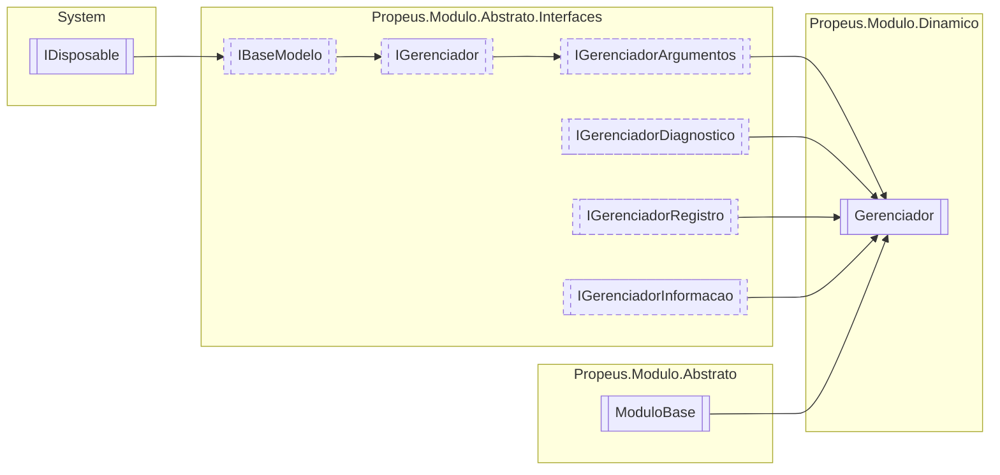

# Gerenciador `class`

## Description
Modulo responsável por administrar modulos em tempo de execução

## Diagram


## Members
### Properties
#### Public  properties
| Type | Name | Methods |
| --- | --- | --- |
| [`GerenciadorConfiguracao`](./propeusmodulodinamico-GerenciadorConfiguracao.md) | [`Configuracao`](#configuracao)<br>Configuracoes do gerenciador | `get` |
| `DateTime` | [`DataInicio`](#datainicio)<br>Retorna data e hora que o gerenciador iniciou | `get` |
| `string` | [`DiretorioModulo`](#diretoriomodulo)<br>Diretório atual do modulo | `get, set` |
| `int` | [`ModulosInicializados`](#modulosinicializados)<br>Indica a quantidade de modulos inicializados pelo gerenciador | `get` |
| `DateTime` | [`UltimaAtualizacao`](#ultimaatualizacao)<br>Data e hora do ultimo evento realizado no gerenciador | `get` |

### Methods
#### Public  methods
| Returns | Name |
| --- | --- |
| `T` | [`Criar`](#criar-16)(`...`) |
| `bool` | [`Existe`](#existe-13)(`...`)<br>Verifica se existe alguma instancia do tipo no gerenciador |
| `IEnumerable`&lt;[`IModulo`](./propeusmoduloabstratointerfaces-IModulo.md)&gt; | [`Listar`](#listar)()<br>Lista todos os modulos |
| `Task` | [`ManterVivoAsync`](#mantervivoasync)()<br>Mantem o gerenciador vivo durante o uso da aplicação |
| `T` | [`Obter`](#obter-13)(`...`) |
| `T` | [`Reciclar`](#reciclar-12)(`...`) |
| `void` | [`Registrar`](#registrar)([`IModulo`](./propeusmoduloabstratointerfaces-IModulo.md) modulo)<br>Registra o modulo no gerenciador |
| `void` | [`Remover`](#remover-12)(`...`) |
| `void` | [`RemoverTodos`](#removertodos)()<br>Remove todos os modulos |
| `string` | [`ToString`](#tostring)()<br>Exibe informacoes basicas sobre o modulo |

#### Protected  methods
| Returns | Name |
| --- | --- |
| `void` | [`Dispose`](#dispose)(`bool` disposing) |

## Details
### Summary
Modulo responsável por administrar modulos em tempo de execução

### Inheritance
 - [
`IGerenciador`
](./propeusmoduloabstratointerfaces-IGerenciador.md)
 - [
`IBaseModelo`
](./propeusmoduloabstratointerfaces-IBaseModelo.md)
 - `IDisposable`
 - [
`IGerenciadorArgumentos`
](./propeusmoduloabstratointerfaces-IGerenciadorArgumentos.md)
 - [
`IGerenciadorDiagnostico`
](./propeusmoduloabstratointerfaces-IGerenciadorDiagnostico.md)
 - [
`IGerenciadorRegistro`
](./propeusmoduloabstratointerfaces-IGerenciadorRegistro.md)
 - [
`IGerenciadorInformacao`
](./propeusmoduloabstratointerfaces-IGerenciadorInformacao.md)
 - [
`ModuloBase`
](./propeusmoduloabstrato-ModuloBase.md)

### Constructors
#### Gerenciador
```csharp
public Gerenciador(IGerenciador gerenciador, GerenciadorConfiguracao configuracao)
```
##### Arguments
| Type | Name | Description |
| --- | --- | --- |
| [`IGerenciador`](./propeusmoduloabstratointerfaces-IGerenciador.md) | gerenciador | Gerenciador que irá controlar o modulo |
| [`GerenciadorConfiguracao`](./propeusmodulodinamico-GerenciadorConfiguracao.md) | configuracao | Configuracao do gerenciador atual |

##### Summary
Inicializa o gerenciador

### Methods
#### Criar [1/6]
```csharp
public virtual T Criar<T>()
where T : IModulo
```

#### Criar [2/6]
```csharp
public virtual IModulo Criar(Type modulo)
```
##### Arguments
| Type | Name | Description |
| --- | --- | --- |
| `Type` | modulo | Tipo do modulo |

##### Summary
Cria uma nova instancia do modulo usando o tipo do parametro `modulo`

##### Example
Crie uma classe em um projeto separado
```csharp
using System;
using Propeus.Modulo.Abstrato.Atributos;
using Propeus.Modulo.Core.Gerenciador;
using Propeus.Modulo.Dinamico.Gerenciador;

namespace Propeus.Modulo.Exemplo
{
    [Modulo]
    public class CalculadoraModulo : ModuloBase
    {
        public ModuloTesteA(IGerenciador gerenciador) : base(gerenciador, false)
        {

        }
        
        public int Calcular(int a, int b)
        {
return a+b;
        }
    }
}

```
No projeto principal, adicione uma interface de contrato
```csharp
using System;
using Propeus.Modulo.Abstrato.Atributos;
using Propeus.Modulo.Core.Gerenciador;
using Propeus.Modulo.Dinamico.Gerenciador;

namespace Propeus.Modulo.Exemplo
{

    [ModuloContrato("CalculadoraModulo")]
    public interface ICalculadoraModuloContrato : IModulo
    {
        public int Calcular(int a, int b);
    }
    
    internal class Program
    {
        private static void Main(string[] args)
        {
using(Gerenciador gerenciador = new Gerenciador(Propeus.Modulo.Core.Gerenciador.Atual))
{
    ICalculadoraModuloContrato modulo = (ICalculadoraModuloContrato)gerenciador.Criar(typeof(ICalculadoraModuloContrato));
    Console.WriteLine(modulo.Calcular(1,1));
}
        }
    }
}

```

##### Returns
[IModulo](./propeusmoduloabstratointerfaces-IModulo.md)

##### Exceptions
| Name | Description |
| --- | --- |
| ArgumentNullException | Parametro nulo |
| ArgumentException | O tipo informado não é uma interface |
| InvalidCastException | O tipo nao possui o atributo [ModuloContratoAttribute](./propeusmoduloabstratoatributos-ModuloContratoAttribute.md) |
| [TipoModuloInvalidoException](./propeusmoduloabstratoexceptions-TipoModuloInvalidoException.md) | Tipo do modulo invalido |
| [TipoModuloInvalidoException](./propeusmoduloabstratoexceptions-TipoModuloInvalidoException.md) | Tipo do modulo nao herdado de [IModulo](./propeusmoduloabstratointerfaces-IModulo.md) |
| [TipoModuloInvalidoException](./propeusmoduloabstratoexceptions-TipoModuloInvalidoException.md) | Tipo do modulo nao possui o atributo [ModuloAttribute](./propeusmoduloabstratoatributos-ModuloAttribute.md) |
| [TipoModuloInvalidoException](./propeusmoduloabstratoexceptions-TipoModuloInvalidoException.md) | Parametro do construtor nao e um modulo valido |
| [ModuloContratoNaoEncontratoException](./propeusmoduloabstratoexceptions-ModuloContratoNaoEncontratoException.md) | Tipo da interface de contrato nao possui o atributo [ModuloContratoAttribute](./propeusmoduloabstratoatributos-ModuloContratoAttribute.md) |
| [TipoModuloNaoEncontradoException](./propeusmoduloabstratoexceptions-TipoModuloNaoEncontradoException.md) | Tipo nao encontrado pelo nome no atributo [ModuloContratoAttribute](./propeusmoduloabstratoatributos-ModuloContratoAttribute.md) |
| [TipoModuloNaoEncontradoException](./propeusmoduloabstratoexceptions-TipoModuloNaoEncontradoException.md) | Tipo ausente no atributo [ModuloContratoAttribute](./propeusmoduloabstratoatributos-ModuloContratoAttribute.md) |
| [ModuloInstanciaUnicaException](./propeusmoduloabstratoexceptions-ModuloInstanciaUnicaException.md) | Criacao de mais de uma instancia de modulo definido como instancia unica |
| [ModuloConstrutorAusenteException](./propeusmoduloabstratoexceptions-ModuloConstrutorAusenteException.md) | Construtor ausente no modulo |

#### Criar [3/6]
```csharp
public virtual IModulo Criar(string nomeModulo)
```
##### Arguments
| Type | Name | Description |
| --- | --- | --- |
| `string` | nomeModulo | Nome do modulo |

##### Summary
Cria uma nova instancia do modulo buscando o tipo pelo nome

##### Example
Crie uma classe em um projeto separado
```csharp
using System;
using Propeus.Modulo.Abstrato.Atributos;
using Propeus.Modulo.Core.Gerenciador;
using Propeus.Modulo.Dinamico.Gerenciador;

namespace Propeus.Modulo.Exemplo
{
    [Modulo]
    public class CalculadoraModulo : ModuloBase
    {
        public ModuloTesteA(IGerenciador gerenciador) : base(gerenciador, false)
        {

        }
        
        public int Calcular(int a, int b)
        {
return a+b;
        }
    }
}

```
No projeto principal, adicione uma interface de contrato
```csharp
using System;
using Propeus.Modulo.Abstrato.Atributos;
using Propeus.Modulo.Core.Gerenciador;
using Propeus.Modulo.Dinamico.Gerenciador;

namespace Propeus.Modulo.Exemplo
{

    [ModuloContrato("CalculadoraModulo")]
    public interface ICalculadoraModuloContrato : IModulo
    {
        public int Calcular(int a, int b);
    }
    
    internal class Program
    {
        private static void Main(string[] args)
        {
using(Gerenciador gerenciador = new Gerenciador(Propeus.Modulo.Core.Gerenciador.Atual))
{
    ICalculadoraModuloContrato modulo = (ICalculadoraModuloContrato)gerenciador.Criar("ICalculadoraModuloContrato");
    Console.WriteLine(modulo.Calcular(1,1));
}
        }
    }
}

```

##### Returns
[IModulo](./propeusmoduloabstratointerfaces-IModulo.md)

##### Exceptions
| Name | Description |
| --- | --- |
| ArgumentNullException | Parametro nulo |
| ArgumentException | O tipo informado não é uma interface |
| InvalidCastException | O tipo nao possui o atributo [ModuloContratoAttribute](./propeusmoduloabstratoatributos-ModuloContratoAttribute.md) |
| [TipoModuloInvalidoException](./propeusmoduloabstratoexceptions-TipoModuloInvalidoException.md) | Tipo do modulo invalido |
| [TipoModuloInvalidoException](./propeusmoduloabstratoexceptions-TipoModuloInvalidoException.md) | Tipo do modulo nao herdado de [IModulo](./propeusmoduloabstratointerfaces-IModulo.md) |
| [TipoModuloInvalidoException](./propeusmoduloabstratoexceptions-TipoModuloInvalidoException.md) | Tipo do modulo nao possui o atributo [ModuloAttribute](./propeusmoduloabstratoatributos-ModuloAttribute.md) |
| [TipoModuloInvalidoException](./propeusmoduloabstratoexceptions-TipoModuloInvalidoException.md) | Parametro do construtor nao e um modulo valido |
| [ModuloContratoNaoEncontratoException](./propeusmoduloabstratoexceptions-ModuloContratoNaoEncontratoException.md) | Tipo da interface de contrato nao possui o atributo [ModuloContratoAttribute](./propeusmoduloabstratoatributos-ModuloContratoAttribute.md) |
| [TipoModuloNaoEncontradoException](./propeusmoduloabstratoexceptions-TipoModuloNaoEncontradoException.md) | Tipo nao encontrado pelo nome no atributo [ModuloContratoAttribute](./propeusmoduloabstratoatributos-ModuloContratoAttribute.md) |
| [TipoModuloNaoEncontradoException](./propeusmoduloabstratoexceptions-TipoModuloNaoEncontradoException.md) | Tipo ausente no atributo [ModuloContratoAttribute](./propeusmoduloabstratoatributos-ModuloContratoAttribute.md) |
| [ModuloInstanciaUnicaException](./propeusmoduloabstratoexceptions-ModuloInstanciaUnicaException.md) | Criacao de mais de uma instancia de modulo definido como instancia unica |
| [ModuloConstrutorAusenteException](./propeusmoduloabstratoexceptions-ModuloConstrutorAusenteException.md) | Construtor ausente no modulo |

#### Criar [4/6]
```csharp
public virtual T Criar<T>(object[] args)
where T : IModulo
```
##### Arguments
| Type | Name | Description |
| --- | --- | --- |
| `object``[]` | args |   |

#### Criar [5/6]
```csharp
public virtual IModulo Criar(Type modulo, object[] args)
```
##### Arguments
| Type | Name | Description |
| --- | --- | --- |
| `Type` | modulo | Tipo do modulo |
| `object``[]` | args | Qualquer argumento necessário para o modulo |

##### Summary
Cria uma nova instancia do modulo usando o tipo do parametro `modulo`

##### Example
Crie uma classe em um projeto separado
```csharp
using System;
using Propeus.Modulo.Abstrato.Atributos;
using Propeus.Modulo.Core.Gerenciador;
using Propeus.Modulo.Dinamico.Gerenciador;

namespace Propeus.Modulo.Exemplo
{
    [Modulo]
    public class CalculadoraModulo : ModuloBase
    {
        public ModuloTesteA(IGerenciador gerenciador) : base(gerenciador, false)
        {

        }
        
        public int Calcular(int a, int b)
        {
return a+b;
        }
        
        public void CriarInstancia(int valorTipoQualquer, string valorTipoString)
        {
          //Voce pode definir quantos parametros e tipos, portanto que seja compativel com a quantidade de argumentos informados ao criar o modulo.
          //Caso contrario, este metodo nao será invocado
        }
        
    }
}

```
No projeto principal, adicione uma interface de contrato
```csharp
using System;
using Propeus.Modulo.Abstrato.Atributos;
using Propeus.Modulo.Core.Gerenciador;
using Propeus.Modulo.Dinamico.Gerenciador;

namespace Propeus.Modulo.Exemplo
{

    [ModuloContrato("CalculadoraModulo")]
    public interface ICalculadoraModuloContrato : IModulo
    {
        public int Calcular(int a, int b);
    }
    
    internal class Program
    {
        private static void Main(string[] args)
        {
using(Gerenciador gerenciador = new Gerenciador(Propeus.Modulo.Core.Gerenciador.Atual))
{
    ICalculadoraModuloContrato modulo = (ICalculadoraModuloContrato)gerenciador.Criar(typeof(ICalculadoraModuloContrato),new object[]{1,"Um valor qualquer para chamar a funcao CriarInstancia"});
    Console.WriteLine(modulo.Calcular(1,1));
}
        }
    }
}

```

##### Returns
[IModulo](./propeusmoduloabstratointerfaces-IModulo.md)

##### Exceptions
| Name | Description |
| --- | --- |
| ArgumentNullException | Parametro nulo |
| ArgumentException | O tipo informado não é uma interface |
| InvalidCastException | O tipo nao possui o atributo [ModuloContratoAttribute](./propeusmoduloabstratoatributos-ModuloContratoAttribute.md) |
| [TipoModuloInvalidoException](./propeusmoduloabstratoexceptions-TipoModuloInvalidoException.md) | Tipo do modulo invalido |
| [TipoModuloInvalidoException](./propeusmoduloabstratoexceptions-TipoModuloInvalidoException.md) | Tipo do modulo nao herdado de [IModulo](./propeusmoduloabstratointerfaces-IModulo.md) |
| [TipoModuloInvalidoException](./propeusmoduloabstratoexceptions-TipoModuloInvalidoException.md) | Tipo do modulo nao possui o atributo [ModuloAttribute](./propeusmoduloabstratoatributos-ModuloAttribute.md) |
| [TipoModuloInvalidoException](./propeusmoduloabstratoexceptions-TipoModuloInvalidoException.md) | Parametro do construtor nao e um modulo valido |
| [ModuloContratoNaoEncontratoException](./propeusmoduloabstratoexceptions-ModuloContratoNaoEncontratoException.md) | Tipo da interface de contrato nao possui o atributo [ModuloContratoAttribute](./propeusmoduloabstratoatributos-ModuloContratoAttribute.md) |
| [TipoModuloNaoEncontradoException](./propeusmoduloabstratoexceptions-TipoModuloNaoEncontradoException.md) | Tipo nao encontrado pelo nome no atributo [ModuloContratoAttribute](./propeusmoduloabstratoatributos-ModuloContratoAttribute.md) |
| [TipoModuloNaoEncontradoException](./propeusmoduloabstratoexceptions-TipoModuloNaoEncontradoException.md) | Tipo ausente no atributo [ModuloContratoAttribute](./propeusmoduloabstratoatributos-ModuloContratoAttribute.md) |
| [ModuloInstanciaUnicaException](./propeusmoduloabstratoexceptions-ModuloInstanciaUnicaException.md) | Criacao de mais de uma instancia de modulo definido como instancia unica |
| [ModuloConstrutorAusenteException](./propeusmoduloabstratoexceptions-ModuloConstrutorAusenteException.md) | Construtor ausente no modulo |

#### Criar [6/6]
```csharp
public virtual IModulo Criar(string nomeModulo, object[] args)
```
##### Arguments
| Type | Name | Description |
| --- | --- | --- |
| `string` | nomeModulo | Nome do modulo |
| `object``[]` | args | Qualquer argumento necessário para o modulo |

##### Summary
Cria uma nova instancia do modulo buscando o tipo pelo nome

##### Example
Crie uma classe em um projeto separado
```csharp
using System;
using Propeus.Modulo.Abstrato.Atributos;
using Propeus.Modulo.Core.Gerenciador;
using Propeus.Modulo.Dinamico.Gerenciador;

namespace Propeus.Modulo.Exemplo
{
    [Modulo]
    public class CalculadoraModulo : ModuloBase
    {
        public ModuloTesteA(IGerenciador gerenciador) : base(gerenciador, false)
        {

        }
        
        public int Calcular(int a, int b)
        {
return a+b;
        }
        
        public void CriarInstancia(int valorTipoQualquer, string valorTipoString)
        {
          //Voce pode definir quantos parametros e tipos, portanto que seja compativel com a quantidade de argumentos informados ao criar o modulo.
          //Caso contrario, este metodo nao será invocado
        }
        
    }
}

```
No projeto principal, adicione uma interface de contrato
```csharp
using System;
using Propeus.Modulo.Abstrato.Atributos;
using Propeus.Modulo.Core.Gerenciador;
using Propeus.Modulo.Dinamico.Gerenciador;

namespace Propeus.Modulo.Exemplo
{

    [ModuloContrato("CalculadoraModulo")]
    public interface ICalculadoraModuloContrato : IModulo
    {
        public int Calcular(int a, int b);
    }
    
    internal class Program
    {
        private static void Main(string[] args)
        {
using(Gerenciador gerenciador = new Gerenciador(Propeus.Modulo.Core.Gerenciador.Atual))
{
    ICalculadoraModuloContrato modulo = (ICalculadoraModuloContrato)gerenciador.Criar("ICalculadoraModuloContrato",new object[]{1,"Um valor qualquer para chamar a funcao CriarInstancia"});
    Console.WriteLine(modulo.Calcular(1,1));
}
        }
    }
}

```

##### Returns
[IModulo](./propeusmoduloabstratointerfaces-IModulo.md)

##### Exceptions
| Name | Description |
| --- | --- |
| ArgumentNullException | Parametro nulo |
| ArgumentException | O tipo informado não é uma interface |
| InvalidCastException | O tipo nao possui o atributo [ModuloContratoAttribute](./propeusmoduloabstratoatributos-ModuloContratoAttribute.md) |
| [TipoModuloInvalidoException](./propeusmoduloabstratoexceptions-TipoModuloInvalidoException.md) | Tipo do modulo invalido |
| [TipoModuloInvalidoException](./propeusmoduloabstratoexceptions-TipoModuloInvalidoException.md) | Tipo do modulo nao herdado de [IModulo](./propeusmoduloabstratointerfaces-IModulo.md) |
| [TipoModuloInvalidoException](./propeusmoduloabstratoexceptions-TipoModuloInvalidoException.md) | Tipo do modulo nao possui o atributo [ModuloAttribute](./propeusmoduloabstratoatributos-ModuloAttribute.md) |
| [TipoModuloInvalidoException](./propeusmoduloabstratoexceptions-TipoModuloInvalidoException.md) | Parametro do construtor nao e um modulo valido |
| [ModuloContratoNaoEncontratoException](./propeusmoduloabstratoexceptions-ModuloContratoNaoEncontratoException.md) | Tipo da interface de contrato nao possui o atributo [ModuloContratoAttribute](./propeusmoduloabstratoatributos-ModuloContratoAttribute.md) |
| [TipoModuloNaoEncontradoException](./propeusmoduloabstratoexceptions-TipoModuloNaoEncontradoException.md) | Tipo nao encontrado pelo nome no atributo [ModuloContratoAttribute](./propeusmoduloabstratoatributos-ModuloContratoAttribute.md) |
| [TipoModuloNaoEncontradoException](./propeusmoduloabstratoexceptions-TipoModuloNaoEncontradoException.md) | Tipo ausente no atributo [ModuloContratoAttribute](./propeusmoduloabstratoatributos-ModuloContratoAttribute.md) |
| [ModuloInstanciaUnicaException](./propeusmoduloabstratoexceptions-ModuloInstanciaUnicaException.md) | Criacao de mais de uma instancia de modulo definido como instancia unica |
| [ModuloConstrutorAusenteException](./propeusmoduloabstratoexceptions-ModuloConstrutorAusenteException.md) | Construtor ausente no modulo |

#### Remover [1/2]
```csharp
public virtual void Remover<T>(T modulo)
where T : IModulo
```
##### Arguments
| Type | Name | Description |
| --- | --- | --- |
| `T` | modulo |   |

#### Remover [2/2]
```csharp
public virtual void Remover(string id)
```
##### Arguments
| Type | Name | Description |
| --- | --- | --- |
| `string` | id | Identificação unica do modulo |

##### Summary
Remove um modulo pelo seu ID

##### Example
Crie uma classe em um projeto separado
```csharp
using System;
using Propeus.Modulo.Abstrato.Atributos;
using Propeus.Modulo.Core.Gerenciador;
using Propeus.Modulo.Dinamico.Gerenciador;

namespace Propeus.Modulo.Exemplo
{
    [Modulo]
    public class CalculadoraModulo : ModuloBase
    {
        public ModuloTesteA(IGerenciador gerenciador) : base(gerenciador, false)
        {

        }
        
        public int Calcular(int a, int b)
        {
return a+b;
        }
        
        public void CriarInstancia(int valorTipoQualquer, string valorTipoString)
        {
          //Voce pode definir quantos parametros e tipos, portanto que seja compativel com a quantidade de argumentos informados ao criar o modulo.
          //Caso contrario, este metodo nao será invocado
        }
        
    }
}

```
No projeto principal, adicione uma interface de contrato e depois remova pelo ID
```csharp
using System;
using Propeus.Modulo.Abstrato.Atributos;
using Propeus.Modulo.Core.Gerenciador;
using Propeus.Modulo.Dinamico.Gerenciador;

namespace Propeus.Modulo.Exemplo
{

    [ModuloContrato("CalculadoraModulo")]
    public interface ICalculadoraModuloContrato : IModulo
    {
        public int Calcular(int a, int b);
    }
    
    internal class Program
    {
        private static void Main(string[] args)
        {
using(Gerenciador gerenciador = new Gerenciador(Propeus.Modulo.Core.Gerenciador.Atual))
{
    ICalculadoraModuloContrato modulo = (ICalculadoraModuloContrato)gerenciador.Criar("ICalculadoraModuloContrato",new object[]{1,"Um valor qualquer para chamar a funcao CriarInstancia"});
    Console.WriteLine(modulo.Calcular(1,1));
    gerenciador.Remover(modulo.Id);
}
        }
    }
}

```

##### Exceptions
| Name | Description |
| --- | --- |
| ArgumentNullException | Parametro nulo |
| [ModuloNaoEncontradoException](./propeusmoduloabstratoexceptions-ModuloNaoEncontradoException.md) | Instancia do modulo nao foi inicializado |
| [ModuloDescartadoException](./propeusmoduloabstratoexceptions-ModuloDescartadoException.md) | Instancia do modulo foi coletado pelo GC ou acionou o IDisposable.Dispose |

#### RemoverTodos
```csharp
public virtual void RemoverTodos()
```
##### Summary
Remove todos os modulos

##### Example
Crie uma classe em um projeto separado
```csharp
using System;
using Propeus.Modulo.Abstrato.Atributos;
using Propeus.Modulo.Core.Gerenciador;
using Propeus.Modulo.Dinamico.Gerenciador;

namespace Propeus.Modulo.Exemplo
{
    [Modulo]
    public class CalculadoraModulo : ModuloBase
    {
        public ModuloTesteA(IGerenciador gerenciador) : base(gerenciador, false)
        {

        }
        
        public int Calcular(int a, int b)
        {
return a+b;
        }
        
        public void CriarInstancia(int valorTipoQualquer, string valorTipoString)
        {
          //Voce pode definir quantos parametros e tipos, portanto que seja compativel com a quantidade de argumentos informados ao criar o modulo.
          //Caso contrario, este metodo nao será invocado
        }
        
    }
}

```
No projeto principal, adicione uma interface de contrato e depois remova pelo ID
```csharp
using System;
using Propeus.Modulo.Abstrato.Atributos;
using Propeus.Modulo.Core.Gerenciador;
using Propeus.Modulo.Dinamico.Gerenciador;

namespace Propeus.Modulo.Exemplo
{

    [ModuloContrato("CalculadoraModulo")]
    public interface ICalculadoraModuloContrato : IModulo
    {
        public int Calcular(int a, int b);
    }
    
    internal class Program
    {
        private static void Main(string[] args)
        {
using(Gerenciador gerenciador = new Gerenciador(Propeus.Modulo.Core.Gerenciador.Atual))
{
    ICalculadoraModuloContrato modulo = (ICalculadoraModuloContrato)gerenciador.Criar("ICalculadoraModuloContrato",new object[]{1,"Um valor qualquer para chamar a funcao CriarInstancia"});
    Console.WriteLine(modulo.Calcular(1,1));
    gerenciador.RemoverTodos();
}
        }
    }
}

```

#### Reciclar [1/2]
```csharp
public virtual T Reciclar<T>(T modulo)
where T : IModulo
```
##### Arguments
| Type | Name | Description |
| --- | --- | --- |
| `T` | modulo |   |

#### Reciclar [2/2]
```csharp
public virtual IModulo Reciclar(string id)
```
##### Arguments
| Type | Name | Description |
| --- | --- | --- |
| `string` | id | Identificação unica do modulo |

##### Summary
Realiza uma reciclagem do modulo

##### Example
Crie uma classe em um projeto separado
```csharp
using System;
using Propeus.Modulo.Abstrato.Atributos;
using Propeus.Modulo.Core.Gerenciador;
using Propeus.Modulo.Dinamico.Gerenciador;

namespace Propeus.Modulo.Exemplo
{
    [Modulo]
    public class CalculadoraModulo : ModuloBase
    {
        public ModuloTesteA(IGerenciador gerenciador) : base(gerenciador, false)
        {

        }
        
        public int Calcular(int a, int b)
        {
return a+b;
        }
        
        public void CriarInstancia(int valorTipoQualquer, string valorTipoString)
        {
          //Voce pode definir quantos parametros e tipos, portanto que seja compativel com a quantidade de argumentos informados ao criar o modulo.
          //Caso contrario, este metodo nao será invocado
        }
        
    }
}

```
No projeto principal, adicione uma interface de contrato e depois recicle pelo ID
```csharp
using System;
using Propeus.Modulo.Abstrato.Atributos;
using Propeus.Modulo.Core.Gerenciador;
using Propeus.Modulo.Dinamico.Gerenciador;

namespace Propeus.Modulo.Exemplo
{

    [ModuloContrato("CalculadoraModulo")]
    public interface ICalculadoraModuloContrato : IModulo
    {
        public int Calcular(int a, int b);
    }
    
    internal class Program
    {
        private static void Main(string[] args)
        {
using(Gerenciador gerenciador = new Gerenciador(Propeus.Modulo.Core.Gerenciador.Atual))
{
    ICalculadoraModuloContrato modulo = (ICalculadoraModuloContrato)gerenciador.Criar("ICalculadoraModuloContrato",new object[]{1,"Um valor qualquer para chamar a funcao CriarInstancia"});
    Console.WriteLine(modulo.Calcular(1,1));
    modulo =  gerenciador.Recilcar(modulo.Id);
}
        }
    }
}

```

##### Returns
Boolean

##### Exceptions
| Name | Description |
| --- | --- |
| ArgumentNullException | Parametro nulo |
| [ModuloNaoEncontradoException](./propeusmoduloabstratoexceptions-ModuloNaoEncontradoException.md) | Instancia do modulo nao foi inicializado |
| [ModuloDescartadoException](./propeusmoduloabstratoexceptions-ModuloDescartadoException.md) | Instancia do modulo foi coletado pelo GC ou acionou o IDisposable.Dispose |
| ArgumentNullException | Parametro nulo |
| [ModuloNaoRegistradoException](./propeusmoduloabstratoexceptions-ModuloNaoRegistradoException.md) | Modulos criados fora do gerenciador |

#### Obter [1/3]
```csharp
public virtual T Obter<T>()
where T : IModulo
```

#### Obter [2/3]
```csharp
public virtual IModulo Obter(Type modulo)
```
##### Arguments
| Type | Name | Description |
| --- | --- | --- |
| `Type` | modulo |   |

##### Summary
Obtem a instancia de `type` caso exista 


##### Example
Crie uma classe em um projeto separado
```csharp
using System;
using Propeus.Modulo.Abstrato.Atributos;
using Propeus.Modulo.Core.Gerenciador;
using Propeus.Modulo.Dinamico.Gerenciador;

namespace Propeus.Modulo.Exemplo
{
    [Modulo]
    public class CalculadoraModulo : ModuloBase
    {
        public ModuloTesteA(IGerenciador gerenciador) : base(gerenciador, false)
        {

        }
        
        public int Calcular(int a, int b)
        {
return a+b;
        }
        
        public void CriarInstancia(int valorTipoQualquer, string valorTipoString)
        {
          //Voce pode definir quantos parametros e tipos, portanto que seja compativel com a quantidade de argumentos informados ao criar o modulo.
          //Caso contrario, este metodo nao será invocado
        }
        
    }
}

```
No projeto principal, adicione uma interface de contrato e depois obtem pelo tipo
```csharp
using System;
using Propeus.Modulo.Abstrato.Atributos;
using Propeus.Modulo.Core.Gerenciador;
using Propeus.Modulo.Dinamico.Gerenciador;

namespace Propeus.Modulo.Exemplo
{

    [ModuloContrato("CalculadoraModulo")]
    public interface ICalculadoraModuloContrato : IModulo
    {
        public int Calcular(int a, int b);
    }
    
    internal class Program
    {
        private static void Main(string[] args)
        {
using(Gerenciador gerenciador = new Gerenciador(Propeus.Modulo.Core.Gerenciador.Atual))
{
    ICalculadoraModuloContrato modulo = (ICalculadoraModuloContrato)gerenciador.Criar("ICalculadoraModuloContrato",new object[]{1,"Um valor qualquer para chamar a funcao CriarInstancia"});
    Console.WriteLine(modulo.Calcular(1,1));
    modulo =  gerenciador.Obter(typeof(ICalculadoraModuloContrato));
}
        }
    }
}

```

##### Returns
[IModulo](./propeusmoduloabstratointerfaces-IModulo.md)

##### Exceptions
| Name | Description |
| --- | --- |
| ArgumentNullException | Parametro nulo |
| [ModuloNaoRegistradoException](./propeusmoduloabstratoexceptions-ModuloNaoRegistradoException.md) | Modulos criados fora do gerenciador |

#### Obter [3/3]
```csharp
public virtual IModulo Obter(string id)
```
##### Arguments
| Type | Name | Description |
| --- | --- | --- |
| `string` | id | Identificação unica do modulo |

##### Summary
Obtem a instancia do modulo pelo id

##### Example
Crie uma classe em um projeto separado
```csharp
using System;
using Propeus.Modulo.Abstrato.Atributos;
using Propeus.Modulo.Core.Gerenciador;
using Propeus.Modulo.Dinamico.Gerenciador;

namespace Propeus.Modulo.Exemplo
{
    [Modulo]
    public class CalculadoraModulo : ModuloBase
    {
        public ModuloTesteA(IGerenciador gerenciador) : base(gerenciador, false)
        {

        }
        
        public int Calcular(int a, int b)
        {
return a+b;
        }
        
        public void CriarInstancia(int valorTipoQualquer, string valorTipoString)
        {
          //Voce pode definir quantos parametros e tipos, portanto que seja compativel com a quantidade de argumentos informados ao criar o modulo.
          //Caso contrario, este metodo nao será invocado
        }
        
    }
}

```
No projeto principal, adicione uma interface de contrato e depois obtem pelo tipo
```csharp
using System;
using Propeus.Modulo.Abstrato.Atributos;
using Propeus.Modulo.Core.Gerenciador;
using Propeus.Modulo.Dinamico.Gerenciador;

namespace Propeus.Modulo.Exemplo
{

    [ModuloContrato("CalculadoraModulo")]
    public interface ICalculadoraModuloContrato : IModulo
    {
        public int Calcular(int a, int b);
    }
    
    internal class Program
    {
        private static void Main(string[] args)
        {
using(Gerenciador gerenciador = new Gerenciador(Propeus.Modulo.Core.Gerenciador.Atual))
{
    ICalculadoraModuloContrato modulo = (ICalculadoraModuloContrato)gerenciador.Criar("ICalculadoraModuloContrato",new object[]{1,"Um valor qualquer para chamar a funcao CriarInstancia"});
    Console.WriteLine(modulo.Calcular(1,1));
    modulo =  gerenciador.Obter(modulo.Id);
}
        }
    }
}

```

##### Returns
[IModulo](./propeusmoduloabstratointerfaces-IModulo.md)

##### Exceptions
| Name | Description |
| --- | --- |
| ArgumentNullException | Parametro nulo |
| [ModuloNaoEncontradoException](./propeusmoduloabstratoexceptions-ModuloNaoEncontradoException.md) | Instancia do modulo nao foi inicializado |

#### Existe [1/3]
```csharp
public virtual bool Existe(Type modulo)
```
##### Arguments
| Type | Name | Description |
| --- | --- | --- |
| `Type` | modulo |   |

##### Summary
Verifica se existe alguma instancia do tipo no gerenciador

##### Example
Crie uma classe em um projeto separado
```csharp
using System;
using Propeus.Modulo.Abstrato.Atributos;
using Propeus.Modulo.Core.Gerenciador;
using Propeus.Modulo.Dinamico.Gerenciador;

namespace Propeus.Modulo.Exemplo
{
    [Modulo]
    public class CalculadoraModulo : ModuloBase
    {
        public ModuloTesteA(IGerenciador gerenciador) : base(gerenciador, false)
        {

        }
        
        public int Calcular(int a, int b)
        {
return a+b;
        }
        
        public void CriarInstancia(int valorTipoQualquer, string valorTipoString)
        {
          //Voce pode definir quantos parametros e tipos, portanto que seja compativel com a quantidade de argumentos informados ao criar o modulo.
          //Caso contrario, este metodo nao será invocado
        }
        
    }
}

```
No projeto principal, adicione uma interface de contrato e depois verifica se existe a instancia
```csharp
using System;
using Propeus.Modulo.Abstrato.Atributos;
using Propeus.Modulo.Core.Gerenciador;
using Propeus.Modulo.Dinamico.Gerenciador;

namespace Propeus.Modulo.Exemplo
{

    [ModuloContrato("CalculadoraModulo")]
    public interface ICalculadoraModuloContrato : IModulo
    {
        public int Calcular(int a, int b);
    }
    
    internal class Program
    {
        private static void Main(string[] args)
        {
using(Gerenciador gerenciador = new Gerenciador(Propeus.Modulo.Core.Gerenciador.Atual))
{
    ICalculadoraModuloContrato modulo = (ICalculadoraModuloContrato)gerenciador.Criar("ICalculadoraModuloContrato",new object[]{1,"Um valor qualquer para chamar a funcao CriarInstancia"});
    Console.WriteLine(modulo.Calcular(1,1));
    modulo =  gerenciador.Existe(typeof(ICalculadoraModuloContrato));
}
        }
    }
}

```

##### Returns
Boolean

##### Exceptions
| Name | Description |
| --- | --- |
| ArgumentNullException | Parametro nulo |
| [TipoModuloInvalidoException](./propeusmoduloabstratoexceptions-TipoModuloInvalidoException.md) | Tipo do modulo invalido |
| [ModuloContratoNaoEncontratoException](./propeusmoduloabstratoexceptions-ModuloContratoNaoEncontratoException.md) | Tipo da interface de contrato nao possui o atributo [ModuloContratoAttribute](./propeusmoduloabstratoatributos-ModuloContratoAttribute.md) |
| ArgumentNullException | Parametro nulo |
| [ModuloNaoRegistradoException](./propeusmoduloabstratoexceptions-ModuloNaoRegistradoException.md) | Modulos criados fora do gerenciador |

#### Existe [2/3]
```csharp
public virtual bool Existe(IModulo modulo)
```
##### Arguments
| Type | Name | Description |
| --- | --- | --- |
| [`IModulo`](./propeusmoduloabstratointerfaces-IModulo.md) | modulo | A instancia do modulo |

##### Summary
Verifica se a instancia do modulo existe no genrenciador

##### Example
Crie uma classe em um projeto separado
```csharp
using System;
using Propeus.Modulo.Abstrato.Atributos;
using Propeus.Modulo.Core.Gerenciador;
using Propeus.Modulo.Dinamico.Gerenciador;

namespace Propeus.Modulo.Exemplo
{
    [Modulo]
    public class CalculadoraModulo : ModuloBase
    {
        public ModuloTesteA(IGerenciador gerenciador) : base(gerenciador, false)
        {

        }
        
        public int Calcular(int a, int b)
        {
return a+b;
        }
        
        public void CriarInstancia(int valorTipoQualquer, string valorTipoString)
        {
          //Voce pode definir quantos parametros e tipos, portanto que seja compativel com a quantidade de argumentos informados ao criar o modulo.
          //Caso contrario, este metodo nao será invocado
        }
        
    }
}

```
No projeto principal, adicione uma interface de contrato e depois verifica se existe a instancia
```csharp
using System;
using Propeus.Modulo.Abstrato.Atributos;
using Propeus.Modulo.Core.Gerenciador;
using Propeus.Modulo.Dinamico.Gerenciador;

namespace Propeus.Modulo.Exemplo
{

    [ModuloContrato("CalculadoraModulo")]
    public interface ICalculadoraModuloContrato : IModulo
    {
        public int Calcular(int a, int b);
    }
    
    internal class Program
    {
        private static void Main(string[] args)
        {
using(Gerenciador gerenciador = new Gerenciador(Propeus.Modulo.Core.Gerenciador.Atual))
{
    ICalculadoraModuloContrato modulo = (ICalculadoraModuloContrato)gerenciador.Criar("ICalculadoraModuloContrato",new object[]{1,"Um valor qualquer para chamar a funcao CriarInstancia"});
    Console.WriteLine(modulo.Calcular(1,1));
    modulo =  gerenciador.Existe(modulo);
}
        }
    }
}

```

##### Returns
Boolean

##### Exceptions
| Name | Description |
| --- | --- |
| ArgumentNullException | Parametro nulo |

#### Existe [3/3]
```csharp
public virtual bool Existe(string id)
```
##### Arguments
| Type | Name | Description |
| --- | --- | --- |
| `string` | id | Identificação unica do modulo |

##### Summary
Verifica se existe alguma instancia com o id no gerenciador

##### Example
Crie uma classe em um projeto separado
```csharp
using System;
using Propeus.Modulo.Abstrato.Atributos;
using Propeus.Modulo.Core.Gerenciador;
using Propeus.Modulo.Dinamico.Gerenciador;

namespace Propeus.Modulo.Exemplo
{
    [Modulo]
    public class CalculadoraModulo : ModuloBase
    {
        public ModuloTesteA(IGerenciador gerenciador) : base(gerenciador, false)
        {

        }
        
        public int Calcular(int a, int b)
        {
return a+b;
        }
        
        public void CriarInstancia(int valorTipoQualquer, string valorTipoString)
        {
          //Voce pode definir quantos parametros e tipos, portanto que seja compativel com a quantidade de argumentos informados ao criar o modulo.
          //Caso contrario, este metodo nao será invocado
        }
        
    }
}

```
No projeto principal, adicione uma interface de contrato e depois verifica se existe a instancia pelo ID
```csharp
using System;
using Propeus.Modulo.Abstrato.Atributos;
using Propeus.Modulo.Core.Gerenciador;
using Propeus.Modulo.Dinamico.Gerenciador;

namespace Propeus.Modulo.Exemplo
{

    [ModuloContrato("CalculadoraModulo")]
    public interface ICalculadoraModuloContrato : IModulo
    {
        public int Calcular(int a, int b);
    }
    
    internal class Program
    {
        private static void Main(string[] args)
        {
using(Gerenciador gerenciador = new Gerenciador(Propeus.Modulo.Core.Gerenciador.Atual))
{
    ICalculadoraModuloContrato modulo = (ICalculadoraModuloContrato)gerenciador.Criar("ICalculadoraModuloContrato",new object[]{1,"Um valor qualquer para chamar a funcao CriarInstancia"});
    Console.WriteLine(modulo.Calcular(1,1));
    modulo =  gerenciador.Existe(modulo.Id);
}
        }
    }
}

```

##### Returns
Boolean

##### Exceptions
| Name | Description |
| --- | --- |
| ArgumentNullException | Parametro nulo |

#### Listar
```csharp
public virtual IEnumerable<IModulo> Listar()
```
##### Summary
Lista todos os modulos

##### Example
Crie uma classe em um projeto separado
```csharp
using System;
using Propeus.Modulo.Abstrato.Atributos;
using Propeus.Modulo.Core.Gerenciador;
using Propeus.Modulo.Dinamico.Gerenciador;

namespace Propeus.Modulo.Exemplo
{
    [Modulo]
    public class CalculadoraModulo : ModuloBase
    {
        public ModuloTesteA(IGerenciador gerenciador) : base(gerenciador, false)
        {

        }
        
        public int Calcular(int a, int b)
        {
return a+b;
        }
        
        public void CriarInstancia(int valorTipoQualquer, string valorTipoString)
        {
          //Voce pode definir quantos parametros e tipos, portanto que seja compativel com a quantidade de argumentos informados ao criar o modulo.
          //Caso contrario, este metodo nao será invocado
        }
        
    }
}

```
No projeto principal, adicione uma interface de contrato e depois verifica se existe a instancia
```csharp
using System;
using Propeus.Modulo.Abstrato.Atributos;
using Propeus.Modulo.Core.Gerenciador;
using Propeus.Modulo.Dinamico.Gerenciador;

namespace Propeus.Modulo.Exemplo
{

    [ModuloContrato("CalculadoraModulo")]
    public interface ICalculadoraModuloContrato : IModulo
    {
        public int Calcular(int a, int b);
    }
    
    internal class Program
    {
        private static void Main(string[] args)
        {
using(Gerenciador gerenciador = new Gerenciador(Propeus.Modulo.Core.Gerenciador.Atual))
{
    ICalculadoraModuloContrato modulo = (ICalculadoraModuloContrato)gerenciador.Criar("ICalculadoraModuloContrato",new object[]{1,"Um valor qualquer para chamar a funcao CriarInstancia"});
    Console.WriteLine(modulo.Calcular(1,1));
    IEnumerable>IModulo< =  gerenciador.Listar();
}
        }
    }
}

```

##### Returns
IEnumerable&lt;ModularDoc.Elements.Markdown.TextElement&gt;

#### ManterVivoAsync
```csharp
public virtual async Task ManterVivoAsync()
```
##### Summary
Mantem o gerenciador vivo durante o uso da aplicação

##### Example
Crie uma classe em um projeto separado
```csharp
using System;
using Propeus.Modulo.Abstrato.Atributos;
using Propeus.Modulo.Core.Gerenciador;
using Propeus.Modulo.Dinamico.Gerenciador;

namespace Propeus.Modulo.Exemplo
{
    [Modulo]
    public class CalculadoraModulo : ModuloBase
    {
        public ModuloTesteA(IGerenciador gerenciador) : base(gerenciador, false)
        {

        }
        
        public int Calcular(int a, int b)
        {
return a+b;
        }
        
        public void CriarInstancia(int valorTipoQualquer, string valorTipoString)
        {
          //Voce pode definir quantos parametros e tipos, portanto que seja compativel com a quantidade de argumentos informados ao criar o modulo.
          //Caso contrario, este metodo nao será invocado
        }
        
    }
}

```
No projeto principal, adicione uma interface de contrato e depois mantenha vivo a instancia do gerenciador
```csharp
using System;
using Propeus.Modulo.Abstrato.Atributos;
using Propeus.Modulo.Core.Gerenciador;
using Propeus.Modulo.Dinamico.Gerenciador;

namespace Propeus.Modulo.Exemplo
{

    [ModuloContrato("CalculadoraModulo")]
    public interface ICalculadoraModuloContrato : IModulo
    {
        public int Calcular(int a, int b);
    }
    
    internal class Program
    {
        private static void Main(string[] args)
        {
using(Gerenciador gerenciador = new Gerenciador(Propeus.Modulo.Core.Gerenciador.Atual))
{
    ICalculadoraModuloContrato modulo = (ICalculadoraModuloContrato)gerenciador.Criar("ICalculadoraModuloContrato",new object[]{1,"Um valor qualquer para chamar a funcao CriarInstancia"});
    Console.WriteLine(modulo.Calcular(1,1));
    gerenciador.ManterVivoAsync().Wait();
}
        }
    }
}

```

##### Returns
Task

#### Registrar
```csharp
public virtual void Registrar(IModulo modulo)
```
##### Arguments
| Type | Name | Description |
| --- | --- | --- |
| [`IModulo`](./propeusmoduloabstratointerfaces-IModulo.md) | modulo | Instancia do modulo |

##### Summary
Registra o modulo no gerenciador

#### Dispose
```csharp
protected override void Dispose(bool disposing)
```
##### Arguments
| Type | Name | Description |
| --- | --- | --- |
| `bool` | disposing |   |

#### ToString
```csharp
public override string ToString()
```
##### Summary
Exibe informacoes basicas sobre o modulo

##### Returns


### Properties
#### Configuracao
```csharp
public GerenciadorConfiguracao Configuracao { get; }
```
##### Summary
Configuracoes do gerenciador

#### DiretorioModulo
```csharp
public string DiretorioModulo { get; set; }
```
##### Summary
Diretório atual do modulo

#### DataInicio
```csharp
public virtual DateTime DataInicio { get; }
```
##### Summary
Retorna data e hora que o gerenciador iniciou

#### UltimaAtualizacao
```csharp
public virtual DateTime UltimaAtualizacao { get; }
```
##### Summary
Data e hora do ultimo evento realizado no gerenciador

##### Remarks
Os eventos sao o CRUD (Criar, Reiniciar, Atualizar ou Remover) do genreciador

#### ModulosInicializados
```csharp
public virtual int ModulosInicializados { get; }
```
##### Summary
Indica a quantidade de modulos inicializados pelo gerenciador

*Generated with* [*ModularDoc*](https://github.com/hailstorm75/ModularDoc)
