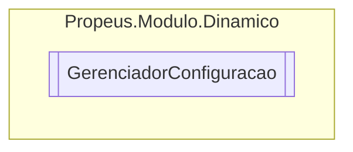

# GerenciadorConfiguracao `class`

## Description
Classe de configuracao do [Gerenciador](./propeusmodulodinamico-Gerenciador.md)

## Diagram


## Members
### Properties
#### Public  properties
| Type | Name | Methods |
| --- | --- | --- |
| `string` | [`CaminhoArquivoModulos`](#caminhoarquivomodulos)<br>Caminho do arquivo que sera armazenado a lista de modulos mapeados | `get, set` |
| `bool` | [`CarregamentoRapido`](#carregamentorapido)<br>Pemite inicializar o gerenciador mais rapidamente, entretanto os novos modulos demorarao a ser encontrados | `get, set` |

## Details
### Summary
Classe de configuracao do [Gerenciador](./propeusmodulodinamico-Gerenciador.md)

### Constructors
#### GerenciadorConfiguracao
```csharp
public GerenciadorConfiguracao()
```
##### Summary
Construtor padrao

### Properties
#### CarregamentoRapido
```csharp
public bool CarregamentoRapido { get; set; }
```
##### Summary
Pemite inicializar o gerenciador mais rapidamente, entretanto os novos modulos demorarao a ser encontrados

##### Value
Por padrao o valor e

#### CaminhoArquivoModulos
```csharp
public string CaminhoArquivoModulos { get; set; }
```
##### Summary
Caminho do arquivo que sera armazenado a lista de modulos mapeados

##### Value
Lista de caminhos de modulos validos

*Generated with* [*ModularDoc*](https://github.com/hailstorm75/ModularDoc)
