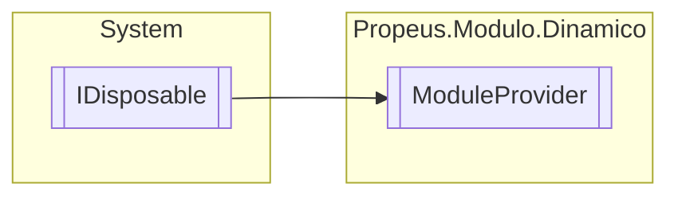

# ModuleProvider `class`

## Description
Provedor de modulos (DLL)

## Diagram


## Members
### Properties
#### Public Static properties
| Type | Name | Methods |
| --- | --- | --- |
| [`ModuleProvider`](propeusmodulodinamico-ModuleProvider.md) | [`Provider`](#provider)<br>Obtem um provedor de modulos existente ou cria um novo | `get` |

#### Public  properties
| Type | Name | Methods |
| --- | --- | --- |
| `string` | [`DiretorioAtual`](#diretorioatual)<br>Indica o diretorio que esta sendo observado | `get` |
| `int` | [`ModulosCarregados`](#moduloscarregados)<br>Quantidade de modulos mapeados | `get` |
| `int` | [`ModulosDllCarregados`](#modulosdllcarregados)<br>Quantidade de DLLs carregados | `get` |

### Methods
#### Public  methods
| Returns | Name |
| --- | --- |
| `void` | [`Dispose`](#dispose-22)()<br>Remove todos os modulos carregados em memoria |
| `Type` | [`ObterTipoModuloAtual`](#obtertipomoduloatual)(`string` name)<br>Obtem o tipo do modulo atual |
| `void` | [`Recarregamento`](#recarregamento)()<br>Recarrega todos os tipos validos e invalidos, garantindo que o tipo invalido foi corrigido e vice e versa |
| `void` | [`RecarregamentoRapido`](#recarregamentorapido)()<br>Recarrega todos os tipos validos |
| `void` | [`RecarregmentoCompleto`](#recarregmentocompleto)()<br>Carrega todas as DLLs incluindo as validas e invalidas |

#### Protected  methods
| Returns | Name |
| --- | --- |
| `void` | [`Dispose`](#dispose-12)(`bool` disposing)<br>Remove todos os modulos carregados em memoria |

## Details
### Summary
Provedor de modulos (DLL)

### Inheritance
 - `IDisposable`

### Constructors
#### ModuleProvider
```csharp
public ModuleProvider()
```

### Methods
#### ObterTipoModuloAtual
```csharp
public Type ObterTipoModuloAtual(string name)
```
##### Arguments
| Type | Name | Description |
| --- | --- | --- |
| `string` | name | Nome do tipo |

##### Summary
Obtem o tipo do modulo atual

##### Returns


#### RecarregamentoRapido
```csharp
public void RecarregamentoRapido()
```
##### Summary
Recarrega todos os tipos validos

#### Recarregamento
```csharp
public void Recarregamento()
```
##### Summary
Recarrega todos os tipos validos e invalidos, garantindo que o tipo invalido foi corrigido e vice e versa

#### RecarregmentoCompleto
```csharp
public void RecarregmentoCompleto()
```
##### Summary
Carrega todas as DLLs incluindo as validas e invalidas

#### Dispose [1/2]
```csharp
protected virtual void Dispose(bool disposing)
```
##### Arguments
| Type | Name | Description |
| --- | --- | --- |
| `bool` | disposing | Indica se deve ser liberado os objetos gerenciaveis da memoria |

##### Summary
Remove todos os modulos carregados em memoria

#### Dispose [2/2]
```csharp
public virtual void Dispose()
```
##### Summary
Remove todos os modulos carregados em memoria

### Properties
#### Provider
```csharp
public static ModuleProvider Provider { get; }
```
##### Summary
Obtem um provedor de modulos existente ou cria um novo

#### DiretorioAtual
```csharp
public string DiretorioAtual { get; }
```
##### Summary
Indica o diretorio que esta sendo observado

##### Value
Diretorio do programa em execucao

#### ModulosCarregados
```csharp
public int ModulosCarregados { get; }
```
##### Summary
Quantidade de modulos mapeados

#### ModulosDllCarregados
```csharp
public int ModulosDllCarregados { get; }
```
##### Summary
Quantidade de DLLs carregados

*Generated with* [*ModularDoc*](https://github.com/hailstorm75/ModularDoc)
