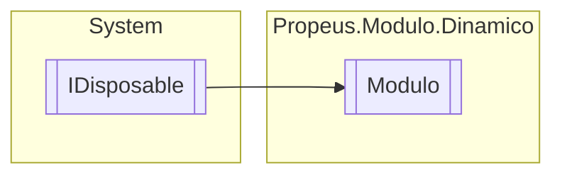

# Modulo `class`

## Diagram


## Members
### Properties
#### Public  properties
| Type | Name | Methods |
| --- | --- | --- |
| `AssemblyLoadContext` | [`AssemblyLoadContext`](#assemblyloadcontext) | `get` |
| `WeakReference`&lt;`Assembly`&gt; | [`CurrentAssembly`](#currentassembly) | `get` |
| `string` | [`Hash`](#hash) | `get` |
| `Type` | [`Item`](#item) | `get` |
| `string` | [`Local`](#local) | `get` |
| `ICollection`&lt;`string`&gt; | [`Modulos`](#modulos) | `get` |
| `long` | [`Tamanho`](#tamanho) | `get` |
| `Nullable`&lt;`DateTime`&gt; | [`UltimaModificacao`](#ultimamodificacao) | `get` |
| `bool` | [`Valido`](#valido) | `get` |

### Methods
#### Public  methods
| Returns | Name |
| --- | --- |
| `void` | [`Dispose`](#dispose-22)() |
| `void` | [`Recarregar`](#recarregar)() |

#### Protected  methods
| Returns | Name |
| --- | --- |
| `void` | [`Dispose`](#dispose-12)(`bool` disposing) |

## Details
### Inheritance
 - `IDisposable`

### Constructors
#### Modulo
```csharp
public Modulo(string filePath)
```
##### Arguments
| Type | Name | Description |
| --- | --- | --- |
| `string` | filePath |   |

### Methods
#### Recarregar
```csharp
public void Recarregar()
```

#### Dispose [1/2]
```csharp
protected virtual void Dispose(bool disposing)
```
##### Arguments
| Type | Name | Description |
| --- | --- | --- |
| `bool` | disposing |   |

#### Dispose [2/2]
```csharp
public virtual void Dispose()
```

### Properties
#### Item
```csharp
public Type Item { get; }
```

#### Valido
```csharp
public bool Valido { get; }
```

#### UltimaModificacao
```csharp
public Nullable<DateTime> UltimaModificacao { get; }
```

#### Local
```csharp
public string Local { get; }
```

#### Hash
```csharp
public string Hash { get; }
```

#### Tamanho
```csharp
public long Tamanho { get; }
```

#### AssemblyLoadContext
```csharp
public AssemblyLoadContext AssemblyLoadContext { get; }
```

#### CurrentAssembly
```csharp
public WeakReference<Assembly> CurrentAssembly { get; }
```

#### Modulos
```csharp
public ICollection<string> Modulos { get; }
```

*Generated with* [*ModularDoc*](https://github.com/hailstorm75/ModularDoc)
