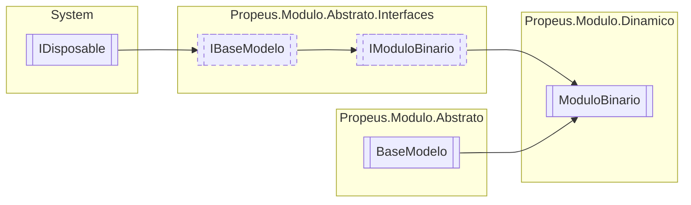

# ModuloBinario `class`

## Description
Modelo para obter informações do binario do modulo

## Diagram


## Members
### Properties
#### Public  properties
| Type | Name | Methods |
| --- | --- | --- |
| `bool` | [`BinarioValido`](#binariovalido)<br>Verifica se o binaro possui algum modulo valido | `get` |
| `string` | [`Caminho`](#caminho)<br>Caminho onde se encontra o binario do modulo | `get` |
| `string` | [`Hash`](#hash)<br>Hash do binario do modulo | `get` |
| `MemoryStream` | [`Memoria`](#memoria)<br>Conteudo do modulo armazenado em memoria | `get` |
| [`IModuloInformacao`](./propeusmoduloabstratointerfaces-IModuloInformacao.md) | [`ModuloInformacao`](#moduloinformacao)<br>ModuloInformacao mapeados do binario | `get` |
| `Span`&lt;`byte`&gt; | [`Referencia`](#referencia)<br>"Ponteiro" onde se encontra o binario em memoria | `get` |

### Methods
#### Public  methods
| Returns | Name |
| --- | --- |
| `string` | [`ToString`](#tostring)() |

#### Protected  methods
| Returns | Name |
| --- | --- |
| `void` | [`Dispose`](#dispose)(`bool` disposing) |

## Details
### Summary
Modelo para obter informações do binario do modulo

### Inheritance
 - [
`IModuloBinario`
](./propeusmoduloabstratointerfaces-IModuloBinario.md)
 - [
`IBaseModelo`
](./propeusmoduloabstratointerfaces-IBaseModelo.md)
 - `IDisposable`
 - [
`BaseModelo`
](./propeusmoduloabstrato-BaseModelo.md)

### Constructors
#### ModuloBinario
```csharp
public ModuloBinario(string caminho)
```
##### Arguments
| Type | Name | Description |
| --- | --- | --- |
| `string` | caminho |   |

### Methods
#### ToString
```csharp
public override string ToString()
```

#### Dispose
```csharp
protected override void Dispose(bool disposing)
```
##### Arguments
| Type | Name | Description |
| --- | --- | --- |
| `bool` | disposing |   |

### Properties
#### Caminho
```csharp
public virtual string Caminho { get; }
```
##### Summary
Caminho onde se encontra o binario do modulo

#### Memoria
```csharp
public virtual MemoryStream Memoria { get; }
```
##### Summary
Conteudo do modulo armazenado em memoria

#### Hash
```csharp
public virtual string Hash { get; }
```
##### Summary
Hash do binario do modulo

#### ModuloInformacao
```csharp
public virtual IModuloInformacao ModuloInformacao { get; }
```
##### Summary
ModuloInformacao mapeados do binario

#### Referencia
```csharp
public virtual Span<byte> Referencia { get; }
```
##### Summary
"Ponteiro" onde se encontra o binario em memoria

#### BinarioValido
```csharp
public virtual bool BinarioValido { get; }
```
##### Summary
Verifica se o binaro possui algum modulo valido

*Generated with* [*ModularDoc*](https://github.com/hailstorm75/ModularDoc)
