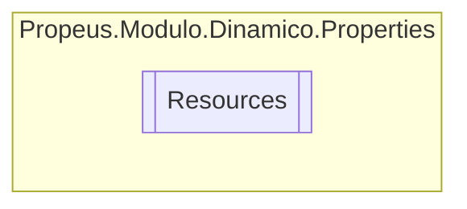

# Resources `class`

## Description
Uma classe de recurso de tipo de alta segurança, para pesquisar cadeias de caracteres localizadas etc.

## Diagram


## Members
### Properties
#### Internal Static properties
| Type | Name | Methods |
| --- | --- | --- |
| `CultureInfo` | [`Culture`](#culture)<br>Substitui a propriedade CurrentUICulture do thread atual para todas as<br>              pesquisas de recursos que usam essa classe de recurso de tipo de alta segurança. | `get, set` |
| `string` | [`DinamicoDiretorioModulos`](#dinamicodiretoriomodulos)<br>Consulta uma cadeia de caracteres localizada semelhante a Dinamico.Diretorio.ModuloInformacao. | `get` |
| `string` | [`DinamicoDiretorioModulosAutoInicializados`](#dinamicodiretoriomodulosautoinicializados)<br>Consulta uma cadeia de caracteres localizada semelhante a Dinamico.ModuloInformacao.AutoInicializados. | `get` |
| `string` | [`DinamicoDiretorioModulosIgnorados`](#dinamicodiretoriomodulosignorados)<br>Consulta uma cadeia de caracteres localizada semelhante a Dinamico.ModuloInformacao.Ignorados. | `get` |
| `string` | [`DinamicoDiretorioModulosValidos`](#dinamicodiretoriomodulosvalidos)<br>Consulta uma cadeia de caracteres localizada semelhante a Dinamico.ModuloInformacao.Validos. | `get` |
| `string` | [`DinamicoIntervaloAtualizacaoModulo`](#dinamicointervaloatualizacaomodulo)<br>Consulta uma cadeia de caracteres localizada semelhante a Dinamico.Intervalo.Atualizacao. | `get` |
| `string` | [`ERRO_AMBIGUIDADE_NOME`](#erroambiguidadenome)<br>Consulta uma cadeia de caracteres localizada semelhante a Ambiguidade de nome: {0}. | `get` |
| `string` | [`ERRO_GERENCIADOR_NAO_POSSUI_INTERFACE`](#errogerenciadornaopossuiinterface)<br>Consulta uma cadeia de caracteres localizada semelhante a O gerenciador '{0}' não possui a interface '{1}'. | `get` |
| `string` | [`ERRO_ID_NAO_ENCONTRADO`](#erroidnaoencontrado)<br>Consulta uma cadeia de caracteres localizada semelhante a {0} não encontrado. | `get` |
| `string` | [`ERRO_ID_NULO_OU_VAZIO`](#erroidnuloouvazio)<br>Consulta uma cadeia de caracteres localizada semelhante a {0} nulo ou vazio. | `get` |
| `string` | [`ERRO_MODULO_NAO_ENCONTRADO`](#erromodulonaoencontrado)<br>Consulta uma cadeia de caracteres localizada semelhante a Nao foi possivel encontrar o modulo '{0}', verifique se o nome foi digitado corretamente ou se o mesmo foi carregado.. | `get` |
| `string` | [`ERRO_TIPO_MODULO_INVALIDO`](#errotipomoduloinvalido)<br>Consulta uma cadeia de caracteres localizada semelhante a O tipo não é um modulo valido. | `get` |
| `string` | [`EXT_DLL`](#extdll)<br>Consulta uma cadeia de caracteres localizada semelhante a *.dll. | `get` |
| `string` | [`EXT_INDICE`](#extindice)<br>Consulta uma cadeia de caracteres localizada semelhante a .index. | `get` |
| `string` | [`INFO_INDICE_CRIADO`](#infoindicecriado)<br>Consulta uma cadeia de caracteres localizada semelhante a Criando indice.. | `get` |
| `string` | [`INFO_INDICE_LIDO`](#infoindicelido)<br>Consulta uma cadeia de caracteres localizada semelhante a Lendo indice.. | `get` |
| `string` | [`INFO_MAPEAMENTO_EM_ANDAMENTO`](#infomapeamentoemandamento)<br>Consulta uma cadeia de caracteres localizada semelhante a Já existe um mapeamento de modulos em andamento.. | `get` |
| `string` | [`INFO_MODULO_MAPEADO`](#infomodulomapeado)<br>Consulta uma cadeia de caracteres localizada semelhante a Modulo '{0}' mapeado.. | `get` |
| `ResourceManager` | [`ResourceManager`](#resourcemanager)<br>Retorna a instância de ResourceManager armazenada em cache usada por essa classe. | `get` |

## Details
### Summary
Uma classe de recurso de tipo de alta segurança, para pesquisar cadeias de caracteres localizadas etc.

### Constructors
#### Resources
```csharp
internal Resources()
```

### Properties
#### ResourceManager
```csharp
internal static ResourceManager ResourceManager { get; }
```
##### Summary
Retorna a instância de ResourceManager armazenada em cache usada por essa classe.

#### Culture
```csharp
internal static CultureInfo Culture { get; set; }
```
##### Summary
Substitui a propriedade CurrentUICulture do thread atual para todas as
              pesquisas de recursos que usam essa classe de recurso de tipo de alta segurança.

#### DinamicoDiretorioModulos
```csharp
internal static string DinamicoDiretorioModulos { get; }
```
##### Summary
Consulta uma cadeia de caracteres localizada semelhante a Dinamico.Diretorio.ModuloInformacao.

#### DinamicoDiretorioModulosAutoInicializados
```csharp
internal static string DinamicoDiretorioModulosAutoInicializados { get; }
```
##### Summary
Consulta uma cadeia de caracteres localizada semelhante a Dinamico.ModuloInformacao.AutoInicializados.

#### DinamicoDiretorioModulosIgnorados
```csharp
internal static string DinamicoDiretorioModulosIgnorados { get; }
```
##### Summary
Consulta uma cadeia de caracteres localizada semelhante a Dinamico.ModuloInformacao.Ignorados.

#### DinamicoDiretorioModulosValidos
```csharp
internal static string DinamicoDiretorioModulosValidos { get; }
```
##### Summary
Consulta uma cadeia de caracteres localizada semelhante a Dinamico.ModuloInformacao.Validos.

#### DinamicoIntervaloAtualizacaoModulo
```csharp
internal static string DinamicoIntervaloAtualizacaoModulo { get; }
```
##### Summary
Consulta uma cadeia de caracteres localizada semelhante a Dinamico.Intervalo.Atualizacao.

#### ERRO_AMBIGUIDADE_NOME
```csharp
internal static string ERRO_AMBIGUIDADE_NOME { get; }
```
##### Summary
Consulta uma cadeia de caracteres localizada semelhante a Ambiguidade de nome: {0}.

#### ERRO_GERENCIADOR_NAO_POSSUI_INTERFACE
```csharp
internal static string ERRO_GERENCIADOR_NAO_POSSUI_INTERFACE { get; }
```
##### Summary
Consulta uma cadeia de caracteres localizada semelhante a O gerenciador '{0}' não possui a interface '{1}'.

#### ERRO_ID_NAO_ENCONTRADO
```csharp
internal static string ERRO_ID_NAO_ENCONTRADO { get; }
```
##### Summary
Consulta uma cadeia de caracteres localizada semelhante a {0} não encontrado.

#### ERRO_ID_NULO_OU_VAZIO
```csharp
internal static string ERRO_ID_NULO_OU_VAZIO { get; }
```
##### Summary
Consulta uma cadeia de caracteres localizada semelhante a {0} nulo ou vazio.

#### ERRO_MODULO_NAO_ENCONTRADO
```csharp
internal static string ERRO_MODULO_NAO_ENCONTRADO { get; }
```
##### Summary
Consulta uma cadeia de caracteres localizada semelhante a Nao foi possivel encontrar o modulo '{0}', verifique se o nome foi digitado corretamente ou se o mesmo foi carregado..

#### ERRO_TIPO_MODULO_INVALIDO
```csharp
internal static string ERRO_TIPO_MODULO_INVALIDO { get; }
```
##### Summary
Consulta uma cadeia de caracteres localizada semelhante a O tipo não é um modulo valido.

#### EXT_DLL
```csharp
internal static string EXT_DLL { get; }
```
##### Summary
Consulta uma cadeia de caracteres localizada semelhante a *.dll.

#### EXT_INDICE
```csharp
internal static string EXT_INDICE { get; }
```
##### Summary
Consulta uma cadeia de caracteres localizada semelhante a .index.

#### INFO_INDICE_CRIADO
```csharp
internal static string INFO_INDICE_CRIADO { get; }
```
##### Summary
Consulta uma cadeia de caracteres localizada semelhante a Criando indice..

#### INFO_INDICE_LIDO
```csharp
internal static string INFO_INDICE_LIDO { get; }
```
##### Summary
Consulta uma cadeia de caracteres localizada semelhante a Lendo indice..

#### INFO_MAPEAMENTO_EM_ANDAMENTO
```csharp
internal static string INFO_MAPEAMENTO_EM_ANDAMENTO { get; }
```
##### Summary
Consulta uma cadeia de caracteres localizada semelhante a Já existe um mapeamento de modulos em andamento..

#### INFO_MODULO_MAPEADO
```csharp
internal static string INFO_MODULO_MAPEADO { get; }
```
##### Summary
Consulta uma cadeia de caracteres localizada semelhante a Modulo '{0}' mapeado..

*Generated with* [*ModularDoc*](https://github.com/hailstorm75/ModularDoc)
