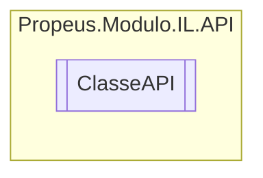

# ClasseAPI `class`

## Diagram


## Members
### Methods
#### Public Static methods
| Returns | Name |
| --- | --- |
| `void` | [`CriarCampo`](#criarcampo)([`ILClasse`](./propeusmoduloilgeradores-ILClasse.md) iLClasse, [`Token`](./propeusmoduloilenums-Token.md)`[]` acessador, `Type` tipo, `string` nome) |
| `void` | [`CriarMetodo`](#criarmetodo)([`ILClasse`](./propeusmoduloilgeradores-ILClasse.md) iLClasse, [`Token`](./propeusmoduloilenums-Token.md)`[]` acessadores, `Type` tipoRetorno, `string` nomeMetodo, [`ILParametro`](./propeusmoduloilgeradores-ILParametro.md)`[]` parametros) |
| `void` | [`CriarPropriedade`](#criarpropriedade)([`ILClasse`](./propeusmoduloilgeradores-ILClasse.md) iLClasse, `Type` tipo, `string` nome, `Type``[]` parametros) |

## Details
### Constructors
#### ClasseAPI
```csharp
public ClasseAPI()
```

### Methods
#### CriarMetodo
```csharp
public static void CriarMetodo(ILClasse iLClasse, Token[] acessadores, Type tipoRetorno, string nomeMetodo, ILParametro[] parametros)
```
##### Arguments
| Type | Name | Description |
| --- | --- | --- |
| [`ILClasse`](./propeusmoduloilgeradores-ILClasse.md) | iLClasse |   |
| [`Token`](./propeusmoduloilenums-Token.md)`[]` | acessadores |   |
| `Type` | tipoRetorno |   |
| `string` | nomeMetodo |   |
| [`ILParametro`](./propeusmoduloilgeradores-ILParametro.md)`[]` | parametros |   |

#### CriarCampo
```csharp
public static void CriarCampo(ILClasse iLClasse, Token[] acessador, Type tipo, string nome)
```
##### Arguments
| Type | Name | Description |
| --- | --- | --- |
| [`ILClasse`](./propeusmoduloilgeradores-ILClasse.md) | iLClasse |   |
| [`Token`](./propeusmoduloilenums-Token.md)`[]` | acessador |   |
| `Type` | tipo |   |
| `string` | nome |   |

#### CriarPropriedade
```csharp
public static void CriarPropriedade(ILClasse iLClasse, Type tipo, string nome, Type[] parametros)
```
##### Arguments
| Type | Name | Description |
| --- | --- | --- |
| [`ILClasse`](./propeusmoduloilgeradores-ILClasse.md) | iLClasse |   |
| `Type` | tipo |   |
| `string` | nome |   |
| `Type``[]` | parametros |   |

*Generated with* [*ModularDoc*](https://github.com/hailstorm75/ModularDoc)
