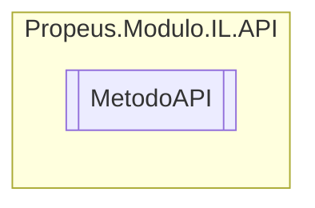

# MetodoAPI `class`

## Diagram


## Members
### Methods
#### Public Static methods
| Returns | Name |
| --- | --- |
| `void` | [`ArmazenarValorCampo`](#armazenarvalorcampo)([`ILMetodo`](./propeusmoduloilgeradores-ILMetodo.md) metodo, [`ILCampo`](./propeusmoduloilgeradores-ILCampo.md) campo) |
| `void` | [`ArmazenarValorVariavel`](#armazenarvalorvariavel)([`ILMetodo`](./propeusmoduloilgeradores-ILMetodo.md) metodo, [`ILVariavel`](./propeusmoduloilgeradores-ILVariavel.md) variavel) |
| `void` | [`CarregarArgumento`](#carregarargumento-12)(`...`) |
| `void` | [`CarregarValorBoolean`](#carregarvalorboolean)([`ILMetodo`](./propeusmoduloilgeradores-ILMetodo.md) metodo, `bool` valor) |
| `void` | [`CarregarValorByte`](#carregarvalorbyte)([`ILMetodo`](./propeusmoduloilgeradores-ILMetodo.md) metodo, `byte` valor) |
| `void` | [`CarregarValorCampo`](#carregarvalorcampo)([`ILMetodo`](./propeusmoduloilgeradores-ILMetodo.md) metodo, [`ILCampo`](./propeusmoduloilgeradores-ILCampo.md) campo) |
| `void` | [`CarregarValorChar`](#carregarvalorchar)([`ILMetodo`](./propeusmoduloilgeradores-ILMetodo.md) metodo, `char` valor) |
| `void` | [`CarregarValorDecimal`](#carregarvalordecimal)([`ILMetodo`](./propeusmoduloilgeradores-ILMetodo.md) metodo, `decimal` valor) |
| `void` | [`CarregarValorDouble`](#carregarvalordouble)([`ILMetodo`](./propeusmoduloilgeradores-ILMetodo.md) metodo, `double` valor) |
| `void` | [`CarregarValorFloat`](#carregarvalorfloat)([`ILMetodo`](./propeusmoduloilgeradores-ILMetodo.md) metodo, `float` valor) |
| `void` | [`CarregarValorInt`](#carregarvalorint)([`ILMetodo`](./propeusmoduloilgeradores-ILMetodo.md) metodo, `int` valor) |
| `void` | [`CarregarValorLong`](#carregarvalorlong)([`ILMetodo`](./propeusmoduloilgeradores-ILMetodo.md) metodo, `long` valor) |
| `void` | [`CarregarValorSbyte`](#carregarvalorsbyte)([`ILMetodo`](./propeusmoduloilgeradores-ILMetodo.md) metodo, `sbyte` valor) |
| `void` | [`CarregarValorShort`](#carregarvalorshort)([`ILMetodo`](./propeusmoduloilgeradores-ILMetodo.md) metodo, `short` valor) |
| `void` | [`CarregarValorString`](#carregarvalorstring)([`ILMetodo`](./propeusmoduloilgeradores-ILMetodo.md) metodo, `string` valor) |
| `void` | [`CarregarValorUint`](#carregarvaloruint)([`ILMetodo`](./propeusmoduloilgeradores-ILMetodo.md) metodo, `uint` valor) |
| `void` | [`CarregarValorUlong`](#carregarvalorulong)([`ILMetodo`](./propeusmoduloilgeradores-ILMetodo.md) metodo, `ulong` valor) |
| `void` | [`CarregarValorUshort`](#carregarvalorushort)([`ILMetodo`](./propeusmoduloilgeradores-ILMetodo.md) metodo, `ushort` valor) |
| `void` | [`ChamarFuncao`](#chamarfuncao-12)(`...`) |
| `void` | [`ChamarFuncaoVirtual`](#chamarfuncaovirtual)([`ILMetodo`](./propeusmoduloilgeradores-ILMetodo.md) iLMetodo, `MethodInfo` methodInfo) |
| `void` | [`CriarArray`](#criararray)([`ILMetodo`](./propeusmoduloilgeradores-ILMetodo.md) iLMetodo, `Type` tipo) |
| `void` | [`CriarInstancia`](#criarinstancia)([`ILMetodo`](./propeusmoduloilgeradores-ILMetodo.md) iLMetodo, `ConstructorInfo` constructorInfo) |
| `void` | [`CriarObjeto`](#criarobjeto)([`ILMetodo`](./propeusmoduloilgeradores-ILMetodo.md) iLMetodo, `ConstructorInfo` constructorInfo) |
| `void` | [`CriarPonteiro`](#criarponteiro)([`ILMetodo`](./propeusmoduloilgeradores-ILMetodo.md) iLMetodo, `MethodInfo` methodInfo) |
| `void` | [`CriarRetorno`](#criarretorno)([`ILMetodo`](./propeusmoduloilgeradores-ILMetodo.md) iLMetodo) |
| `void` | [`CriarVariavel`](#criarvariavel)([`ILMetodo`](./propeusmoduloilgeradores-ILMetodo.md) iLMetodo, `Type` tipo, `string` nome) |
| `void` | [`Diferente`](#diferente)([`ILMetodo`](./propeusmoduloilgeradores-ILMetodo.md) iLMetodo) |
| `void` | [`Dividir`](#dividir)([`ILMetodo`](./propeusmoduloilgeradores-ILMetodo.md) iLMetodo) |
| `void` | [`Igual`](#igual)([`ILMetodo`](./propeusmoduloilgeradores-ILMetodo.md) iLMetodo) |
| `void` | [`MaiorOuIgualQue`](#maiorouigualque)([`ILMetodo`](./propeusmoduloilgeradores-ILMetodo.md) iLMetodo) |
| `void` | [`MaiorQue`](#maiorque)([`ILMetodo`](./propeusmoduloilgeradores-ILMetodo.md) iLMetodo) |
| `void` | [`MenorOuIgualQue`](#menorouigualque)([`ILMetodo`](./propeusmoduloilgeradores-ILMetodo.md) iLMetodo) |
| `void` | [`MenorQue`](#menorque)([`ILMetodo`](./propeusmoduloilgeradores-ILMetodo.md) iLMetodo) |
| `void` | [`Multiplicar`](#multiplicar)([`ILMetodo`](./propeusmoduloilgeradores-ILMetodo.md) iLMetodo) |
| `void` | [`Se`](#se)([`ILMetodo`](./propeusmoduloilgeradores-ILMetodo.md) iLMetodo) |
| `void` | [`SeFim`](#sefim)([`ILMetodo`](./propeusmoduloilgeradores-ILMetodo.md) iLMetodo) |
| `void` | [`Soma`](#soma)([`ILMetodo`](./propeusmoduloilgeradores-ILMetodo.md) iLMetodo) |
| `void` | [`Subitrair`](#subitrair)([`ILMetodo`](./propeusmoduloilgeradores-ILMetodo.md) iLMetodo) |

## Details
### Constructors
#### MetodoAPI
```csharp
public MetodoAPI()
```

### Methods
#### ArmazenarValorCampo
```csharp
public static void ArmazenarValorCampo(ILMetodo metodo, ILCampo campo)
```
##### Arguments
| Type | Name | Description |
| --- | --- | --- |
| [`ILMetodo`](./propeusmoduloilgeradores-ILMetodo.md) | metodo |   |
| [`ILCampo`](./propeusmoduloilgeradores-ILCampo.md) | campo |   |

#### ArmazenarValorVariavel
```csharp
public static void ArmazenarValorVariavel(ILMetodo metodo, ILVariavel variavel)
```
##### Arguments
| Type | Name | Description |
| --- | --- | --- |
| [`ILMetodo`](./propeusmoduloilgeradores-ILMetodo.md) | metodo |   |
| [`ILVariavel`](./propeusmoduloilgeradores-ILVariavel.md) | variavel |   |

#### CarregarArgumento [1/2]
```csharp
public static void CarregarArgumento(ILMetodo metodo)
```
##### Arguments
| Type | Name | Description |
| --- | --- | --- |
| [`ILMetodo`](./propeusmoduloilgeradores-ILMetodo.md) | metodo |   |

#### CarregarArgumento [2/2]
```csharp
public static void CarregarArgumento(ILMetodo metodo, int indice)
```
##### Arguments
| Type | Name | Description |
| --- | --- | --- |
| [`ILMetodo`](./propeusmoduloilgeradores-ILMetodo.md) | metodo |   |
| `int` | indice |   |

#### CarregarValorBoolean
```csharp
public static void CarregarValorBoolean(ILMetodo metodo, bool valor)
```
##### Arguments
| Type | Name | Description |
| --- | --- | --- |
| [`ILMetodo`](./propeusmoduloilgeradores-ILMetodo.md) | metodo |   |
| `bool` | valor |   |

#### CarregarValorByte
```csharp
public static void CarregarValorByte(ILMetodo metodo, byte valor)
```
##### Arguments
| Type | Name | Description |
| --- | --- | --- |
| [`ILMetodo`](./propeusmoduloilgeradores-ILMetodo.md) | metodo |   |
| `byte` | valor |   |

#### CarregarValorChar
```csharp
public static void CarregarValorChar(ILMetodo metodo, char valor)
```
##### Arguments
| Type | Name | Description |
| --- | --- | --- |
| [`ILMetodo`](./propeusmoduloilgeradores-ILMetodo.md) | metodo |   |
| `char` | valor |   |

#### CarregarValorDecimal
```csharp
public static void CarregarValorDecimal(ILMetodo metodo, decimal valor)
```
##### Arguments
| Type | Name | Description |
| --- | --- | --- |
| [`ILMetodo`](./propeusmoduloilgeradores-ILMetodo.md) | metodo |   |
| `decimal` | valor |   |

#### CarregarValorDouble
```csharp
public static void CarregarValorDouble(ILMetodo metodo, double valor)
```
##### Arguments
| Type | Name | Description |
| --- | --- | --- |
| [`ILMetodo`](./propeusmoduloilgeradores-ILMetodo.md) | metodo |   |
| `double` | valor |   |

#### CarregarValorFloat
```csharp
public static void CarregarValorFloat(ILMetodo metodo, float valor)
```
##### Arguments
| Type | Name | Description |
| --- | --- | --- |
| [`ILMetodo`](./propeusmoduloilgeradores-ILMetodo.md) | metodo |   |
| `float` | valor |   |

#### CarregarValorInt
```csharp
public static void CarregarValorInt(ILMetodo metodo, int valor)
```
##### Arguments
| Type | Name | Description |
| --- | --- | --- |
| [`ILMetodo`](./propeusmoduloilgeradores-ILMetodo.md) | metodo |   |
| `int` | valor |   |

#### CarregarValorLong
```csharp
public static void CarregarValorLong(ILMetodo metodo, long valor)
```
##### Arguments
| Type | Name | Description |
| --- | --- | --- |
| [`ILMetodo`](./propeusmoduloilgeradores-ILMetodo.md) | metodo |   |
| `long` | valor |   |

#### CarregarValorSbyte
```csharp
public static void CarregarValorSbyte(ILMetodo metodo, sbyte valor)
```
##### Arguments
| Type | Name | Description |
| --- | --- | --- |
| [`ILMetodo`](./propeusmoduloilgeradores-ILMetodo.md) | metodo |   |
| `sbyte` | valor |   |

#### CarregarValorShort
```csharp
public static void CarregarValorShort(ILMetodo metodo, short valor)
```
##### Arguments
| Type | Name | Description |
| --- | --- | --- |
| [`ILMetodo`](./propeusmoduloilgeradores-ILMetodo.md) | metodo |   |
| `short` | valor |   |

#### CarregarValorUint
```csharp
public static void CarregarValorUint(ILMetodo metodo, uint valor)
```
##### Arguments
| Type | Name | Description |
| --- | --- | --- |
| [`ILMetodo`](./propeusmoduloilgeradores-ILMetodo.md) | metodo |   |
| `uint` | valor |   |

#### CarregarValorUlong
```csharp
public static void CarregarValorUlong(ILMetodo metodo, ulong valor)
```
##### Arguments
| Type | Name | Description |
| --- | --- | --- |
| [`ILMetodo`](./propeusmoduloilgeradores-ILMetodo.md) | metodo |   |
| `ulong` | valor |   |

#### CarregarValorUshort
```csharp
public static void CarregarValorUshort(ILMetodo metodo, ushort valor)
```
##### Arguments
| Type | Name | Description |
| --- | --- | --- |
| [`ILMetodo`](./propeusmoduloilgeradores-ILMetodo.md) | metodo |   |
| `ushort` | valor |   |

#### CarregarValorString
```csharp
public static void CarregarValorString(ILMetodo metodo, string valor)
```
##### Arguments
| Type | Name | Description |
| --- | --- | --- |
| [`ILMetodo`](./propeusmoduloilgeradores-ILMetodo.md) | metodo |   |
| `string` | valor |   |

#### CarregarValorCampo
```csharp
public static void CarregarValorCampo(ILMetodo metodo, ILCampo campo)
```
##### Arguments
| Type | Name | Description |
| --- | --- | --- |
| [`ILMetodo`](./propeusmoduloilgeradores-ILMetodo.md) | metodo |   |
| [`ILCampo`](./propeusmoduloilgeradores-ILCampo.md) | campo |   |

#### CriarRetorno
```csharp
public static void CriarRetorno(ILMetodo iLMetodo)
```
##### Arguments
| Type | Name | Description |
| --- | --- | --- |
| [`ILMetodo`](./propeusmoduloilgeradores-ILMetodo.md) | iLMetodo |   |

#### CriarVariavel
```csharp
public static void CriarVariavel(ILMetodo iLMetodo, Type tipo, string nome)
```
##### Arguments
| Type | Name | Description |
| --- | --- | --- |
| [`ILMetodo`](./propeusmoduloilgeradores-ILMetodo.md) | iLMetodo |   |
| `Type` | tipo |   |
| `string` | nome |   |

#### CriarObjeto
```csharp
public static void CriarObjeto(ILMetodo iLMetodo, ConstructorInfo constructorInfo)
```
##### Arguments
| Type | Name | Description |
| --- | --- | --- |
| [`ILMetodo`](./propeusmoduloilgeradores-ILMetodo.md) | iLMetodo |   |
| `ConstructorInfo` | constructorInfo |   |

#### CriarArray
```csharp
public static void CriarArray(ILMetodo iLMetodo, Type tipo)
```
##### Arguments
| Type | Name | Description |
| --- | --- | --- |
| [`ILMetodo`](./propeusmoduloilgeradores-ILMetodo.md) | iLMetodo |   |
| `Type` | tipo |   |

#### CriarPonteiro
```csharp
public static void CriarPonteiro(ILMetodo iLMetodo, MethodInfo methodInfo)
```
##### Arguments
| Type | Name | Description |
| --- | --- | --- |
| [`ILMetodo`](./propeusmoduloilgeradores-ILMetodo.md) | iLMetodo |   |
| `MethodInfo` | methodInfo |   |

#### CriarInstancia
```csharp
public static void CriarInstancia(ILMetodo iLMetodo, ConstructorInfo constructorInfo)
```
##### Arguments
| Type | Name | Description |
| --- | --- | --- |
| [`ILMetodo`](./propeusmoduloilgeradores-ILMetodo.md) | iLMetodo |   |
| `ConstructorInfo` | constructorInfo |   |

#### ChamarFuncao [1/2]
```csharp
public static void ChamarFuncao(ILMetodo iLMetodo, ConstructorInfo constructorInfo)
```
##### Arguments
| Type | Name | Description |
| --- | --- | --- |
| [`ILMetodo`](./propeusmoduloilgeradores-ILMetodo.md) | iLMetodo |   |
| `ConstructorInfo` | constructorInfo |   |

#### ChamarFuncao [2/2]
```csharp
public static void ChamarFuncao(ILMetodo iLMetodo, MethodInfo methodInfo)
```
##### Arguments
| Type | Name | Description |
| --- | --- | --- |
| [`ILMetodo`](./propeusmoduloilgeradores-ILMetodo.md) | iLMetodo |   |
| `MethodInfo` | methodInfo |   |

#### ChamarFuncaoVirtual
```csharp
public static void ChamarFuncaoVirtual(ILMetodo iLMetodo, MethodInfo methodInfo)
```
##### Arguments
| Type | Name | Description |
| --- | --- | --- |
| [`ILMetodo`](./propeusmoduloilgeradores-ILMetodo.md) | iLMetodo |   |
| `MethodInfo` | methodInfo |   |

#### Soma
```csharp
public static void Soma(ILMetodo iLMetodo)
```
##### Arguments
| Type | Name | Description |
| --- | --- | --- |
| [`ILMetodo`](./propeusmoduloilgeradores-ILMetodo.md) | iLMetodo |   |

#### Subitrair
```csharp
public static void Subitrair(ILMetodo iLMetodo)
```
##### Arguments
| Type | Name | Description |
| --- | --- | --- |
| [`ILMetodo`](./propeusmoduloilgeradores-ILMetodo.md) | iLMetodo |   |

#### Dividir
```csharp
public static void Dividir(ILMetodo iLMetodo)
```
##### Arguments
| Type | Name | Description |
| --- | --- | --- |
| [`ILMetodo`](./propeusmoduloilgeradores-ILMetodo.md) | iLMetodo |   |

#### Multiplicar
```csharp
public static void Multiplicar(ILMetodo iLMetodo)
```
##### Arguments
| Type | Name | Description |
| --- | --- | --- |
| [`ILMetodo`](./propeusmoduloilgeradores-ILMetodo.md) | iLMetodo |   |

#### Se
```csharp
public static void Se(ILMetodo iLMetodo)
```
##### Arguments
| Type | Name | Description |
| --- | --- | --- |
| [`ILMetodo`](./propeusmoduloilgeradores-ILMetodo.md) | iLMetodo |   |

#### SeFim
```csharp
public static void SeFim(ILMetodo iLMetodo)
```
##### Arguments
| Type | Name | Description |
| --- | --- | --- |
| [`ILMetodo`](./propeusmoduloilgeradores-ILMetodo.md) | iLMetodo |   |

#### Diferente
```csharp
public static void Diferente(ILMetodo iLMetodo)
```
##### Arguments
| Type | Name | Description |
| --- | --- | --- |
| [`ILMetodo`](./propeusmoduloilgeradores-ILMetodo.md) | iLMetodo |   |

#### Igual
```csharp
public static void Igual(ILMetodo iLMetodo)
```
##### Arguments
| Type | Name | Description |
| --- | --- | --- |
| [`ILMetodo`](./propeusmoduloilgeradores-ILMetodo.md) | iLMetodo |   |

#### MaiorOuIgualQue
```csharp
public static void MaiorOuIgualQue(ILMetodo iLMetodo)
```
##### Arguments
| Type | Name | Description |
| --- | --- | --- |
| [`ILMetodo`](./propeusmoduloilgeradores-ILMetodo.md) | iLMetodo |   |

#### MenorOuIgualQue
```csharp
public static void MenorOuIgualQue(ILMetodo iLMetodo)
```
##### Arguments
| Type | Name | Description |
| --- | --- | --- |
| [`ILMetodo`](./propeusmoduloilgeradores-ILMetodo.md) | iLMetodo |   |

#### MaiorQue
```csharp
public static void MaiorQue(ILMetodo iLMetodo)
```
##### Arguments
| Type | Name | Description |
| --- | --- | --- |
| [`ILMetodo`](./propeusmoduloilgeradores-ILMetodo.md) | iLMetodo |   |

#### MenorQue
```csharp
public static void MenorQue(ILMetodo iLMetodo)
```
##### Arguments
| Type | Name | Description |
| --- | --- | --- |
| [`ILMetodo`](./propeusmoduloilgeradores-ILMetodo.md) | iLMetodo |   |

*Generated with* [*ModularDoc*](https://github.com/hailstorm75/ModularDoc)
