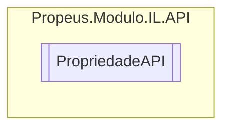

# PropriedadeAPI `class`

## Diagram


## Details
### Constructors
#### PropriedadeAPI
```csharp
public PropriedadeAPI()
```

*Generated with* [*ModularDoc*](https://github.com/hailstorm75/ModularDoc)
