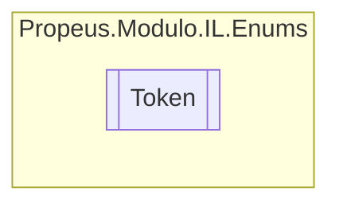

# Token `enum`

## Description
Enumerador para identificar o tipo de acessador de uma classe, metodo, propriedade etc.

## Diagram

## Details
### Summary
Enumerador para identificar o tipo de acessador de uma classe, metodo, propriedade etc.

### Fields
#### Privado
##### Summary
private

#### Publico
##### Summary
public

#### Protegido
##### Summary
protected

#### Interno
##### Summary
internal

#### Virtual
##### Summary
virtual

#### Final
##### Summary
final

#### NovoSlot
##### Summary
newslot

#### NomeEspecial
##### Summary
specialname

#### OcutarAssinatura
##### Summary
hidebysig

#### Abstrato
##### Summary
abstract

#### Classe
##### Summary
class

#### RotuloNomeEspecial
##### Summary
rtspecialname

#### ReusoSlot
##### Summary
reuseslot

#### EscopoPrivado
##### Summary
privateScope

#### VtableLayoutMask
##### Summary
vtablelayoutmask

#### Auto
##### Summary
AutoLayout

#### Selado
##### Summary
Sealed

#### Ansi
##### Summary
AnsiClass

#### PublicaAninhado
##### Summary
NestedPublic

*Generated with* [*ModularDoc*](https://github.com/hailstorm75/ModularDoc)
