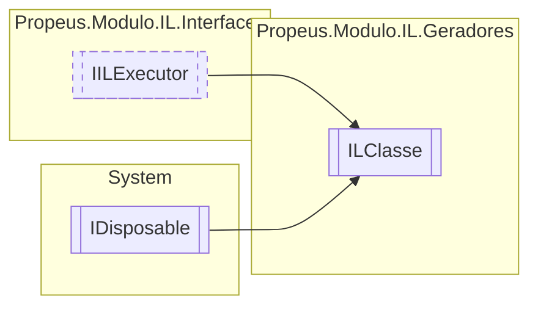

# ILClasse `class`

## Description
Gera uma classe em IL

## Diagram


## Members
### Properties
#### Public  properties
| Type | Name | Methods |
| --- | --- | --- |
| `Type` | [`Base`](#base)<br>Tipo extendido da classe | `get` |
| `string` | [`Hash`](#hash)<br>Identificador unico da classe | `get` |
| `string` | [`Namespace`](#namespace)<br>Namespace da classe | `get` |
| `string` | [`Nome`](#nome)<br>Nome da classe | `get` |
| `Type` | [`TipoGerado`](#tipogerado)<br>Tipo gerado da classe | `get` |

#### Internal  properties
| Type | Name | Methods |
| --- | --- | --- |
| `List`&lt;[`ILCampo`](./propeusmoduloilgeradores-ILCampo.md)&gt; | [`Campos`](#campos) | `get` |
| `List`&lt;[`ILMetodo`](./propeusmoduloilgeradores-ILMetodo.md)&gt; | [`Construtores`](#construtores) | `get` |
| `List`&lt;[`ILDelegate`](./propeusmoduloilgeradores-ILDelegate.md)&gt; | [`Delegates`](#delegates) | `get` |
| `List`&lt;`Type`&gt; | [`Interfaces`](#interfaces) | `get, set` |
| `List`&lt;[`ILMetodo`](./propeusmoduloilgeradores-ILMetodo.md)&gt; | [`Metodos`](#metodos) | `get` |
| `List`&lt;[`ILPropriedade`](./propeusmoduloilgeradores-ILPropriedade.md)&gt; | [`Propriedades`](#propriedades) | `get` |
| [`ILBuilderProxy`](./propeusmoduloilproxy-ILBuilderProxy.md) | [`Proxy`](#proxy) | `get` |

### Methods
#### Public  methods
| Returns | Name |
| --- | --- |
| `void` | [`Dispose`](#dispose-22)() |
| `void` | [`Executar`](#executar)()<br>Executa a montagem do código IL |
| [`Token`](./propeusmoduloilenums-Token.md)`[]` | [`GetAcessadores`](#getacessadores)()<br>Acessadores da classe |
| `string` | [`ToString`](#tostring)()<br>Obtem a construção da classe em IL |

#### Protected  methods
| Returns | Name |
| --- | --- |
| `void` | [`Dispose`](#dispose-12)(`bool` disposing) |

#### Public Static methods
| Returns | Name |
| --- | --- |
| `string` | [`GerarHashIlClasse`](#gerarhashilclasse)(`string` nome, `string` namespace, `Type` base, `Type``[]` interfaces, [`Token`](./propeusmoduloilenums-Token.md)`[]` acessadores)<br>Gera um hash unico para a classe dinamica |

## Details
### Summary
Gera uma classe em IL

### Inheritance
 - [
`IILExecutor`
](./propeusmoduloilinterfaces-IILExecutor.md)
 - `IDisposable`

### Constructors
#### ILClasse
```csharp
public ILClasse(ILBuilderProxy IlProxy, string nome, string namespace, Type base, Type[] interfaces, Token[] acessadores)
```
##### Arguments
| Type | Name | Description |
| --- | --- | --- |
| [`ILBuilderProxy`](./propeusmoduloilproxy-ILBuilderProxy.md) | IlProxy | Gerador de IL atual |
| `string` | nome | Nome da classe |
| `string` | namespace | Namespace da classe |
| `Type` | base | Objeto a ser extendido para classse |
| `Type``[]` | interfaces | Interface a ser implementado na classe |
| [`Token`](./propeusmoduloilenums-Token.md)`[]` | acessadores | Acessadores da classe |

##### Summary
Instancia para criar uma classe

### Methods
#### GetAcessadores
```csharp
public Token GetAcessadores()
```
##### Summary
Acessadores da classe

#### Executar
```csharp
public virtual void Executar()
```
##### Summary
Executa a montagem do código IL

#### ToString
```csharp
public override string ToString()
```
##### Summary
Obtem a construção da classe em IL

##### Returns


#### GerarHashIlClasse
```csharp
public static string GerarHashIlClasse(string nome, string namespace, Type base, Type[] interfaces, Token[] acessadores)
```
##### Arguments
| Type | Name | Description |
| --- | --- | --- |
| `string` | nome |  |
| `string` | namespace |  |
| `Type` | base |  |
| `Type``[]` | interfaces |  |
| [`Token`](./propeusmoduloilenums-Token.md)`[]` | acessadores |  |

##### Summary
Gera um hash unico para a classe dinamica

##### Returns


#### Dispose [1/2]
```csharp
protected virtual void Dispose(bool disposing)
```
##### Arguments
| Type | Name | Description |
| --- | --- | --- |
| `bool` | disposing |   |

#### Dispose [2/2]
```csharp
public virtual void Dispose()
```

### Properties
#### Hash
```csharp
public string Hash { get; }
```
##### Summary
Identificador unico da classe

#### Nome
```csharp
public string Nome { get; }
```
##### Summary
Nome da classe

#### Namespace
```csharp
public string Namespace { get; }
```
##### Summary
Namespace da classe

#### Base
```csharp
public Type Base { get; }
```
##### Summary
Tipo extendido da classe

#### TipoGerado
```csharp
public Type TipoGerado { get; }
```
##### Summary
Tipo gerado da classe

#### Proxy
```csharp
internal ILBuilderProxy Proxy { get; }
```

#### Metodos
```csharp
internal List<ILMetodo> Metodos { get; }
```

#### Construtores
```csharp
internal List<ILMetodo> Construtores { get; }
```

#### Propriedades
```csharp
internal List<ILPropriedade> Propriedades { get; }
```

#### Delegates
```csharp
internal List<ILDelegate> Delegates { get; }
```

#### Campos
```csharp
internal List<ILCampo> Campos { get; }
```

#### Interfaces
```csharp
internal List<Type> Interfaces { get; set; }
```

*Generated with* [*ModularDoc*](https://github.com/hailstorm75/ModularDoc)
