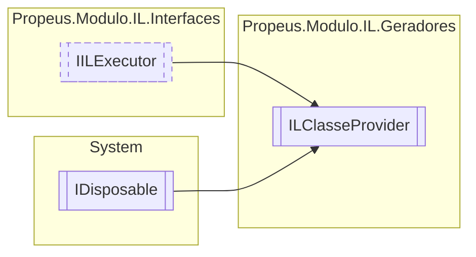

# ILClasseProvider `class`

## Diagram


## Members
### Properties
#### Internal  properties
| Type | Name | Methods |
| --- | --- | --- |
| [`ILClasse`](./propeusmoduloilgeradores-ILClasse.md) | [`Atual`](#atual) | `get` |

#### Public  properties
| Type | Name | Methods |
| --- | --- | --- |
| [`Token`](./propeusmoduloilenums-Token.md)`[]` | [`Acessadores`](#acessadores) | `get` |
| `Type` | [`Base`](#base) | `get` |
| `bool` | [`Executado`](#executado) | `get` |
| `Type``[]` | [`Interfaces`](#interfaces) | `get` |
| `string` | [`Namespace`](#namespace) | `get` |
| `string` | [`Nome`](#nome) | `get` |
| [`ILBuilderProxy`](./propeusmoduloilproxy-ILBuilderProxy.md) | [`Proxy`](#proxy) | `get` |
| `int` | [`Versao`](#versao) | `get` |

### Methods
#### Public  methods
| Returns | Name |
| --- | --- |
| `void` | [`Dispose`](#dispose-22)() |
| `void` | [`Executar`](#executar)() |
| [`ILClasseProvider`](propeusmoduloilgeradores-ILClasseProvider.md) | [`NovaVersao`](#novaversao)(`string` namespace, `Type` base, `Type``[]` interfaces, [`Token`](./propeusmoduloilenums-Token.md)`[]` acessadores) |
| `string` | [`ToString`](#tostring)() |

#### Protected  methods
| Returns | Name |
| --- | --- |
| `void` | [`Dispose`](#dispose-12)(`bool` disposing) |

## Details
### Inheritance
 - [
`IILExecutor`
](./propeusmoduloilinterfaces-IILExecutor.md)
 - `IDisposable`

### Constructors
#### ILClasseProvider
```csharp
public ILClasseProvider(ILBuilderProxy proxy, string nome, string namespace, Type base, Type[] interfaces, Token[] acessadores)
```
##### Arguments
| Type | Name | Description |
| --- | --- | --- |
| [`ILBuilderProxy`](./propeusmoduloilproxy-ILBuilderProxy.md) | proxy |   |
| `string` | nome |   |
| `string` | namespace |   |
| `Type` | base |   |
| `Type``[]` | interfaces |   |
| [`Token`](./propeusmoduloilenums-Token.md)`[]` | acessadores |   |

### Methods
#### NovaVersao
```csharp
public ILClasseProvider NovaVersao(string namespace, Type base, Type[] interfaces, Token[] acessadores)
```
##### Arguments
| Type | Name | Description |
| --- | --- | --- |
| `string` | namespace |   |
| `Type` | base |   |
| `Type``[]` | interfaces |   |
| [`Token`](./propeusmoduloilenums-Token.md)`[]` | acessadores |   |

#### Executar
```csharp
public virtual void Executar()
```

#### ToString
```csharp
public override string ToString()
```

#### Dispose [1/2]
```csharp
protected virtual void Dispose(bool disposing)
```
##### Arguments
| Type | Name | Description |
| --- | --- | --- |
| `bool` | disposing |   |

#### Dispose [2/2]
```csharp
public virtual void Dispose()
```

### Properties
#### Atual
```csharp
internal ILClasse Atual { get; }
```

#### Versao
```csharp
public int Versao { get; }
```

#### Nome
```csharp
public string Nome { get; }
```

#### Namespace
```csharp
public string Namespace { get; }
```

#### Base
```csharp
public Type Base { get; }
```

#### Interfaces
```csharp
public Type Interfaces { get; }
```

#### Acessadores
```csharp
public Token Acessadores { get; }
```

#### Proxy
```csharp
public ILBuilderProxy Proxy { get; }
```

#### Executado
```csharp
public bool Executado { get; }
```

*Generated with* [*ModularDoc*](https://github.com/hailstorm75/ModularDoc)
