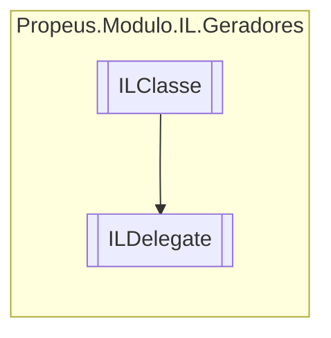

# ILDelegate `class`

## Diagram


## Members
### Properties
#### Public  properties
| Type | Name | Methods |
| --- | --- | --- |
| `ConstructorInfo` | [`ConstructorInfo`](#constructorinfo) | `get` |
| `MethodInfo` | [`InvokeInfo`](#invokeinfo) | `get` |

## Details
### Inheritance
 - [
`ILClasse`
](./propeusmoduloilgeradores-ILClasse.md)

### Constructors
#### ILDelegate
```csharp
public ILDelegate(ILBuilderProxy IlProxy, string nome, string namespace, Token[] acessadores)
```
##### Arguments
| Type | Name | Description |
| --- | --- | --- |
| [`ILBuilderProxy`](./propeusmoduloilproxy-ILBuilderProxy.md) | IlProxy |   |
| `string` | nome |   |
| `string` | namespace |   |
| [`Token`](./propeusmoduloilenums-Token.md)`[]` | acessadores |   |

### Properties
#### ConstructorInfo
```csharp
public ConstructorInfo ConstructorInfo { get; }
```

#### InvokeInfo
```csharp
public MethodInfo InvokeInfo { get; }
```

*Generated with* [*ModularDoc*](https://github.com/hailstorm75/ModularDoc)
