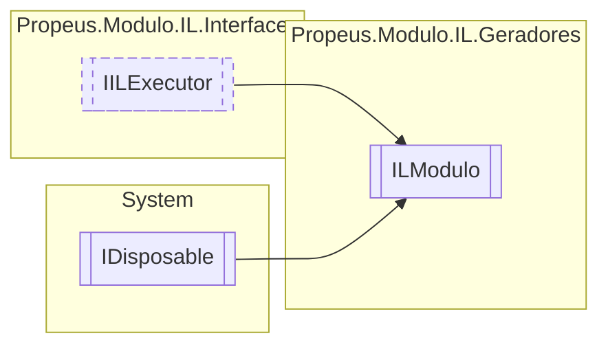

# ILModulo `class`

## Description
Gera o modulo que sera resposavel pelas classes

## Diagram


## Members
### Properties
#### Public  properties
| Type | Name | Methods |
| --- | --- | --- |
| `bool` | [`Executado`](#executado) | `get` |

### Methods
#### Internal  methods
| Returns | Name |
| --- | --- |
| [`ILClasseProvider`](./propeusmoduloilgeradores-ILClasseProvider.md) | [`CriarClasseProvider`](#criarclasseprovider)(`string` nomeClasse, `string` namespace, `Type` base, `Type``[]` interfaces, [`Token`](./propeusmoduloilenums-Token.md)`[]` acessadores) |
| [`ILDelegate`](./propeusmoduloilgeradores-ILDelegate.md) | [`CriarDelegate`](#criardelegate)(`string` nomeClasse, `string` namespace, [`Token`](./propeusmoduloilenums-Token.md)`[]` acessadores) |
| [`ILClasseProvider`](./propeusmoduloilgeradores-ILClasseProvider.md) | [`ObterCLasseProvider`](#obterclasseprovider)(`string` nomeClasse, `string` namespace) |

#### Public  methods
| Returns | Name |
| --- | --- |
| `void` | [`Dispose`](#dispose-22)() |
| `void` | [`Executar`](#executar)() |
| `string` | [`ToString`](#tostring)() |

#### Protected  methods
| Returns | Name |
| --- | --- |
| `void` | [`Dispose`](#dispose-12)(`bool` disposing) |

## Details
### Summary
Gera o modulo que sera resposavel pelas classes

### Inheritance
 - [
`IILExecutor`
](./propeusmoduloilinterfaces-IILExecutor.md)
 - `IDisposable`

### Constructors
#### ILModulo
```csharp
internal ILModulo(ILGerador iLGerador, string nomeModulo)
```
##### Arguments
| Type | Name | Description |
| --- | --- | --- |
| [`ILGerador`](./propeusmoduloilgeradores-ILGerador.md) | iLGerador |   |
| `string` | nomeModulo |   |

### Methods
#### CriarDelegate
```csharp
internal ILDelegate CriarDelegate(string nomeClasse, string namespace, Token[] acessadores)
```
##### Arguments
| Type | Name | Description |
| --- | --- | --- |
| `string` | nomeClasse |   |
| `string` | namespace |   |
| [`Token`](./propeusmoduloilenums-Token.md)`[]` | acessadores |   |

#### CriarClasseProvider
```csharp
internal ILClasseProvider CriarClasseProvider(string nomeClasse, string namespace, Type base, Type[] interfaces, Token[] acessadores)
```
##### Arguments
| Type | Name | Description |
| --- | --- | --- |
| `string` | nomeClasse |   |
| `string` | namespace |   |
| `Type` | base |   |
| `Type``[]` | interfaces |   |
| [`Token`](./propeusmoduloilenums-Token.md)`[]` | acessadores |   |

#### ObterCLasseProvider
```csharp
internal ILClasseProvider ObterCLasseProvider(string nomeClasse, string namespace)
```
##### Arguments
| Type | Name | Description |
| --- | --- | --- |
| `string` | nomeClasse |   |
| `string` | namespace |   |

#### Executar
```csharp
public virtual void Executar()
```

#### Dispose [1/2]
```csharp
protected virtual void Dispose(bool disposing)
```
##### Arguments
| Type | Name | Description |
| --- | --- | --- |
| `bool` | disposing |   |

#### Dispose [2/2]
```csharp
public virtual void Dispose()
```

#### ToString
```csharp
public override string ToString()
```

### Properties
#### Executado
```csharp
public bool Executado { get; }
```

*Generated with* [*ModularDoc*](https://github.com/hailstorm75/ModularDoc)
