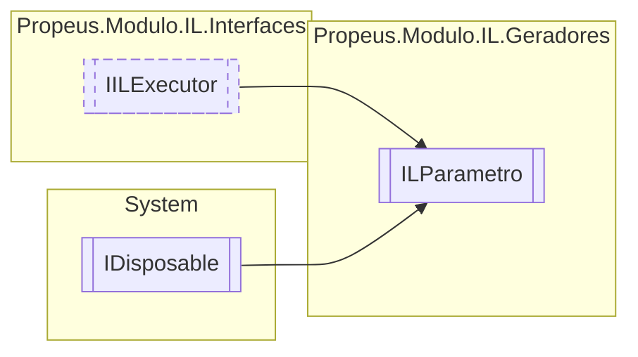

# ILParametro `class`

## Diagram


## Members
### Properties
#### Public  properties
| Type | Name | Methods |
| --- | --- | --- |
| `object` | [`DefaultValue`](#defaultvalue) | `get` |
| `int` | [`Indice`](#indice) | `get, internal set` |
| `string` | [`Nome`](#nome) | `get` |
| `bool` | [`Opcional`](#opcional) | `get` |
| `Type` | [`Tipo`](#tipo) | `get` |

### Methods
#### Public  methods
| Returns | Name |
| --- | --- |
| `void` | [`Dispose`](#dispose-22)() |
| `void` | [`Executar`](#executar)() |
| `int` | [`ToInt32`](#toint32)() |
| `string` | [`ToString`](#tostring)() |
| `Type` | [`ToType`](#totype)() |

#### Protected  methods
| Returns | Name |
| --- | --- |
| `void` | [`Dispose`](#dispose-12)(`bool` disposing) |

#### Public Static methods
| Returns | Name |
| --- | --- |
| `Type` | `explicit` `operator` [`Type`](#operator-type)([`ILParametro`](propeusmoduloilgeradores-ILParametro.md) obj) |
| `int` | `implicit` `operator` [`int`](#operator-int)([`ILParametro`](propeusmoduloilgeradores-ILParametro.md) obj) |
| `string` | `implicit` `operator` [`string`](#operator-string)([`ILParametro`](propeusmoduloilgeradores-ILParametro.md) obj) |

## Details
### Inheritance
 - [
`IILExecutor`
](./propeusmoduloilinterfaces-IILExecutor.md)
 - `IDisposable`

### Constructors
#### ILParametro [1/2]
```csharp
public ILParametro(string nomeMetodo, Type tipo, bool opcional, object defaultValue, string nome)
```
##### Arguments
| Type | Name | Description |
| --- | --- | --- |
| `string` | nomeMetodo |   |
| `Type` | tipo |   |
| `bool` | opcional |   |
| `object` | defaultValue |   |
| `string` | nome |   |

#### ILParametro [2/2]
```csharp
public ILParametro(ILBuilderProxy builderProxy, string nomeMetodo, Type tipo, string nome)
```
##### Arguments
| Type | Name | Description |
| --- | --- | --- |
| [`ILBuilderProxy`](./propeusmoduloilproxy-ILBuilderProxy.md) | builderProxy |   |
| `string` | nomeMetodo |   |
| `Type` | tipo |   |
| `string` | nome |   |

### Methods
#### Executar
```csharp
public virtual void Executar()
```

#### Dispose [1/2]
```csharp
protected virtual void Dispose(bool disposing)
```
##### Arguments
| Type | Name | Description |
| --- | --- | --- |
| `bool` | disposing |   |

#### Dispose [2/2]
```csharp
public virtual void Dispose()
```

#### Operator Type
```csharp
public static explicit operator Type(ILParametro obj)
```
##### Arguments
| Type | Name | Description |
| --- | --- | --- |
| [`ILParametro`](propeusmoduloilgeradores-ILParametro.md) | obj |   |

#### Operator int
```csharp
public static implicit operator int(ILParametro obj)
```
##### Arguments
| Type | Name | Description |
| --- | --- | --- |
| [`ILParametro`](propeusmoduloilgeradores-ILParametro.md) | obj |   |

#### Operator string
```csharp
public static implicit operator string(ILParametro obj)
```
##### Arguments
| Type | Name | Description |
| --- | --- | --- |
| [`ILParametro`](propeusmoduloilgeradores-ILParametro.md) | obj |   |

#### ToInt32
```csharp
public int ToInt32()
```

#### ToString
```csharp
public override string ToString()
```

#### ToType
```csharp
public Type ToType()
```

### Properties
#### Tipo
```csharp
public Type Tipo { get; }
```

#### Opcional
```csharp
public bool Opcional { get; }
```

#### DefaultValue
```csharp
public object DefaultValue { get; }
```

#### Nome
```csharp
public string Nome { get; }
```

#### Indice
```csharp
public int Indice { get; internal set; }
```

*Generated with* [*ModularDoc*](https://github.com/hailstorm75/ModularDoc)
