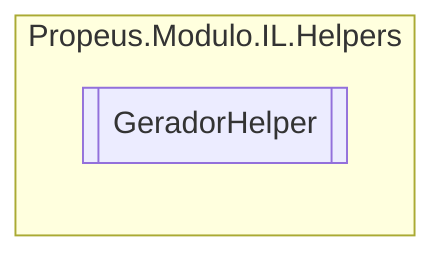

# GeradorHelper `class`

## Diagram


## Members
### Methods
#### Public Static methods
| Returns | Name |
| --- | --- |
| [`ILGerador`](./propeusmoduloilgeradores-ILGerador.md) | [`ObterGerador`](#obtergerador)() |
| [`ILModulo`](./propeusmoduloilgeradores-ILModulo.md) | [`ObterModuloGenerico`](#obtermodulogenerico)() |

## Details
### Methods
#### ObterGerador
```csharp
public static ILGerador ObterGerador()
```

#### ObterModuloGenerico
```csharp
public static ILModulo ObterModuloGenerico()
```

*Generated with* [*ModularDoc*](https://github.com/hailstorm75/ModularDoc)
