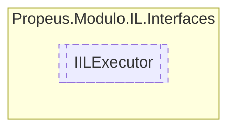

# IILExecutor `interface`

## Description
Interface para execução de função

## Diagram


## Members
### Methods
#### Public  methods
| Returns | Name |
| --- | --- |
| `void` | [`Executar`](#executar)()<br>Executa a montagem do código IL |

## Details
### Summary
Interface para execução de função

### Methods
#### Executar
```csharp
public void Executar()
```
##### Summary
Executa a montagem do código IL

*Generated with* [*ModularDoc*](https://github.com/hailstorm75/ModularDoc)
