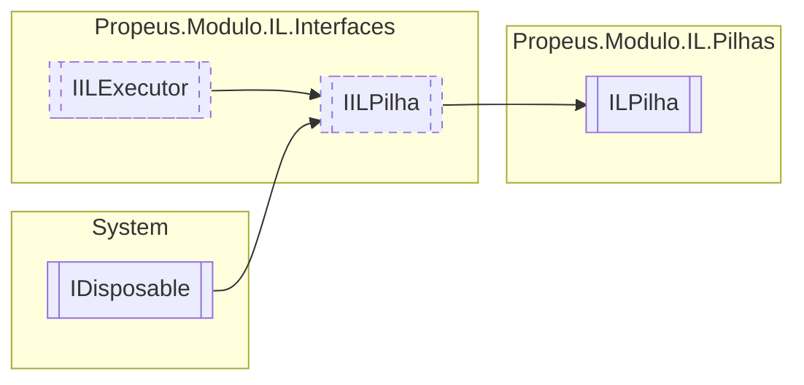

# ILPilha `class`

## Diagram


## Members
### Properties
#### Public  properties
| Type | Name | Methods |
| --- | --- | --- |
| `OpCode` | [`Code`](#code) | `get` |
| [`ILBuilderProxy`](./propeusmoduloilproxy-ILBuilderProxy.md) | [`Proxy`](#proxy) | `get` |

### Methods
#### Public  methods
| Returns | Name |
| --- | --- |
| `void` | [`Dispose`](#dispose-22)() |
| `void` | [`Executar`](#executar)() |

#### Protected  methods
| Returns | Name |
| --- | --- |
| `void` | [`Dispose`](#dispose-12)(`bool` disposing) |

## Details
### Inheritance
 - [
`IILPilha`
](./propeusmoduloilinterfaces-IILPilha.md)
 - [
`IILExecutor`
](./propeusmoduloilinterfaces-IILExecutor.md)
 - `IDisposable`

### Constructors
#### ILPilha [1/2]
```csharp
public ILPilha(ILBuilderProxy iLBuilderProxy, OpCode opCode)
```
##### Arguments
| Type | Name | Description |
| --- | --- | --- |
| [`ILBuilderProxy`](./propeusmoduloilproxy-ILBuilderProxy.md) | iLBuilderProxy |   |
| `OpCode` | opCode |   |

#### ILPilha [2/2]
```csharp
public ILPilha(ILBuilderProxy iLBuilderProxy, OpCode opCode, object valor)
```
##### Arguments
| Type | Name | Description |
| --- | --- | --- |
| [`ILBuilderProxy`](./propeusmoduloilproxy-ILBuilderProxy.md) | iLBuilderProxy |   |
| `OpCode` | opCode |   |
| `object` | valor |   |

### Methods
#### Executar
```csharp
public virtual void Executar()
```

#### Dispose [1/2]
```csharp
protected virtual void Dispose(bool disposing)
```
##### Arguments
| Type | Name | Description |
| --- | --- | --- |
| `bool` | disposing |   |

#### Dispose [2/2]
```csharp
public virtual void Dispose()
```

### Properties
#### Proxy
```csharp
public virtual ILBuilderProxy Proxy { get; }
```

#### Code
```csharp
public virtual OpCode Code { get; }
```

*Generated with* [*ModularDoc*](https://github.com/hailstorm75/ModularDoc)
