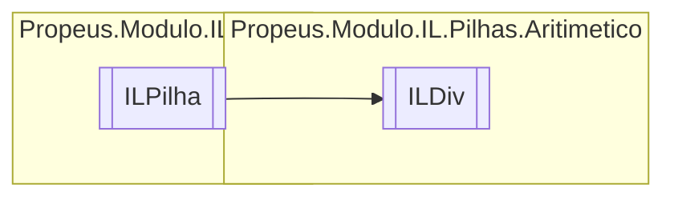

# ILDiv `class`

## Diagram


## Members
### Methods
#### Public  methods
| Returns | Name |
| --- | --- |
| `void` | [`Executar`](#executar)() |
| `string` | [`ToString`](#tostring)() |

## Details
### Inheritance
 - [
`ILPilha`
](./propeusmoduloilpilhas-ILPilha.md)

### Constructors
#### ILDiv
```csharp
public ILDiv(ILBuilderProxy iLBuilderProxy)
```
##### Arguments
| Type | Name | Description |
| --- | --- | --- |
| [`ILBuilderProxy`](./propeusmoduloilproxy-ILBuilderProxy.md) | iLBuilderProxy |   |

### Methods
#### Executar
```csharp
public override void Executar()
```

#### ToString
```csharp
public override string ToString()
```

*Generated with* [*ModularDoc*](https://github.com/hailstorm75/ModularDoc)
