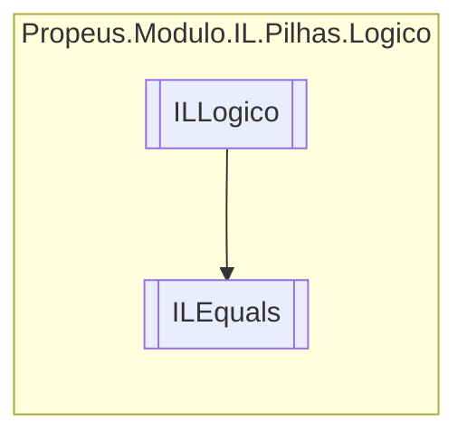

# ILEquals `class`

## Description
== || OpCodes.Bne_Un_S || OpCodes.Ceq

## Diagram


## Details
### Summary
== || OpCodes.Bne_Un_S || OpCodes.Ceq

### Inheritance
 - [
`ILLogico`
](./propeusmoduloilpilhaslogico-ILLogico.md)

### Constructors
#### ILEquals [1/2]
```csharp
public ILEquals(ILBuilderProxy iLBuilderProxy)
```
##### Arguments
| Type | Name | Description |
| --- | --- | --- |
| [`ILBuilderProxy`](./propeusmoduloilproxy-ILBuilderProxy.md) | iLBuilderProxy |   |

#### ILEquals [2/2]
```csharp
public ILEquals(ILBuilderProxy iLBuilderProxy, ILLabel label)
```
##### Arguments
| Type | Name | Description |
| --- | --- | --- |
| [`ILBuilderProxy`](./propeusmoduloilproxy-ILBuilderProxy.md) | iLBuilderProxy |   |
| [`ILLabel`](./propeusmoduloilpilhassaltos-ILLabel.md) | label |   |

*Generated with* [*ModularDoc*](https://github.com/hailstorm75/ModularDoc)
