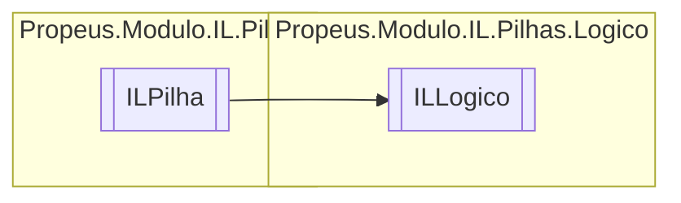

# ILLogico `class`

## Diagram


## Members
### Properties
#### Public  properties
| Type | Name | Methods |
| --- | --- | --- |
| [`ILLabel`](./propeusmoduloilpilhassaltos-ILLabel.md) | [`Label`](#label) | `get, internal set` |

### Methods
#### Public  methods
| Returns | Name |
| --- | --- |
| `void` | [`Executar`](#executar)() |
| `string` | [`ToString`](#tostring)() |

## Details
### Inheritance
 - [
`ILPilha`
](./propeusmoduloilpilhas-ILPilha.md)

### Constructors
#### ILLogico [1/2]
```csharp
public ILLogico(ILBuilderProxy iLBuilderProxy, OpCode opCode)
```
##### Arguments
| Type | Name | Description |
| --- | --- | --- |
| [`ILBuilderProxy`](./propeusmoduloilproxy-ILBuilderProxy.md) | iLBuilderProxy |   |
| `OpCode` | opCode |   |

#### ILLogico [2/2]
```csharp
public ILLogico(ILBuilderProxy iLBuilderProxy, OpCode opCode, ILLabel label)
```
##### Arguments
| Type | Name | Description |
| --- | --- | --- |
| [`ILBuilderProxy`](./propeusmoduloilproxy-ILBuilderProxy.md) | iLBuilderProxy |   |
| `OpCode` | opCode |   |
| [`ILLabel`](./propeusmoduloilpilhassaltos-ILLabel.md) | label |   |

### Methods
#### Executar
```csharp
public override void Executar()
```

#### ToString
```csharp
public override string ToString()
```

### Properties
#### Label
```csharp
public ILLabel Label { get; internal set; }
```

*Generated with* [*ModularDoc*](https://github.com/hailstorm75/ModularDoc)
