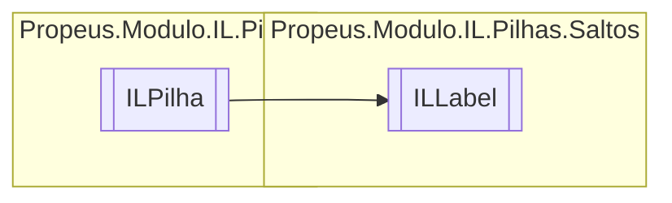

# ILLabel `class`

## Diagram


## Members
### Properties
#### Public  properties
| Type | Name | Methods |
| --- | --- | --- |
| `Nullable`&lt;`Label`&gt; | [`Label`](#label) | `get, internal set` |
| `string` | [`Nome`](#nome) | `get` |

### Methods
#### Public  methods
| Returns | Name |
| --- | --- |
| `void` | [`Executar`](#executar)() |
| `string` | [`ToString`](#tostring)() |

#### Protected  methods
| Returns | Name |
| --- | --- |
| `void` | [`Dispose`](#dispose)(`bool` disposing) |

## Details
### Inheritance
 - [
`ILPilha`
](./propeusmoduloilpilhas-ILPilha.md)

### Constructors
#### ILLabel
```csharp
public ILLabel(ILBuilderProxy proxy)
```
##### Arguments
| Type | Name | Description |
| --- | --- | --- |
| [`ILBuilderProxy`](./propeusmoduloilproxy-ILBuilderProxy.md) | proxy |   |

### Methods
#### Executar
```csharp
public override void Executar()
```

#### ToString
```csharp
public override string ToString()
```

#### Dispose
```csharp
protected override void Dispose(bool disposing)
```
##### Arguments
| Type | Name | Description |
| --- | --- | --- |
| `bool` | disposing |   |

### Properties
#### Label
```csharp
public Nullable<Label> Label { get; internal set; }
```

#### Nome
```csharp
public string Nome { get; }
```

*Generated with* [*ModularDoc*](https://github.com/hailstorm75/ModularDoc)
