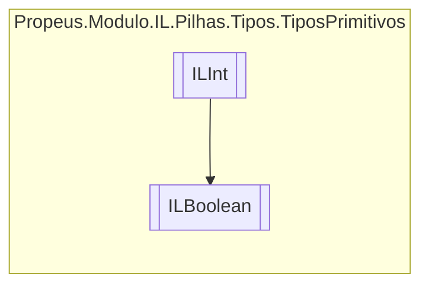

# ILBoolean `class`

## Description
Boolean || Boolean || OpCodes.Ldc_I4

## Diagram


## Details
### Summary
Boolean || Boolean || OpCodes.Ldc_I4

### Inheritance
 - [
`ILInt`
](./propeusmoduloilpilhastipostiposprimitivos-ILInt.md)

### Constructors
#### ILBoolean
```csharp
public ILBoolean(ILBuilderProxy proxy, bool valor)
```
##### Arguments
| Type | Name | Description |
| --- | --- | --- |
| [`ILBuilderProxy`](./propeusmoduloilproxy-ILBuilderProxy.md) | proxy |   |
| `bool` | valor |   |

##### Summary
Boolean || Boolean || OpCodes.Ldc_I4

*Generated with* [*ModularDoc*](https://github.com/hailstorm75/ModularDoc)
