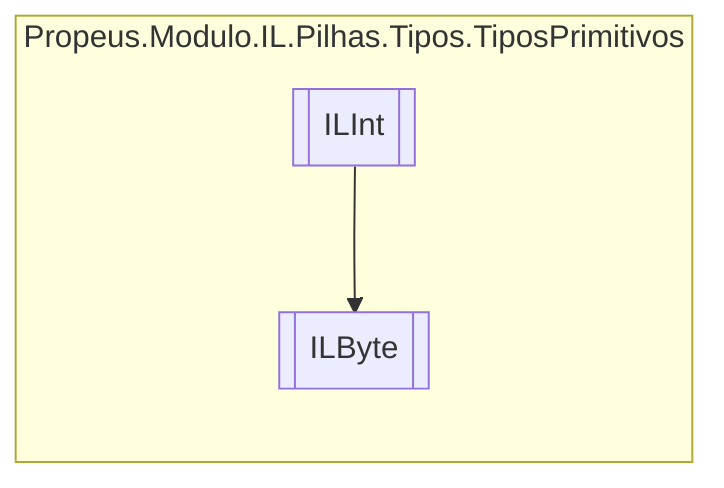

# ILByte `class`

## Description
Byte || uint8 || OpCodes.Ldc_I4

## Diagram


## Details
### Summary
Byte || uint8 || OpCodes.Ldc_I4

### Inheritance
 - [
`ILInt`
](./propeusmoduloilpilhastipostiposprimitivos-ILInt.md)

### Constructors
#### ILByte
```csharp
public ILByte(ILBuilderProxy proxy, byte valor)
```
##### Arguments
| Type | Name | Description |
| --- | --- | --- |
| [`ILBuilderProxy`](./propeusmoduloilproxy-ILBuilderProxy.md) | proxy |   |
| `byte` | valor |   |

##### Summary
Byte || uint8 || OpCodes.Ldc_I4

*Generated with* [*ModularDoc*](https://github.com/hailstorm75/ModularDoc)
