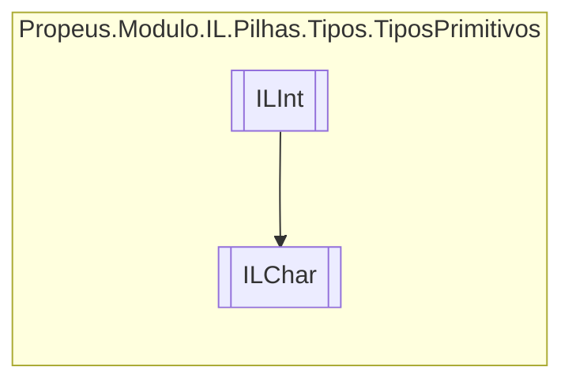

# ILChar `class`

## Description
Char || Char || OpCodes.Ldc_I4

## Diagram


## Details
### Summary
Char || Char || OpCodes.Ldc_I4

### Inheritance
 - [
`ILInt`
](./propeusmoduloilpilhastipostiposprimitivos-ILInt.md)

### Constructors
#### ILChar
```csharp
public ILChar(ILBuilderProxy proxy, char valor)
```
##### Arguments
| Type | Name | Description |
| --- | --- | --- |
| [`ILBuilderProxy`](./propeusmoduloilproxy-ILBuilderProxy.md) | proxy |   |
| `char` | valor |   |

##### Summary
Char || Char || OpCodes.Ldc_I4

*Generated with* [*ModularDoc*](https://github.com/hailstorm75/ModularDoc)
