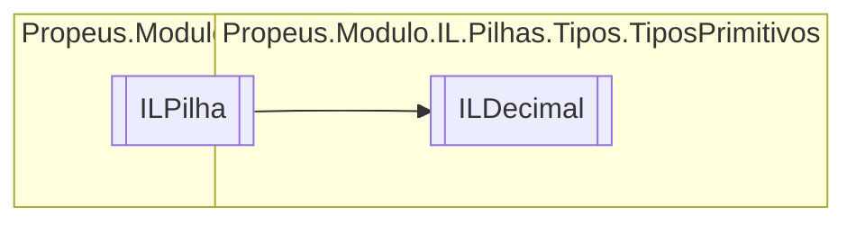

# ILDecimal `class`

## Description
Decimal || ValueType || OpCodes.Newobj

## Diagram


## Members
### Properties
#### Public  properties
| Type | Name | Methods |
| --- | --- | --- |
| [`ILNewObj`](./propeusmoduloilpilhas-ILNewObj.md) | [`Constutor`](#constutor) | `get` |
| [`ILBoolean`](./propeusmoduloilpilhastipostiposprimitivos-ILBoolean.md) | [`NumeroNegativo`](#numeronegativo) | `get` |
| [`ILSbyte`](./propeusmoduloilpilhastipostiposprimitivos-ILSbyte.md) | [`QuantidadePontoFlutuante`](#quantidadepontoflutuante) | `get` |
| [`ILInt`](./propeusmoduloilpilhastipostiposprimitivos-ILInt.md) | [`Slot1`](#slot1) | `get` |
| [`ILInt`](./propeusmoduloilpilhastipostiposprimitivos-ILInt.md) | [`Slot2`](#slot2) | `get` |
| [`ILInt`](./propeusmoduloilpilhastipostiposprimitivos-ILInt.md) | [`Slot3`](#slot3) | `get` |
| `decimal` | [`Valor`](#valor) | `get` |

### Methods
#### Public  methods
| Returns | Name |
| --- | --- |
| `void` | [`Executar`](#executar)() |

#### Protected  methods
| Returns | Name |
| --- | --- |
| `void` | [`Dispose`](#dispose)(`bool` disposing) |

## Details
### Summary
Decimal || ValueType || OpCodes.Newobj

### Inheritance
 - [
`ILPilha`
](./propeusmoduloilpilhas-ILPilha.md)

### Constructors
#### ILDecimal
```csharp
public ILDecimal(ILBuilderProxy proxy, decimal valor)
```
##### Arguments
| Type | Name | Description |
| --- | --- | --- |
| [`ILBuilderProxy`](./propeusmoduloilproxy-ILBuilderProxy.md) | proxy |   |
| `decimal` | valor |   |

##### Summary
Decimal || ValueType || OpCodes.Newobj

### Methods
#### Executar
```csharp
public override void Executar()
```

#### Dispose
```csharp
protected override void Dispose(bool disposing)
```
##### Arguments
| Type | Name | Description |
| --- | --- | --- |
| `bool` | disposing |   |

### Properties
#### Valor
```csharp
public decimal Valor { get; }
```

#### Slot1
```csharp
public ILInt Slot1 { get; }
```

#### Slot2
```csharp
public ILInt Slot2 { get; }
```

#### Slot3
```csharp
public ILInt Slot3 { get; }
```

#### NumeroNegativo
```csharp
public ILBoolean NumeroNegativo { get; }
```

#### QuantidadePontoFlutuante
```csharp
public ILSbyte QuantidadePontoFlutuante { get; }
```

#### Constutor
```csharp
public ILNewObj Constutor { get; }
```

*Generated with* [*ModularDoc*](https://github.com/hailstorm75/ModularDoc)
