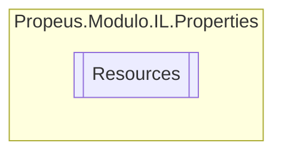

# Resources `class`

## Description
Uma classe de recurso de tipo de alta segurança, para pesquisar cadeias de caracteres localizadas etc.

## Diagram


## Members
### Properties
#### Internal Static properties
| Type | Name | Methods |
| --- | --- | --- |
| `string` | [`ANALISADOR_PILHA_ERRO`](#analisadorpilhaerro)<br>Consulta uma cadeia de caracteres localizada semelhante a Falha na analise da pilha.. | `get` |
| `string` | [`ANALISADOR_SEM_PILHA_EXECUCAO`](#analisadorsempilhaexecucao)<br>Consulta uma cadeia de caracteres localizada semelhante a Este compilador não possui uma pilha de execução.. | `get` |
| `string` | [`CLASSE_SEM_PROXY`](#classesemproxy)<br>Consulta uma cadeia de caracteres localizada semelhante a Esta classe não possui proxy. | `get` |
| `CultureInfo` | [`Culture`](#culture)<br>Substitui a propriedade CurrentUICulture do thread atual para todas as<br>              pesquisas de recursos que usam essa classe de recurso de tipo de alta segurança. | `get, set` |
| `string` | [`METODO_NAO_IMPLEMENTADO`](#metodonaoimplementado)<br>Consulta uma cadeia de caracteres localizada semelhante a Metodo não implementado. | `get` |
| `ResourceManager` | [`ResourceManager`](#resourcemanager)<br>Retorna a instância de ResourceManager armazenada em cache usada por essa classe. | `get` |
| `string` | [`TIPO_NAO_MAPEADO`](#tiponaomapeado)<br>Consulta uma cadeia de caracteres localizada semelhante a Tipo nao mapeado. | `get` |

## Details
### Summary
Uma classe de recurso de tipo de alta segurança, para pesquisar cadeias de caracteres localizadas etc.

### Constructors
#### Resources
```csharp
internal Resources()
```

### Properties
#### ResourceManager
```csharp
internal static ResourceManager ResourceManager { get; }
```
##### Summary
Retorna a instância de ResourceManager armazenada em cache usada por essa classe.

#### Culture
```csharp
internal static CultureInfo Culture { get; set; }
```
##### Summary
Substitui a propriedade CurrentUICulture do thread atual para todas as
              pesquisas de recursos que usam essa classe de recurso de tipo de alta segurança.

#### ANALISADOR_PILHA_ERRO
```csharp
internal static string ANALISADOR_PILHA_ERRO { get; }
```
##### Summary
Consulta uma cadeia de caracteres localizada semelhante a Falha na analise da pilha..

#### ANALISADOR_SEM_PILHA_EXECUCAO
```csharp
internal static string ANALISADOR_SEM_PILHA_EXECUCAO { get; }
```
##### Summary
Consulta uma cadeia de caracteres localizada semelhante a Este compilador não possui uma pilha de execução..

#### CLASSE_SEM_PROXY
```csharp
internal static string CLASSE_SEM_PROXY { get; }
```
##### Summary
Consulta uma cadeia de caracteres localizada semelhante a Esta classe não possui proxy.

#### METODO_NAO_IMPLEMENTADO
```csharp
internal static string METODO_NAO_IMPLEMENTADO { get; }
```
##### Summary
Consulta uma cadeia de caracteres localizada semelhante a Metodo não implementado.

#### TIPO_NAO_MAPEADO
```csharp
internal static string TIPO_NAO_MAPEADO { get; }
```
##### Summary
Consulta uma cadeia de caracteres localizada semelhante a Tipo nao mapeado.

*Generated with* [*ModularDoc*](https://github.com/hailstorm75/ModularDoc)
