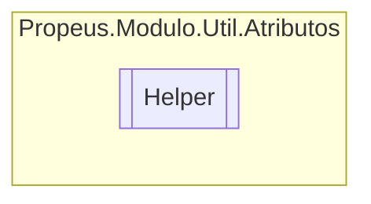

# Helper `class`

## Description
Classe de ajuda para Attribute

## Diagram


## Members
### Methods
#### Public Static methods
| Returns | Name |
| --- | --- |
| `bool` | [`PossuiAtributo`](#possuiatributo)(`Type` obj) |

## Details
### Summary
Classe de ajuda para Attribute

### Methods
#### PossuiAtributo
```csharp
public static bool PossuiAtributo<T>(Type obj)
where T : Attribute
```
##### Arguments
| Type | Name | Description |
| --- | --- | --- |
| `Type` | obj |   |

*Generated with* [*ModularDoc*](https://github.com/hailstorm75/ModularDoc)
