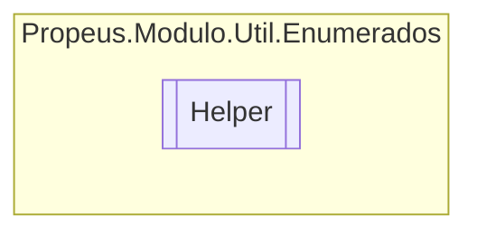

# Helper `class`

## Description
Classe de ajuda para Enum

## Diagram


## Members
### Methods
#### Public Static methods
| Returns | Name |
| --- | --- |
| `TEnum` | [`ConcatenarEnum`](#concatenarenum)(`TEnum``[]` enum) |
| `TEnum``[]` | [`DividirEnum`](#dividirenum)(`TEnum` enum) |
| `string` | [`ObterDescricaoEnum`](#obterdescricaoenum)(`TEnum` enum) |
| `TNovoEnum``[]` | [`ParseEnum`](#parseenum)(`TAntigoEnum``[]` enum) |

## Details
### Summary
Classe de ajuda para Enum

### Methods
#### ParseEnum
```csharp
public static TNovoEnum ParseEnum<TAntigoEnum, TNovoEnum>(TAntigoEnum[] enum)
where TAntigoEnum : Enum, ValueType
where TNovoEnum : Enum, ValueType
```
##### Arguments
| Type | Name | Description |
| --- | --- | --- |
| `TAntigoEnum``[]` | enum |   |

#### DividirEnum
```csharp
public static TEnum DividirEnum<TEnum>(TEnum enum)
where TEnum : ValueType
```
##### Arguments
| Type | Name | Description |
| --- | --- | --- |
| `TEnum` | enum |   |

#### ConcatenarEnum
```csharp
public static TEnum ConcatenarEnum<TEnum>(TEnum[] enum)
where TEnum : 
```
##### Arguments
| Type | Name | Description |
| --- | --- | --- |
| `TEnum``[]` | enum |   |

#### ObterDescricaoEnum
```csharp
public static string ObterDescricaoEnum<TEnum>(TEnum enum)
where TEnum : 
```
##### Arguments
| Type | Name | Description |
| --- | --- | --- |
| `TEnum` | enum |   |

*Generated with* [*ModularDoc*](https://github.com/hailstorm75/ModularDoc)
