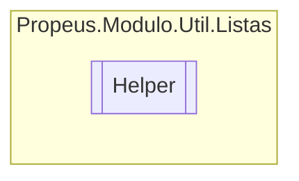

# Helper `class`

## Description
Classe de ajuda para listas

## Diagram


## Members
### Methods
#### Public Static methods
| Returns | Name |
| --- | --- |
| `IEnumerable`&lt;`TSaida`&gt; | [`Converter`](#converter)(`IEnumerable` obj) |
| `IEnumerable`&lt;`T`&gt; | [`FullJoin`](#fulljoin)(`IEnumerable`&lt;`T`&gt; esquerda, `IEnumerable`&lt;`T`&gt; direita) |
| `IDictionary`&lt;`MethodInfo`, `bool`&gt; | [`FullJoinDictionaryMethodInfo`](#fulljoindictionarymethodinfo)(`IEnumerable`&lt;`MethodInfo`&gt; esquerda, `IEnumerable`&lt;`MethodInfo`&gt; direita) |

## Details
### Summary
Classe de ajuda para listas

### Methods
#### FullJoin
```csharp
public static IEnumerable<T> FullJoin<T>(IEnumerable<T> esquerda, IEnumerable<T> direita)
where T : 
```
##### Arguments
| Type | Name | Description |
| --- | --- | --- |
| `IEnumerable`&lt;`T`&gt; | esquerda |   |
| `IEnumerable`&lt;`T`&gt; | direita |   |

#### FullJoinDictionaryMethodInfo
```csharp
public static IDictionary<MethodInfo, bool> FullJoinDictionaryMethodInfo(IEnumerable<MethodInfo> esquerda, IEnumerable<MethodInfo> direita)
```
##### Arguments
| Type | Name | Description |
| --- | --- | --- |
| `IEnumerable`&lt;`MethodInfo`&gt; | esquerda |   |
| `IEnumerable`&lt;`MethodInfo`&gt; | direita |   |

#### Converter
```csharp
public static IEnumerable<TSaida> Converter<TSaida>(IEnumerable obj)
where TSaida : 
```
##### Arguments
| Type | Name | Description |
| --- | --- | --- |
| `IEnumerable` | obj |   |

*Generated with* [*ModularDoc*](https://github.com/hailstorm75/ModularDoc)
