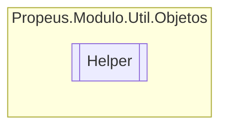

# Helper `class`

## Description
Classe de ajuda para tipos variados

## Diagram


## Members
### Methods
#### Public Static methods
| Returns | Name |
| --- | --- |
| `string` | [`Hash`](#hash)(`object` obj)<br>Obtem o hash de um objeto serializavel |
| `byte``[]` | [`Serializar`](#serializar)(`object` obj)<br>Serializa um objeto em array de Byte |
| `T` | [`To`](#to-12)(`...`) |

## Details
### Summary
Classe de ajuda para tipos variados

### Methods
#### Serializar
```csharp
public static byte Serializar(object obj)
```
##### Arguments
| Type | Name | Description |
| --- | --- | --- |
| `object` | obj | Qualuer objeto do tipo Object |

##### Summary
Serializa um objeto em array de Byte

##### Returns


##### Exceptions
| Name | Description |
| --- | --- |
| ArgumentNullException | Argumento nulo |
| SerializationException | Objeto não serializavel |

#### To [1/2]
```csharp
public static T To<T>(object obj)
where T : 
```
##### Arguments
| Type | Name | Description |
| --- | --- | --- |
| `object` | obj |   |

#### To [2/2]
```csharp
public static object To(object obj, Type para)
```
##### Arguments
| Type | Name | Description |
| --- | --- | --- |
| `object` | obj | Objeto a ser convertido |
| `Type` | para | Tipo a ser convertido |

##### Summary
Converte qualquer objeto para o tipo desejado

##### Returns


##### Exceptions
| Name | Description |
| --- | --- |
| ArgumentNullException | Argumento nulo |
| ArgumentException | Argumento invalido |
| OverflowException |  |

#### Hash
```csharp
public static string Hash(object obj)
```
##### Arguments
| Type | Name | Description |
| --- | --- | --- |
| `object` | obj |  |

##### Summary
Obtem o hash de um objeto serializavel

##### Returns


##### Exceptions
| Name | Description |
| --- | --- |
| ArgumentNullException |  |
| SerializationException |  |

*Generated with* [*ModularDoc*](https://github.com/hailstorm75/ModularDoc)
